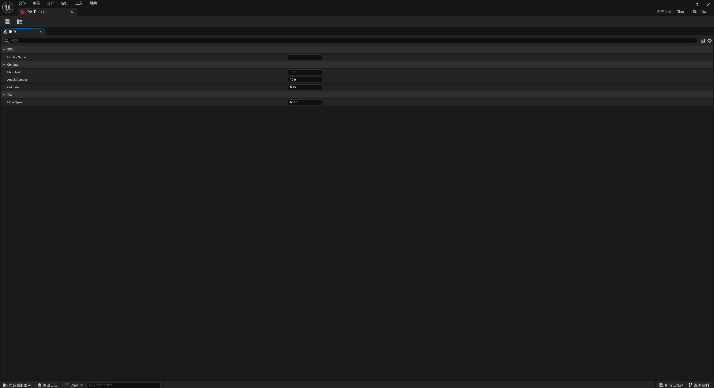
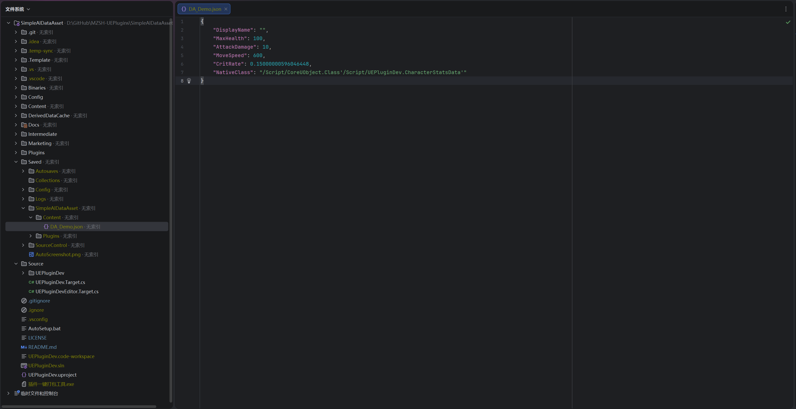

[English](./README.md) | [中文](./README_CN.md)

# AI DataAsset

DataAsset 与 JSON 文件自动双向绑定，支持 AI 直接修改 DataAsset。

## 功能特性

- **双向同步**：DataAsset 属性变更自动导出为 JSON；JSON 文件变更自动导入回 DataAsset
- **初始同步**：编辑器启动时比较时间戳，以最新版本为准进行同步
- **孤立清理**：自动删除对应 DataAsset 已不存在的 JSON 文件
- **版本控制集成**：保存前自动通过 Perforce/Git/SVN 检出文件
- **防循环机制**：内置防止无限同步循环的机制
- **高精度输出**：JSON 导出使用完整精度的浮点数值
- **属性名还原**：JSON 字段名与编辑器显示一致，而非 UE 内部的 camelCase 形式
- **智能写入**：仅在内容真正变化时才写入文件，避免版本控制中产生无意义的变更

## 安装

1. 将 `AIDataAsset` 文件夹复制到项目的 `Plugins/` 目录
2. 重启 Unreal 编辑器
3. 如未自动启用，在 编辑 > 插件 中启用

## 配置

打开 **项目设置 > 插件 > AIDataAsset**：

| 设置项 | 默认值 | 说明 |
|--------|--------|------|
| JSON Output Directory | `Saved/AIDataAsset` | JSON 文件存储目录（相对于项目根目录） |
| Enable Auto Sync | `true` | 开启/关闭自动同步 |

## 工作原理

1. 编辑器中修改 DataAsset 属性时，插件自动导出为 JSON 文件
2. 外部修改 JSON 文件（如 AI 工具）时，插件自动将变更导入回 DataAsset
3. 启动时，插件根据文件时间戳执行初始同步

## AI 集成

本插件专为 AI 工作流设计。以下是将 AI 工具接入 DataAsset 的具体方法。

### JSON 文件位置

JSON 文件存储在项目的 `Saved/AIDataAsset/` 目录下（可配置）。路径与内容浏览器结构一一对应：

| 资产路径（UE 内） | JSON 文件路径 |
|-------------------|--------------|
| `/Game/DA_Demo` | `Saved/AIDataAsset/Content/DA_Demo.json` |
| `/Game/Data/Characters/DA_Warrior` | `Saved/AIDataAsset/Content/Data/Characters/DA_Warrior.json` |

### JSON 格式

以编辑器中的 `CharacterStatsData` DataAsset 为例：



插件自动导出如下 JSON：



```json
{
    "DisplayName": "",
    "MaxHealth": 100,
    "AttackDamage": 10,
    "MoveSpeed": 600,
    "CritRate": 0.15000000596046448,
    "NativeClass": "/Script/CoreUObject.Class'/Script/UEPluginDev.CharacterStatsData'"
}
```

> **注意**：字段名与 UE 编辑器显示一致（如 `MaxHealth` 而非 `maxHealth`）。浮点数使用完整精度，防止往返转换时丢失数据。

### AI 工作流示例

1. **告诉 AI 数据文件的位置**：

   ```
   游戏角色数据在：
   D:/MyProject/Saved/AIDataAsset/Content/

   读取 DA_Demo.json，将 MaxHealth 提升 20%，CritRate 降低到 0.1，
   然后保存文件。
   ```

2. **AI 读取 JSON、修改数值、写回文件**：

   ```json
   {
       "DisplayName": "",
       "MaxHealth": 120,
       "AttackDamage": 10,
       "MoveSpeed": 600,
       "CritRate": 0.10000000149011612,
       "NativeClass": "/Script/CoreUObject.Class'/Script/UEPluginDev.CharacterStatsData'"
   }
   ```

3. **插件检测到文件变化，自动导入到 DataAsset** —— 无需手动操作。修改会立即出现在 UE 编辑器中。

### 使用建议

- AI 修改 JSON 文件时需保持 UE 编辑器运行 —— 文件监听仅在编辑器中生效
- 不要删除或重命名 `NativeClass` 字段 —— 反序列化时需要该字段
- AI 可以按照相同的路径规则创建新的 JSON 文件 —— 下次编辑器启动时插件会自动创建对应的 DataAsset

## 支持的引擎版本

- Unreal Engine 5.2+

## 联系方式

如有问题或反馈，请在 Fab 产品页面留言。
