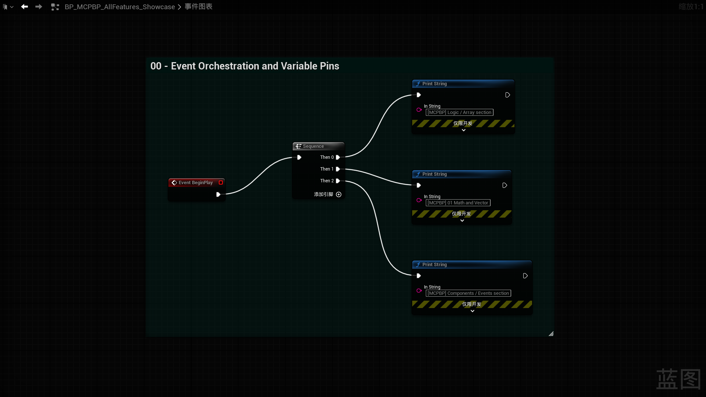
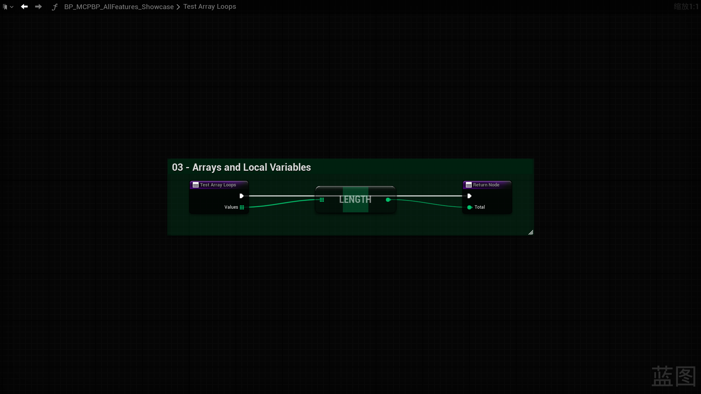
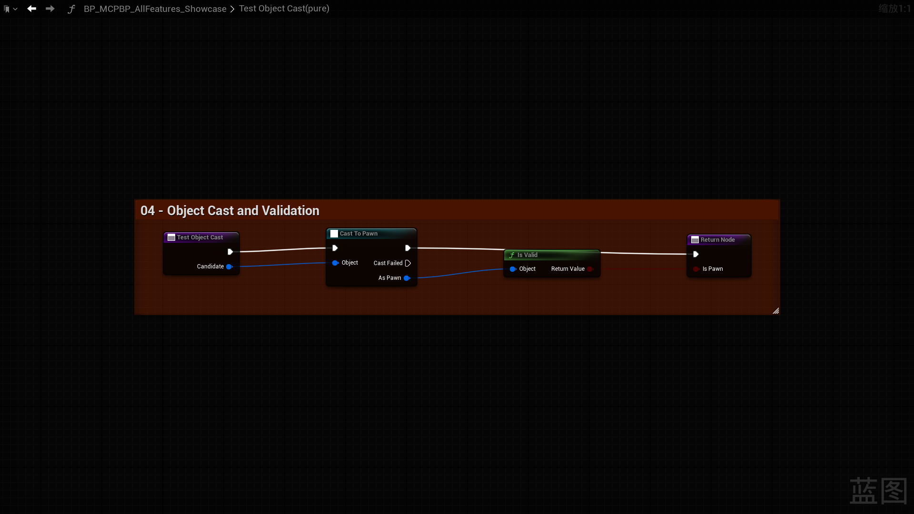
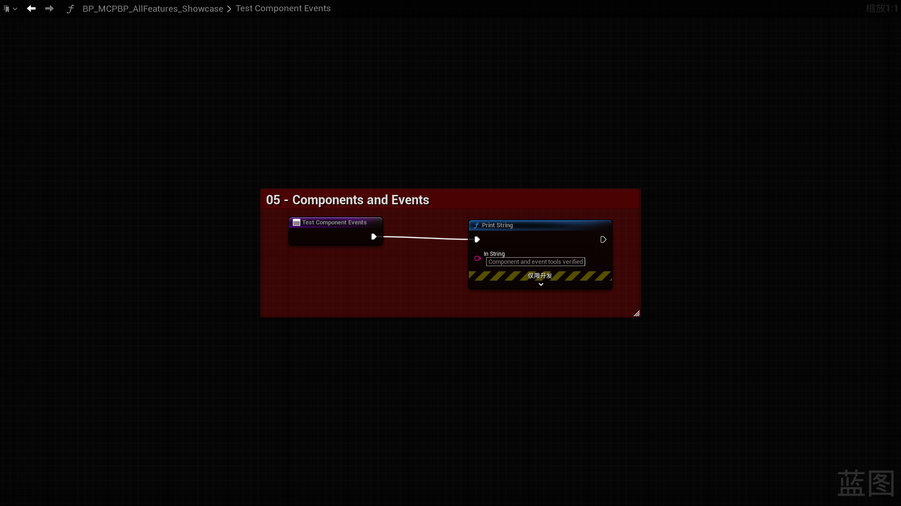
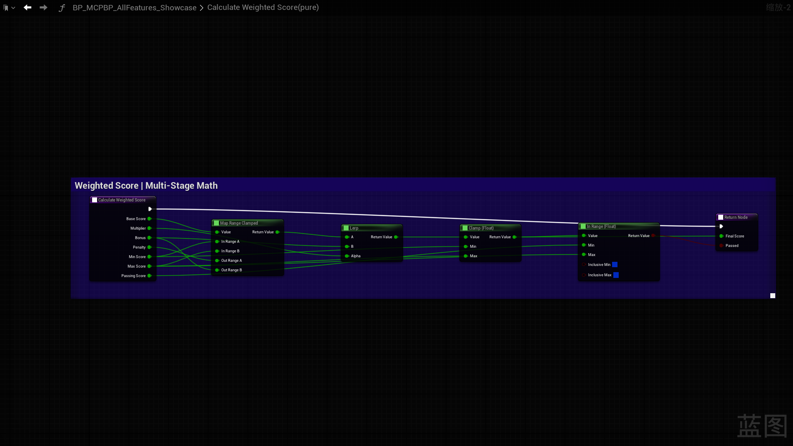
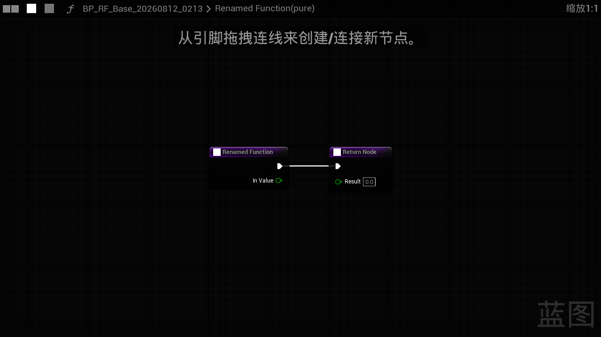
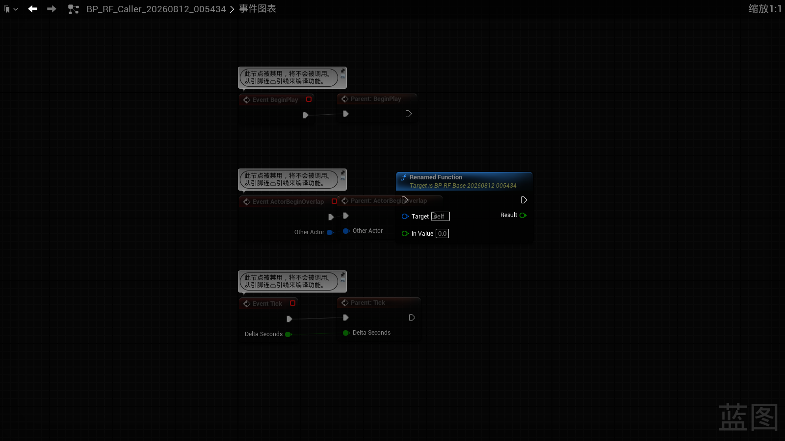
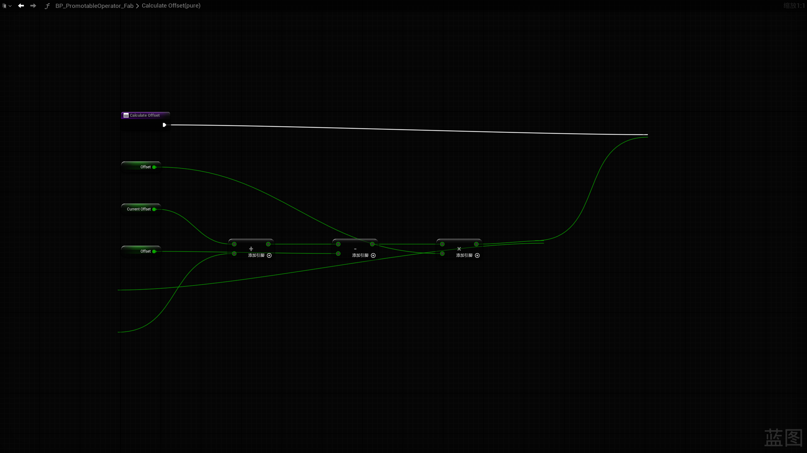
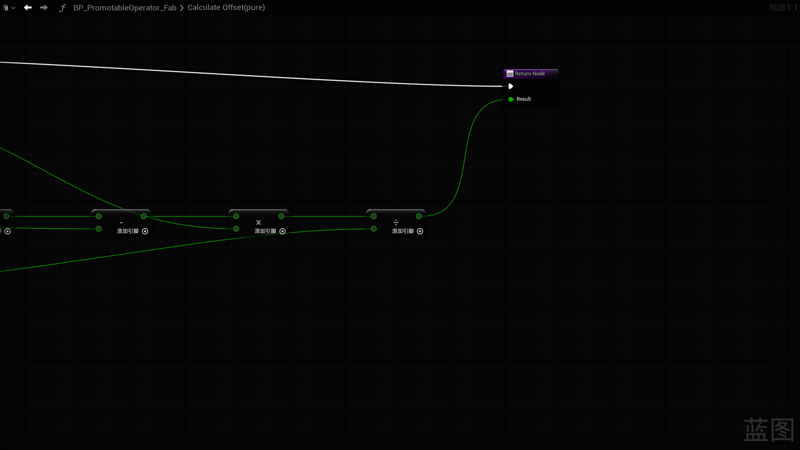

# MCPBlueprint — Fab listing draft

> Release-preparation draft only. It is not ready for Fab submission: `MarketplaceURL`, final release metadata, the packaged product icon, technical details, and the 1920×1080 thumbnail remain pending a real listing UUID and final rebuild.

## One-line pitch

Connect AI assistants to Unreal Editor and inspect, create, refactor, compile, and visually verify Blueprint graphs through 53 safety-aware MCP tools.

## Short description

MCPBlueprint is a self-contained Win64 editor plugin for Unreal Engine 5.2–5.8. It exposes Blueprint discovery, variables and functions, graph editing, components, User Defined Structs/Enums, asset lifecycle actions, compiler diagnostics, and real graph screenshots over a local HTTP MCP endpoint.

## Long description

MCPBlueprint turns Unreal Editor into a local Model Context Protocol server for repeatable, inspectable Blueprint work. AI clients can enumerate assets, read bounded graph details, search native Blueprint actions, apply declarative graph patches, manage variables and functions, edit component templates, compile, save explicitly, and capture real Blueprint graph PNGs.

The plugin is designed for editor automation rather than runtime gameplay. Mutating tools validate their targets and return structured results. Risk-sensitive operations expose dry runs or explicit approval gates; supported changes participate in Unreal transactions for Undo. Changes mark assets dirty and do not save automatically, so users keep control of disk persistence.

### Core capability groups

- Discovery and bounded reads: Blueprint lists, overviews, members, graphs, components, defaults, and diagnostics.
- Members and refactoring: variables, local variables, functions, Custom Events, dispatchers, interfaces, and dynamic pins.
- Graph construction: exact action-spawner search, declarative patches, pin defaults, deterministic formatting, and native Comment Boxes.
- Actor Blueprint components: create, duplicate, rename, remove, reparent, choose roots, and edit template properties.
- Data definitions: create, inspect, and safety-gated edit of User Defined Structs and Enums.
- Asset lifecycle: create, duplicate, rename, reparent, compile, open, close, explicitly save, or delete supported Blueprint assets.
- Visual verification: capture the actual Unreal Blueprint graph as PNG.

## Compatibility

| Engine | Package | Deployment | EnginePlugin load | MCP health |
|---|---|---|---|---|
| UE 5.2 | Passed | Passed | Passed | initialize / 53 tools / ping passed |
| UE 5.3 | Passed | Passed | Passed | initialize / 53 tools / ping passed |
| UE 5.4 | Passed | Passed | Passed | 53 tools registered; endpoint started |
| UE 5.5 | Passed | Passed | Passed | initialize / 53 tools / ping passed |
| UE 5.6 | Passed | Passed | Passed | initialize / 53 tools / ping passed |
| UE 5.7 | Passed | Passed | Passed | initialize / 53 tools / ping passed |
| UE 5.8 | Passed | Passed | Passed | initialize / 53 tools / ping passed |

These results cover installed Windows editor builds. They do not claim macOS/Linux support or exhaustive execution of all 53 tools on every engine version.

All seven version-matched compatibility packages are deployed with matching DLL hashes. They are not final Fab packages: their descriptors remain beta, `DocsURL`/`MarketplaceURL` are not populated for release, and the product icon is not packaged yet.

## Installation and first connection

1. Copy the version-matched `MCPBlueprint` folder to `<EngineRoot>/Engine/Plugins/Marketplace/MCPBlueprint` or to your project's `Plugins/MCPBlueprint` directory.
2. Start Unreal Editor, open **Edit > Plugins**, enable **MCP Blueprint**, and restart if requested.
3. Open **Project Settings > Plugins > MCP Blueprint**. Auto Start is enabled by default and the first port is `8766`.
4. Read the actual endpoint from the MCP Blueprint toolbar. If `8766` is occupied, the plugin tries subsequent ports.
5. Configure that URL as an HTTP MCP server in the AI client, for example `http://127.0.0.1:8766/mcp`.
6. Verify `initialize`, `tools/list` (53 tools), and `ping` before any write operation.

```json
{"jsonrpc":"2.0","id":1,"method":"ping","params":{}}
```

## Typical workflows

1. **Understand a Blueprint:** `ListBlueprints` → `GetBlueprintOverview` → paged `GetGraphDetail`.
2. **Build a function:** `SearchGraphNodes` → `CreateFunction` → `ApplyGraphPatch` → `FormatGraph` → `CompileBlueprint`.
3. **Document variables:** `ModifyVariable` with `Category` and `Tooltip` → `GetBlueprintOverview` read-back → compile → explicit save.
4. **Refactor safely:** `RenameFunction` dry run → review GUID/referencers/blockers → explicit approval → read callers → compile → save.
5. **Edit components:** `GetComponents` → `AddComponent`/`SetComponentProperties` → read-back → compile.
6. **Evolve data definitions:** inspect a User Defined Struct/Enum → dry run → approve the reported data-risk gate → compile affected Blueprints.
7. **Review graph quality:** `FormatGraph` dry run → inspect layout metrics → apply → `CaptureGraphScreenshot`.

## Safety boundaries

- Dry-run first for risk-sensitive changes; approval flags are separate from preview flags.
- Supported mutations participate in Unreal transactions, but destructive asset deletion is not Undoable.
- The plugin marks assets dirty and never saves automatically. Use `SaveAsset` only after read-back and compile verification.
- Function rename fails closed on incomplete reference scans, unloaded derived Blueprints, protected/override and RepNotify functions, `CreateDelegate` bindings, and opaque AnimBlueprint/AnimGraph state.
- Requests are local by default. The server binds to loopback; browser origins are restricted to loopback hosts.

## Troubleshooting

- **Cannot connect:** confirm the toolbar endpoint, Auto Start, firewall policy, and whether the initial port moved because it was occupied.
- **Tool count is not 53:** confirm the matching plugin version is loaded, restart the editor, and inspect the Unreal log for module registration.
- **Plugin asks to rebuild:** install the package matching the exact UE minor version; never mix Binaries or `.modules` files between versions.
- **Safety rejection:** read the blocker list, load reported dependents, remove unsafe bindings, and repeat the dry run.
- **Asset is dirty but unchanged on disk:** expected; compile, review, then call `SaveAsset` explicitly.
- **Request timed out:** the game-thread operation may still finish; inspect editor state before retrying a write.

## Privacy and network behavior

MCPBlueprint does not require a vendor cloud service and does not include analytics or telemetry. Its HTTP server listens on loopback (`127.0.0.1`) and exposes editor/asset data to the local MCP client you configure. Your AI client's own data handling, network access, and privacy policy remain separate. Do not expose the endpoint through port forwarding or a public proxy.

## Support and updates

- Documentation: <https://github.com/MZSH-UEPlugins/UEPluginDocs/tree/main/MCPBlueprint>
- Support/contact: <https://mengzhishanghun.github.io/mengzhishanghun/contact/>
- Updates are validated as bounded source units, then packaged separately for each supported UE minor version.
- `MarketplaceURL` remains empty until a real Fab listing exists.

## Real Unreal Editor captures



*Real Blueprint Event Graph capture showing event orchestration and variable pins.*



*Real function graph showing an array input, a length read, and a returned result. This frame does not independently demonstrate local-variable mutation.*



*Real object-cast and validity-check graph.*



*Real function graph showing the component/event validation section inside a native Comment Box. This frame does not independently prove component-template mutation.*



*Real multi-stage math graph formatted for readable left-to-right flow.*



*Real renamed function graph after the safety-gated operation.*



*Real external caller graph whose function-reference node was updated by the approved rename.*



*Real UE 5.2 function-graph capture after registry-backed Add/Subtract/Multiply/Divide creation and whole-graph formatting. This zoom-to-fit view shows the entry, typed inputs, and the Add → Subtract → Multiply portion with no node overlap.*



*Node-focused capture of the same persisted function, showing Subtract → Multiply → Divide → Result. Two views are used because UE 5.2's off-screen graph-widget full-frame capture can omit far-right node bodies; the graph read-back, compile, save, close, and reopen checks cover the complete chain.*

The first seven newly added files and the final two arithmetic images are real graph captures. Some draft frames contain localized Chinese editor guidance or development-only node banners, so they are internal evidence rather than the final English Fab gallery. The set does not yet include separate captures of the toolbar endpoint, the 53-tool protocol response, variable Category/Tooltip Details, the dry-run impact report, save/reopen state, or a safety rejection/Undo result.
