[English](./README.md) | [中文](./README_CN.md)

# MCPBlueprint

MCPBlueprint is a self-contained Unreal Editor plugin that exposes Blueprint discovery, graph editing, members, components, asset lifecycle operations, and compile feedback through MCP over HTTP. It supports Unreal Engine 5.2 and later and does not depend on another user plugin. Win64 editor packages with precompiled binaries are verified across UE 5.2–5.8.

For the draft Fab product copy, current compatibility matrix, installation, seven end-to-end workflows, privacy, troubleshooting, and captured media, see [FAB_LISTING.md](./FAB_LISTING.md). It is not a final submission artifact.

## Connection

The default endpoint is `http://127.0.0.1:8766/mcp`. If that port is occupied, the server tries the next ports and the toolbar displays the actual endpoint. Add that URL as an HTTP MCP server in your AI client.

The server implements `initialize`, `tools/list`, `tools/call`, and `ping`. Write operations run on the game thread, participate in editor transactions where Unreal supports Undo, mark assets dirty, and do not save automatically.

The 55 registered tools are covered by an editor automation schema/call matrix: every `tools/list`-equivalent definition is checked for a serializable closed input schema, names and descriptions, unknown-field rejection, and missing-required-field rejection at the registry boundary. Zero-required tools must be explicitly classified as safe reads before their empty-object call is allowed; operation-specific `oneOf`/`const` branches are also rejected before tool execution when incomplete.

Requests must use JSON-RPC `2.0` with object-valued `params` and tool `arguments`. Browser-style `Origin` headers are accepted only for `localhost`, `127.0.0.1`, or `[::1]`; non-browser clients may omit `Origin`.

## Tools (55)

### Discovery and reading

| Tool | Purpose |
|---|---|
| `ListBlueprints` | List Blueprint assets with stable bounded pagination. |
| `GetBlueprintOverview` | Read graphs, variables, functions, components, interfaces, and parent class. |
| `ListBlueprintMembers` | List functions, Custom Events, dispatchers, and local variables with unified stable pagination. |
| `GetGraphDetail` | Read graph nodes, pins, defaults, and links. |
| `SearchGraphNodes` | Search Blueprint action spawners by Unreal's English standard names and return stable `SpawnerId` values. Standard queries include `Branch`, `For Loop`, `For Each Loop`, `Switch on Int/Name/String`, `Add/Subtract/Multiply/Divide`, and function-scoped variable `Get`/`Set`. |
| `GetCompileErrors` | Compile and return the authoritative Blueprint status and diagnostics. |

### User Defined Struct and Enum

| Tool | Purpose |
|---|---|
| `CreateUserDefinedStruct` / `GetUserDefinedStruct` / `ModifyUserDefinedStruct` | Create, inspect, and safely edit fields by stable GUID. |
| `CreateUserDefinedEnum` / `GetUserDefinedEnum` / `ModifyUserDefinedEnum` | Create, inspect, and safely edit enum entries. |

Use `bDryRun=true` to review the bounded reference-impact result first. Struct removal and type changes then require `bAllowPotentialDataLoss=true`. Enum removal and reordering require `bAllowSerializedValueSemanticChange=true`. Enum renaming changes only the display name and preserves the internal enumerator name. Modify operations refresh and compile referencing Blueprints, report affected DataTables/DataAssets, participate in Undo, mark assets dirty, and never save automatically. Create operations validate first; a failed partial asset is discarded and is not announced to the Asset Registry.

### Variables, functions, and events

| Tool | Purpose |
|---|---|
| `AddVariable` / `ModifyVariable` / `RemoveVariable` | Manage Blueprint member variables. `ModifyVariable` also updates `Category` and `Tooltip` transactionally. |
| `CreateFunction` / `RenameFunction` / `ModifyFunctionSignature` / `RemoveFunction` | Create, safety-gated rename, safely modify an editable user function signature, or safely remove a function graph. Rename and signature modification default to dry-run impact analysis and require explicit approval before reference updates. |
| `CreateCustomEvent` / `AddEventNode` / `AddBoundEvent` | Add custom, engine, component, or level-actor events. |
| `AddLocalVariable` / `RemoveLocalVariable` | Add or safely remove a function-local variable. After adding one, search its name in that exact function graph to obtain its registry-backed `LocalGet` and `LocalSet` actions. |
| `AddNodePin` / `RemoveNodePin` | Add or remove supported dynamic pins on Sequence, container, and Switch nodes. |
| `AddInterface` | Implement a Blueprint interface. |
| `AddEventDispatcher` / `RemoveEventDispatcher` | Create or safely remove a multicast event dispatcher and its signature. |

For `RenameFunction`, omit `bDryRun` (or set it to `true`) to inspect the stable graph GUID, bounded local/external reference counts, affected Blueprints, unloaded derived classes, and blockers without mutation. Apply only by sending both `bDryRun=false` and `bApproveReferenceUpdates=true`. The first version deliberately rejects override/protected and RepNotify functions, incomplete reference scans, unloaded derived Blueprints, `CreateDelegate` bindings, and AnimBlueprint/AnimGraph state found in the declaring Blueprint, loaded dependents, or Asset Registry referencers—even when ordinary node-reference counting is zero. This gate is fail-closed because UE 5.4+ can rewrite opaque nested function property bindings that cannot yet be scanned or restored transactionally. A successful apply preserves `FunctionGraphGuid`, verifies the old name has no remaining references, compiles every affected Blueprint, participates in Undo, marks packages dirty, and never saves automatically.

`ModifyFunctionSignature` accepts exactly one of `AddInput`, `AddOutput`, `RenamePin`, `RemovePin`, or `ChangePinType`. Address the declaration with both the exact `FunctionName` and stable `FunctionGraphGuid`. Existing parameters must be selected by `PinId` from `GetGraphDetail`; their names are display-only and are never accepted as identity. Omit `bDryRun` to inspect ordinary local/external callers, Asset Registry referencers, derived classes, delegate/opaque bindings, compile baselines, incompatible type connections, and blockers without mutation. Apply requires `bDryRun=false` plus `bApproveReferenceUpdates=true`; `RemovePin` and `ChangePinType` additionally require `bAllowPotentialDataLoss=true`. Successful apply verifies the complete declaration/caller Pin contract: rename preserves the target PinId, full `FEdGraphPinType` semantics, defaults, and connections while changing only its name; compatible type/default changes preserve target PinIds and connections; add creates matching declaration/caller pins and caller input defaults; remove deletes only the approved target and its connections. Every non-target PinId, direction, full type qualifiers (category/subcategory/object/container/reference/const/weak), string default, stable DefaultObject path, text default, relative order, and connection endpoint must remain unchanged or the transaction rolls back. Output pins have no caller-input default contract. Incompatible connected type changes are blocked rather than silently disconnected. The tool rebuilds ordinary call nodes, compiles every affected Blueprint, supports one-step Undo, marks packages dirty, and never saves automatically. Override/interface/RepNotify functions, missing generated/skeleton classes, non-verifiable compile state, loaded or unloaded derived Blueprints, incomplete scans, non-call references, `CreateDelegate`, and AnimBlueprint/AnimGraph candidates are rejected fail-closed. Pin reordering is intentionally not part of this first safe unit.

Function-local variable actions are scoped by both the function graph GUID and the local declaration GUID. `SearchGraphNodes` returns `LocalGet:<GraphGuidDigits>:<LocalVarGuidDigits>` and `LocalSet:<GraphGuidDigits>:<LocalVarGuidDigits>` only for the declaring graph. The setter exposes `execute`, `then`, the named value input, and `Output_Get`. Pass the exact returned ID to `ApplyGraphPatch`; cross-graph, stale, or fabricated GUID combinations fail closed, and placement reuses the original Action Registry spawner so Unreal retains the native local scope.

### Graph editing

| Tool | Purpose |
|---|---|
| `ApplyGraphPatch` | Read-only preview or atomically apply bounded node create/remove, connect/disconnect, defaults, move, and layout changes. |
| `SetPinDefaults` | Set validated literal defaults on existing input pins. |
| `FormatGraph` | Lay out a whole graph or a selected node set. |
| `AddCommentBox` | Enclose selected nodes in a native Comment Box with configurable title, color, and padding. |

#### Professional graph layout

`FormatGraph` uses deterministic weak-component separation, SCC cycle condensation, left-to-right layered topology, barycentric crossing reduction, measured Slate node and pin-row sizes with bounded fallbacks, pin-aware vertical alignment, and component packing. `LayoutScope` accepts `WholeGraph`, `ConnectedComponent`, or `Selection`. `LayoutStyle` accepts `Balanced` (default general-purpose spacing), `Straight` (stronger wire alignment and more vertical room), or `Compact` (smaller footprint with lighter alignment). This small preset surface is suitable for project conventions or AI skill instructions without exposing algorithm-specific weights. Whole-graph layout protects comment boxes and the nodes they currently contain. Use `bDryRun=true` to return planned positions and before/after overlap, backward-edge, crossing, long-edge, area, `FlatEdgeRatio`, `AveragePinDeltaY`, and `P95PinDeltaY` metrics without calling `Modify()` or opening an editor transaction. Optional reroute insertion is disabled by default and bounded by `MaxRerouteNodes`; its quality metrics describe the original-node plan before knot insertion.

For `Selection` and `ConnectedComponent`, Comment Boxes that already contain target nodes are ignored only as local obstacles, then every planned node is checked against its complete original containment set. Nodes must remain inside each original container's content area, outside unrelated comments, and clear of the real off-window Slate-measured wrapped title plus eight graph units of safety padding. Unselected contained nodes stay fixed obstacles; nested comments are supported. Ambiguous existing boundary crossings, incompatible containers, insufficient space, and `bInsertReroutes=true` whenever the graph contains any Comment Box fail closed without changing topology or Undo state, because newly inserted knot nodes are not part of the pre-mutation containment plan. The result reports `PreservedCommentRelationshipCount`, and dry-run/apply share the same deterministic constraint plan.

`ApplyGraphPatch` accepts `LayoutScope=Auto|CreatedNodes|ConnectedComponent|None` and the same `LayoutStyle` presets. Set `bDryRun=true` first to receive a stable, read-only plan containing `OperationCounts`, normalized create/remove/move/connect/disconnect entries, `LayoutPlan`, and `Blockers`. This branch does not call `Modify()`, open a transaction, dirty the package, change Undo or Asset Registry state, or compile the Blueprint. Existing-node operations are validated directly. Creating Action Registry nodes, generated or wildcard pins, native conversion/promotion, and exact post-patch layout cannot be proven without mutation, so they are explicitly reported as blockers instead of being simulated by applying and undoing the patch. A blocker means the preview is intentionally incomplete; it is not approval to skip `SearchGraphNodes`, apply-time validation, read-back, compilation, or Undo testing.

A normal AI caller submits node logic, pin defaults, and connections while omitting `Position` and `LayoutScope`; MCPBlueprint then owns standard post-connection layering, pin ordering, spacing, and crossing reduction through the default `Auto` layout. Explicit `Position` or `None` is reserved for a user-requested fixed manual layout. MCP-driven placement is required to avoid overlap by default and must not silently accept an unresolved collision. A node with an explicit `Position` remains fixed. Layout failure, reroute failure, or compile failure participates in the same patch rollback. The write result returns the applied scope, style, and layout quality metrics.

Real UE 5.2 MCP acceptance covers three call patterns, all with both `Position` and `LayoutScope` omitted. A one-shot node-and-connection patch reduced crossings from 1 to 0 and backward edges from 2 to 0. A second, connection-only patch issued after node creation automatically selected the affected connected component and reduced backward edges from 2 to 0. Reusing an existing `BeginPlay` event and then connecting `Print String` reduced backward edges from 1 to 0 and pin delta from 552 to 1. `Auto` also handles reused nodes, move-only patches, disconnected endpoints, and surviving neighbors of removed nodes. Conflicting exclusive data-input requests reject the whole patch, exec inputs retain legal multi-source fan-in, and valid automatically inserted conversion nodes participate in final connection verification and layout.

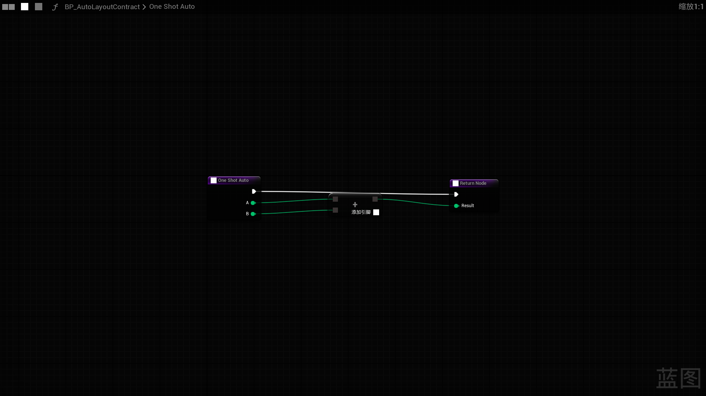

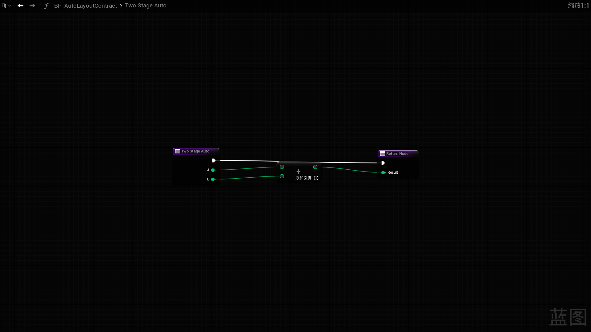

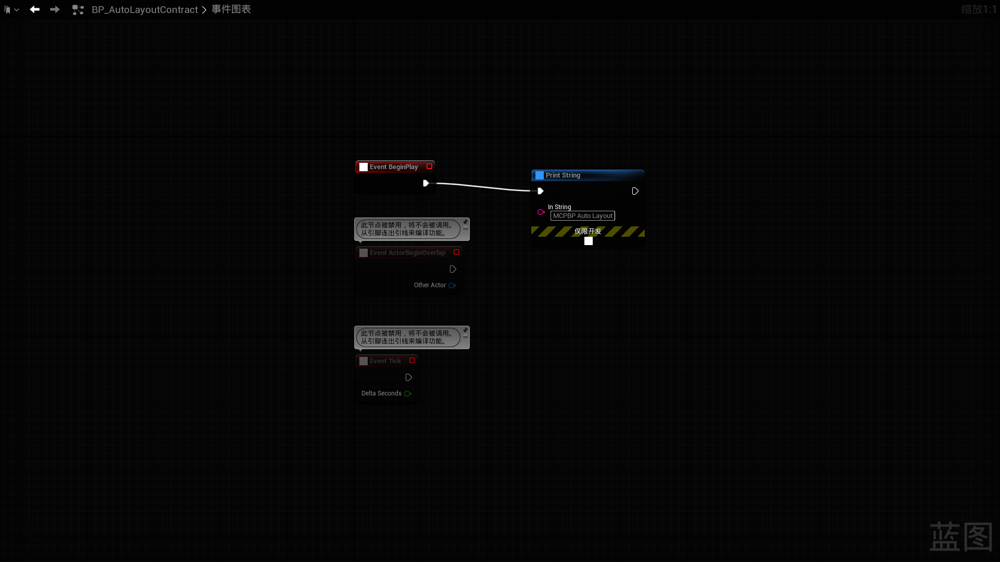

`Patch.MoveNodes` provides a bounded, explicit path for moving existing nodes when a new business block needs space or a complex graph needs staged reorganization. Each entry is `{ "NodeGuid": "...", "Position": { "X": 1200, "Y": 600 } }`. Coordinates are absolute graph units. The operation preserves each node GUID, class, pins, defaults, and every existing link; all requested moves share the graph-patch transaction, compile gate, rollback, and single Undo. Read GUIDs and coordinates with `GetGraphDetail` first. Unknown or duplicate GUIDs, non-finite/out-of-range positions, and requests beyond the shared 60-operation patch limit are rejected without partial changes.

When `Auto` falls back to `CreatedNodes` inside an existing implementation, it first anchors each created connected block between its real external predecessor and successor. If that block needs more horizontal space, only a bounded colliding right-side closure is shifted rigidly along `+X`; every node in the closure receives the same delta and keeps its `Y`, while nodes outside the closure keep their GUIDs, coordinates, and connections. The patch fails closed rather than moving a function entry, crossing Comment Box containment, exceeding the node/iteration/distance limits, or introducing any new backward edge. Explicit `LayoutScope=CreatedNodes` intentionally retains the older below-existing placement and does not move existing nodes. Write tools still do not auto-save: read back and compile first, then call `SaveAsset` explicitly. One editor Undo restores both created nodes and the displaced closure.

### Layout-pressure evidence and readable-logic acceptance

The following UE 5.2 captures remain available as **layout-pressure evidence only**. They prove bounded `+X` displacement, one-step Undo, and save/close/reopen persistence. They do **not** represent a real business function or pass product acceptance: their 102/108-node setup must not be used as an example of normal production wiring. A later 112/114-node connected test also failed the user's product-level screenshot review. Zero isolated nodes, successful compilation, save/reopen, and Undo/Redo do not prove that a function was actually called with fixed inputs or produced correct business results. The GetterSafety `01–05` captures likewise remain implementation/process evidence only. Do not reuse either old test graph as the acceptance baseline. The authoritative requirements for the next isolated test asset, runtime proof, per-change screenshots, rejection conditions, and Definition of Done are in [Blueprint Graph Workflow Acceptance](./GRAPH_WORKFLOW_ACCEPTANCE.md).

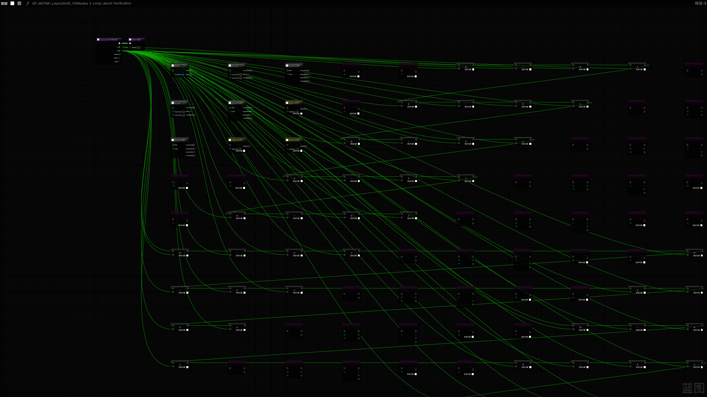

*Layout-pressure baseline only; not a real connected business-logic example.*

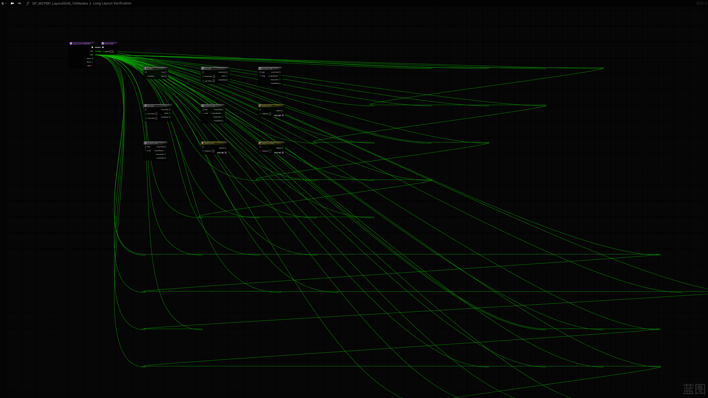

*Pressure-test stage 2 (`103 → 106`): nine old nodes moved by the same `+633` graph units with `DeltaY=0`. This proves local displacement only, not business-logic readability.*

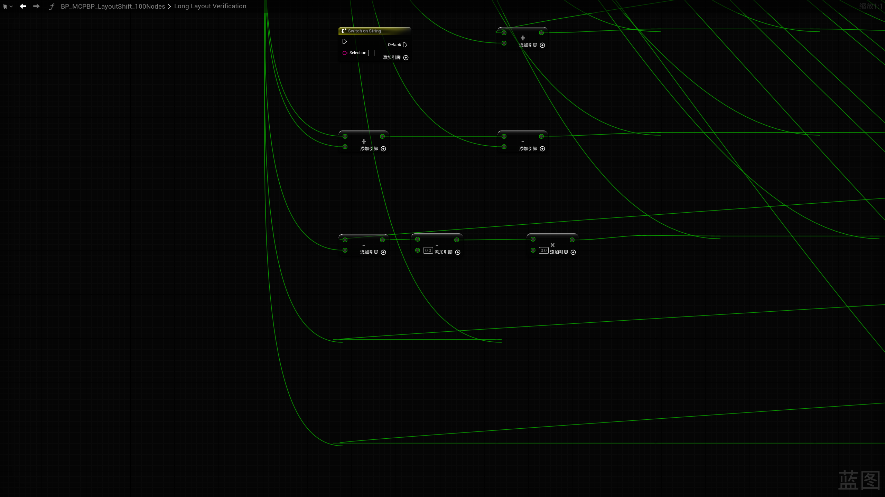

*Saved/reopened pressure-test view; it is retained as local-displacement evidence, not a readable workflow example.*

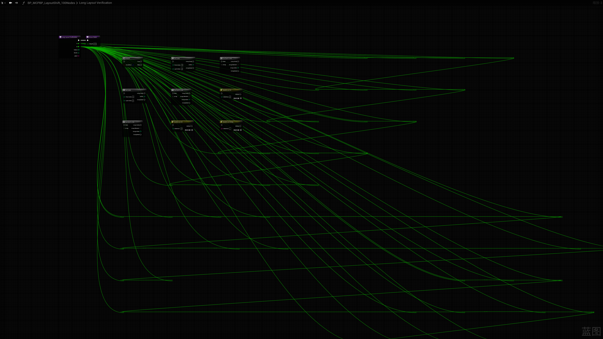

*Pressure-test stage 3 (`106 → 108`): two old nodes moved by the same local `+298`; compile, Undo, save, close, and reopen passed. It is not a business-logic acceptance image.*

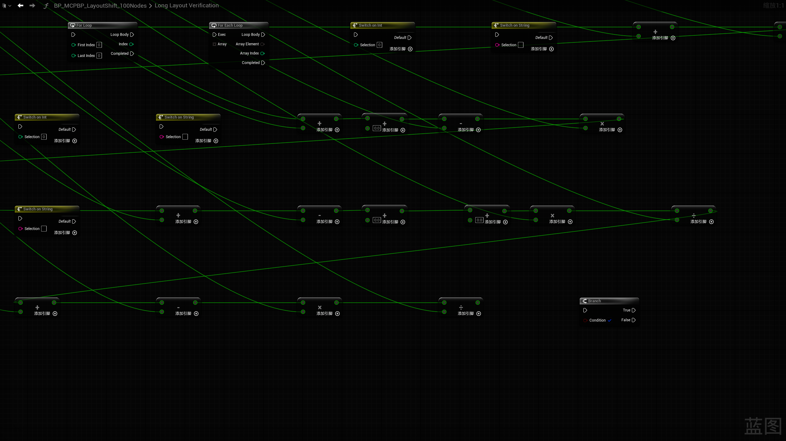

*Saved/reopened pressure-test view only; the [stage-1 local view](./Images/LayoutShift/02_Insert_Add_Local.png) remains evidence that a single Add fit without moving old nodes.*

For a readable real workflow with 100+ nodes, require connected Exec and data paths. Branch, For Loop, For Each Loop, Switch, and Add/Subtract/Multiply/Divide results must feed a later assignment, condition, or return—not merely exist as separate nodes. Create a legal member-variable, function-parameter, or local-variable Get near each consuming region; do not fan out a Function Entry pin or distant getter across the entire graph. A temporary calculation is not safely replaceable with a duplicated Get: keep its semantics with a local-variable Set/Get pair or a bounded reroute. Only pure variable getters without execution pins may be split per consumer and placed near their use sites; multiple local getters for one consumer are deterministically stacked and checked against the same 60-unit spacing used by the graph layout. If no safe local position exists, the whole patch fails and rolls back. Impure getters such as Validated Get retain one node and their original execution-flow connections. This consumer-local re-anchoring runs only for `Auto` and `ConnectedComponent`; explicit `CreatedNodes` keeps its established below-existing placement, while `None` performs no implicit layout. `ApplyGraphPatch` does not silently rewrite old logic or old connections outside the requested patch; `Auto` may only change the coordinates of the explicitly reported bounded right-side closure described above. Run the exact patch with `bDryRun=true` before mutation and review every blocker. After resolving reviewable issues, apply with `bDryRun=false`, then rely on the atomic transaction, immediate read-back/compile checks, and editor Undo; the dry-run never substitutes for those write-path checks.

For standard arithmetic, call `SearchGraphNodes` with the English Unreal action name `Add`, `Subtract`, `Multiply`, or `Divide`, then pass the exact returned `Operator:<Name>` value to `ApplyGraphPatch`; never construct a SpawnerId manually. In that same patch, connect a Real/Double source pin to `A` or `B` and set the node's optional `PromotedType` to `double` or `real`. Unreal's schema performs its native connection-driven promotion; after all connections, the tool verifies that the operator function and `A`, `B`, and `ReturnValue` are Real/Double, otherwise the entire patch is rolled back. Unreal's UI and serialized pin text can use **Float**, **Double**, or **Real** wording depending on engine version and context; this workflow explicitly guarantees the Real/Double form, not an independently forced single-precision Float form.

For standard flow control, search with the exact English Unreal names `Branch`, `For Loop`, `For Each Loop`, `Switch on Int`, `Switch on Name`, or `Switch on String`. Loop results are real StandardMacros Action Registry entries (for example `Macro:/Engine/EditorBlueprintResources/StandardMacros.StandardMacros:ForLoop`), while Branch and the three scalar switches use their registry-backed `Native:K2Node_*` IDs. Always use the returned value; fabricated macro or native IDs remain invalid. The editor UI can localize node titles after placement even though search uses stable English names.


*Real UE 5.2 capture after Search → ApplyGraphPatch → read-back → compile → save → close/reopen. The six standard nodes are separated with no overlap.*

### Actor Blueprint components and defaults

| Tool | Purpose |
|---|---|
| `GetComponents` / `GetComponentProperties` | Read the local SCS hierarchy and editable component-template properties. |
| `AddComponent` / `DuplicateComponent` / `RenameComponent` / `RemoveComponent` | Manage local SCS components. |
| `ReparentComponent` / `SetRootComponent` | Edit the local SceneComponent hierarchy. |
| `SetComponentProperties` | Atomically import editable component-template values in Unreal text format. |
| `GetClassDefaults` / `SetClassDefaults` | Read paginated editable Class Default Object values, then atomically set reviewed values. |

### Asset lifecycle and capture

| Tool | Purpose |
|---|---|
| `CreateBlueprint` | Create an in-memory Blueprint asset under `/Game`. |
| `CompileBlueprint` | Compile and return authoritative status and diagnostics. |
| `SaveAsset` | Explicitly save a standalone Blueprint, User Defined Struct, or User Defined Enum package. Level Blueprints and unsupported asset types are rejected. |
| `OpenAsset` / `CloseAsset` | Open or close a standalone Blueprint in the Blueprint Editor. |
| `ReloadBlueprintFromDisk` | Dry-run or explicitly discard the in-memory state of one loaded standalone Blueprint and reload its existing package file through Unreal's official package reload API. |
| `DeleteAsset` / `RenameAsset` / `DuplicateAsset` | Manage standalone Blueprint assets. |
| `ReparentBlueprint` | Dry-run or apply a safe parent-class change with cycle and data-loss checks. |
| `CaptureGraphScreenshot` | Return a PNG and optionally save it below `Saved/MCPBlueprint/Screenshots`. It clears selection by default and supports `NodeGuid`, `bZoomToFit`, explicit `ViewLocation` + `Zoom`, or `GraphRect` navigation. For compatibility, `NodeGuid` with omitted/true `bZoomToFit` jumps then fits the graph; explicit false gives a 1:1 node view. The response includes the applied transform, `ViewMode`, and a stable `ViewportToken`. |

`ViewportToken` is stable for the same graph, view mode, applied transform, and output size. It proves viewport framing, not byte-identical pixels: Slate hover, animation, fonts, theme, DPI, and GPU state remain rendering transients. For before/after comparisons, reuse the returned `AppliedViewLocation`, `AppliedZoom`, `Width`, and `Height`; keep `bClearSelection=true`. `GraphRect` fits the requested graph-space rectangle without distorting aspect ratio, so the longer axis is exact and the other axis may include deterministic extra margin. Requests that would need zoom below `0.05` are rejected instead of silently cropping the region.

## Fixed Order Settlement Baseline Example

This checked-in example is a **five-node executable baseline**, not the completed order-settlement workflow or the 100+ node product-acceptance target.

- Order line struct: `/Game/MCPBP_AutoTest/BusinessWorkflow/OrderSettlement/ST_OrderLine`
- Result struct: `/Game/MCPBP_AutoTest/BusinessWorkflow/OrderSettlement/ST_SettlementResult`
- Actor Blueprint: `/Game/MCPBP_AutoTest/BusinessWorkflow/OrderSettlement/BP_OrderSettlementBaseline`
- Function: `EvaluateOrderBatch(Items) -> SettlementResult`

The graph uses `For Each Loop`, `Length`, `Break ST_OrderLine`, integer `Multiply`, and `Make ST_SettlementResult`. The loop returns during its first body execution, while `ConsumedLineCount` is populated from the array `Length`; therefore a value of `2` proves the input array length was read, not that two lines were fully settled.

| Input | Expected output |
|---|---|
| `(UnitPriceCents=5000, Quantity=2)`, `(7000, 3)` | `ConsumedLineCount=2`, `FirstLineTotalCents=10000`, `ProofMarker=24680` |

Run the fixed-path, read-only Automation test after compiling the project:

```powershell
& "<UE_5.2>/Engine/Binaries/Win64/UnrealEditor-Cmd.exe" "<Project>/UEPluginDev.uproject" -unattended -nop4 -nosplash -NullRHI '-ExecCmds=Automation RunTests MCPBlueprint.BusinessWorkflow.OrderSettlementBaseline;Automation Quit' '-TestExit=Automation Test Queue Empty' -log
```

The passing result includes `bPackagesCleanBefore=true`, `bPackagesCleanAfter=true`, and `bExpectedOutput=true`. `SaveAsset` persists the Blueprint and both User Defined Struct packages independently; it does not perform Save All.

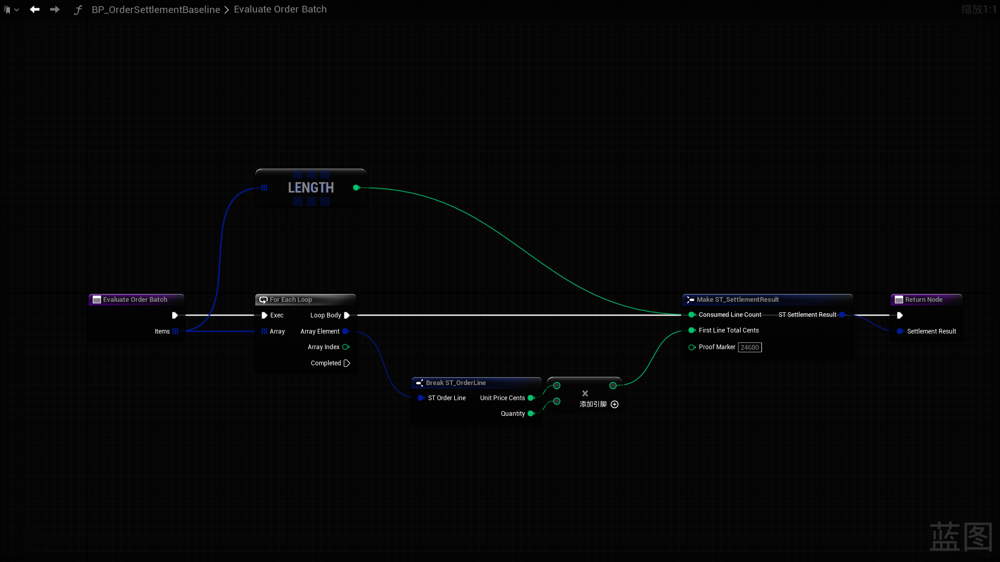

*Real UE 5.2 Blueprint graph capture after MCP creation, read-back, compilation, explicit per-package save, editor close, disk reload, and fixed-input execution.*

### V2 all-line subtotal slice

`EvaluateOrderBatchV2` leaves the V1 baseline unchanged and implements the first real business slice: iterate over every `Items` entry, calculate `UnitPriceCents * Quantity`, accumulate through the function-local `SubtotalCents` `LocalGet` / `LocalSet` actions, and return only after the loop completes. `ConsumedLineCount` still comes from array `Length`.

With fixed inputs `(5000, 2)` and `(7000, 3)`, plus `CustomerTier=0`, `Region=0`, and `bFirstOrder=false`, execution after a disk reload returns `ConsumedLineCount=2` and `SubtotalCents=31000`. This slice verifies all-line subtotal accumulation only; discount, tax, shipping, points, risk, and final decision logic are not implemented here yet.

```powershell
& "<UE_5.2>/Engine/Binaries/Win64/UnrealEditor-Cmd.exe" "<Project>/UEPluginDev.uproject" -unattended -nop4 -nosplash -NullRHI '-ExecCmds=Automation RunTests MCPBlueprint.BusinessWorkflow.OrderSettlementV2Subtotal' '-TestExit=Automation Test Queue Empty' -log
```

For this slice, `UEQuickStart.exe --test` exited with code 0, the targeted `MCPBlueprint.Graph.PromotableOperators` test passed, and one shared-prefix order-settlement run completed all three matching tests successfully. The V2 log includes `MCPBP_ORDER_SETTLEMENT_V2_SUBTOTAL_RESULT=ConsumedLineCount=2 SubtotalCents=31000`; the runner also verifies that all three related packages remain clean before and after invocation.

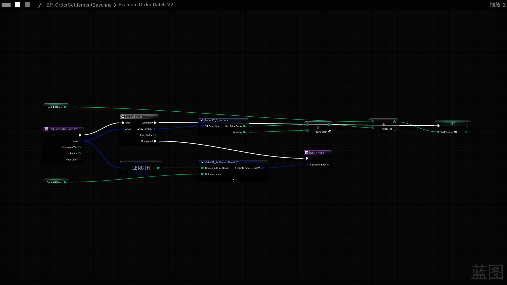

*Real UE 5.2 Blueprint graph: 11 nodes, with Entry → For Each Loop → LocalSet and Completed → Return execution paths, plus Length, Break, Multiply, Add, LocalGet/LocalSet, and the V2 result struct data flow.*

### Complex order-policy validation

`BP_OrderSettlementComplex` is an isolated duplicate of the baseline, so the V1/V2 reference assets remain unchanged. Its `EvaluateOrderBatchV2` graph is now a single connected 64-node, 81-edge long function: accumulate every order line, choose a tier discount, apply the first-order discount, then choose regional shipping. `Region=1` enters a local Branch: first orders receive free shipping, while non-first orders retain 1000. The graph then calculates net, 8% integer tax, total, points, risk score, and decision. The long function remains intact instead of being split into helpers, and its ABI is unchanged.

The long-function layout fix combines cached semantic stable keys, 12 barycentric candidates, real geometric crossing scores, bounded adjacent/global swaps, and whole-layer Y-offset search. Each layout has hard budgets of 4096 global-swap candidate evaluations and 2048 layer-offset metric evaluations. Running `FormatGraph(WholeGraph, Straight)` on the previous saved layout produces crossings `26 → 11`, `OverlapCount=0`, `BackwardEdgeCount=0`, and average pin delta `236 → 212`. A structurally identical copy with every NodeGuid regenerated produces the same metrics; all 17 graph-layout automation tests pass.

The fixed order lines remain `(5000, 2)` and `(7000, 3)`. Real `ProcessEvent` execution covers five paths:

| Case | Tier / Region / First order | Discount | Net | Tax | Shipping | Total | Points / Risk / Decision |
|---|---|---:|---:|---:|---:|---:|---|
| Regular order | `0 / 0 / false` | 0 | 31000 | 2480 | 800 | 34280 | `334 / 3 / 1` |
| Tier-2 first order | `2 / 1 / true` | 2550 | 28450 | 2276 | 0 | 30726 | `307 / 3 / 1` |
| Tier-2 regular order | `2 / 1 / false` | 1000 | 30000 | 2400 | 1000 | 33400 | `324 / 3 / 1` |
| Region 2 regular order | `0 / 2 / false` | 0 | 31000 | 2480 | 2000 | 35480 | `334 / 3 / 1` |
| Default branches | `99 / 99 / false` | 1500 | 29500 | 2360 | 2500 | 34360 | `318 / 3 / 2` |

`MCPBlueprint.BusinessWorkflow.OrderSettlementComplexPolicy` returns `Success` on UE 5.2; every output matches and the related packages remain clean before and after invocation. The four-test order-settlement regression passes. The asset is explicitly saved, closed, reopened, recompiled, and captured; `UEQuickStart.exe --test` also exits with code 0.

The screenshots below are the **current complex-logic acceptance baseline**. Native UE Comment Boxes identify three business regions; they are not a local-logic Before/After comparison. The overview remains unboxed because distant zoom levels reduce large comments to opaque color blocks. A future local business-logic change must first preserve a same-frame baseline, then capture the same view after nodes, pin defaults, or links actually change, with a Comment Box enclosing only that change.

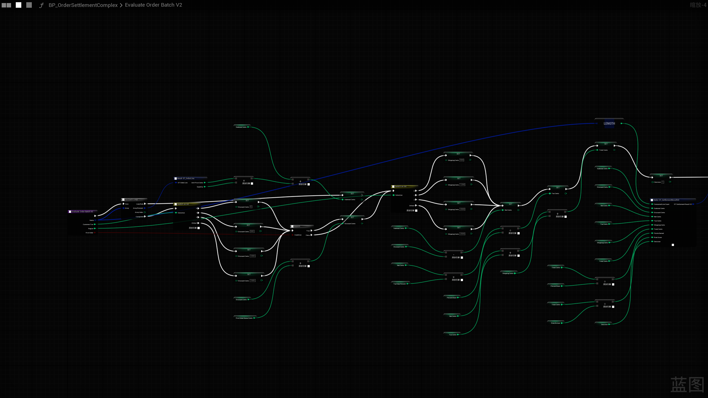

#### Current local baseline: tier discount and first-order bonus

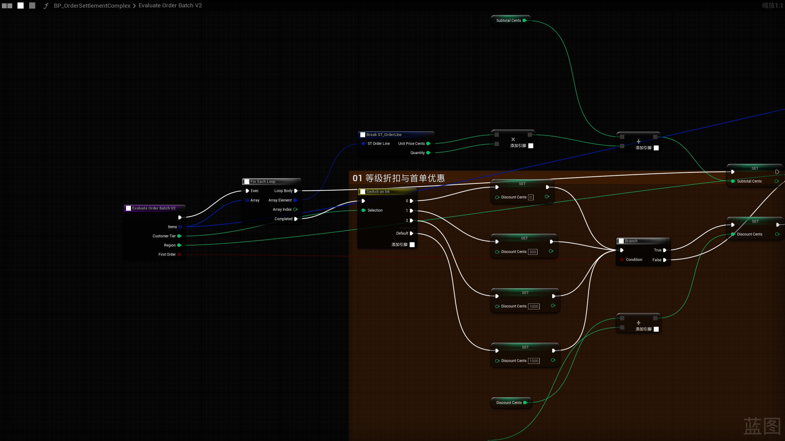

#### Current local baseline: regional shipping and tax calculation

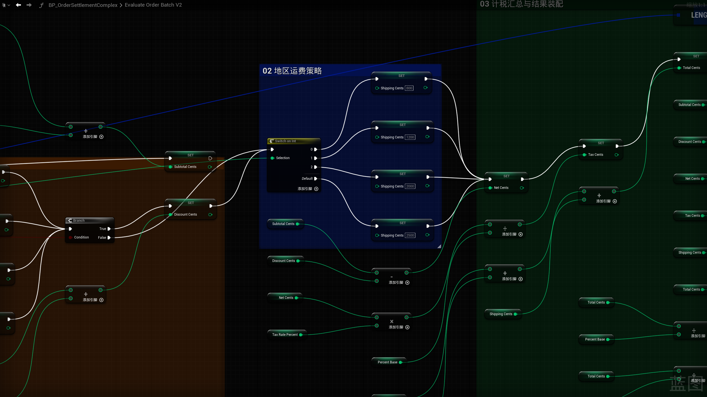

#### Current local baseline: result assembly

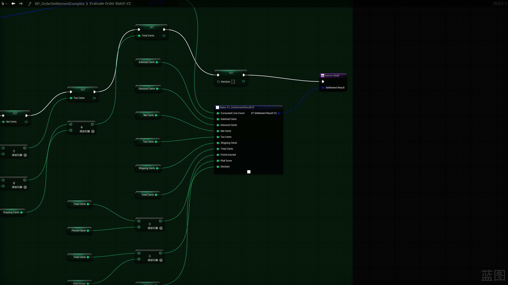

### Real local structural-logic change: free first-order shipping in Region 1

Before the change, the `Region=1` Exec path entered `Set ShippingCents(1000)` directly. The modified long function locally adds `Get bFirstOrder`, a Branch, and `Set ShippingCents(0)`. Case 1 is rewired so True receives free shipping, False reuses the original `1000` node, and both paths rejoin the original downstream `Set NetCents`. All other Region cases and the tax, total, points, and decision links remain unchanged.

| Path | Before Shipping / Total / Points | After Shipping / Total / Points |
|---|---:|---:|
| `Tier=2, Region=1, bFirstOrder=true` | `1000 / 32590 / 325` | `0 / 31590 / 315` |
| `Tier=2, Region=1, bFirstOrder=false` | `1000 / 33400 / 334` | `1000 / 33400 / 334` |

Before and After are both 2560×1440 at 1:1 zoom and use the unmoved Region Switch as their common frame anchor. In After, the native red Comment Box encloses only the new Getter, Branch, free-shipping Set, and the rewired original `1000` node. The targeted test returns `bExpectedOutput=true`, and the final four-test order-settlement regression passes 4/4.

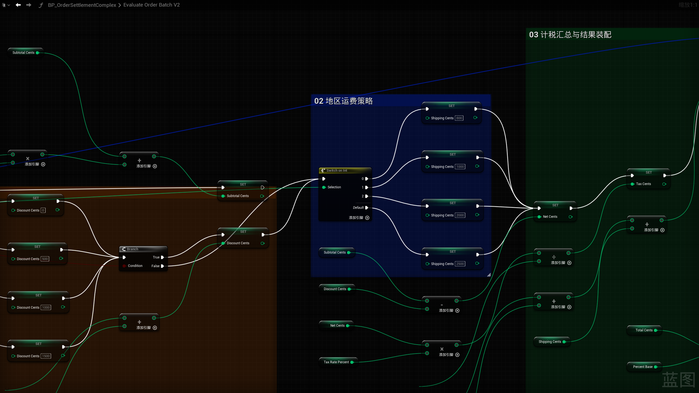

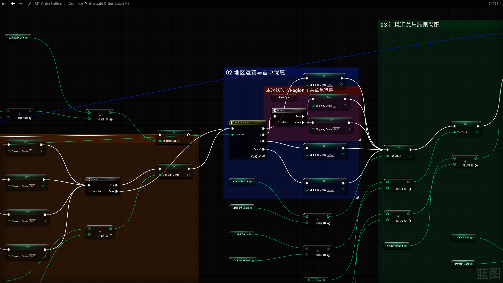

### Multi-logic regression unit 1: first-order discount becomes 5% of subtotal

The previous graph added a fixed 750 through `Get FirstOrderBonusCents`. This unit removes that Getter and adds a consumer-local `Get SubtotalCents` plus integer `Divide(B=20)`, rewiring the data path to `Subtotal / 20 → Add Discount → Set DiscountCents`. The first-order case now returns `Discount=2550, Net=28450, Tax=2276, Shipping=0, Total=30726, Points=307`; the other three cases remain unchanged, and the full regression passes 4/4.

This scenario originally exposed an ordering limitation: a newly created wildcard Divide received `PinDefaults` before its connections could resolve the pin type, so `B=20` failed in the same patch. This is now fixed: non-wildcard defaults keep their original order, while defaults on still-wildcard pins of newly created nodes are validated and applied after all Connections and Unreal's native promotion, but before layout and compile, inside the same transaction. Unresolved wildcards, invalid defaults, and failed connections roll back the whole patch. `PromotedType` remains a Real/Double assertion and is not extended into fake `int` pre-promotion.

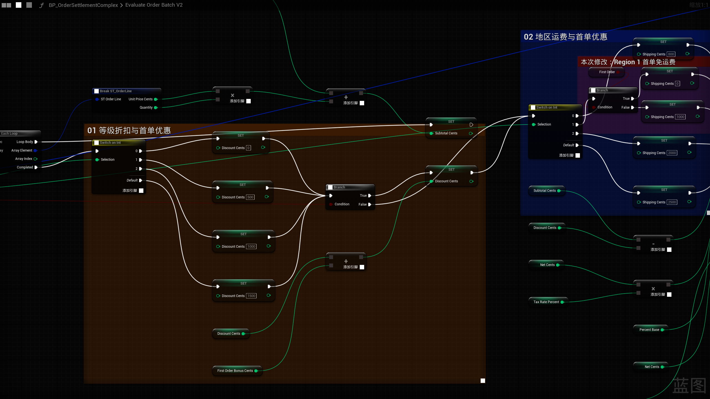

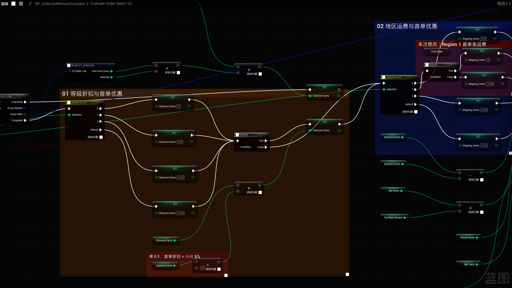

### Multi-logic regression unit 2: unsupported regions require manual review

The previous graph always executed `Set Decision(1)` after `Set TotalCents`. This unit adds `Get Region`, a `Switch on Int` with three explicit cases, and `Set Decision(2)`. Regions `0/1/2` still enter the original approval node, Default enters manual review, and both paths rejoin the original Return. The test table adds a positive Region 2 case and changes Region 99 from Decision 1 to 2; all five business cases and all 4/4 order-settlement automation tests pass.

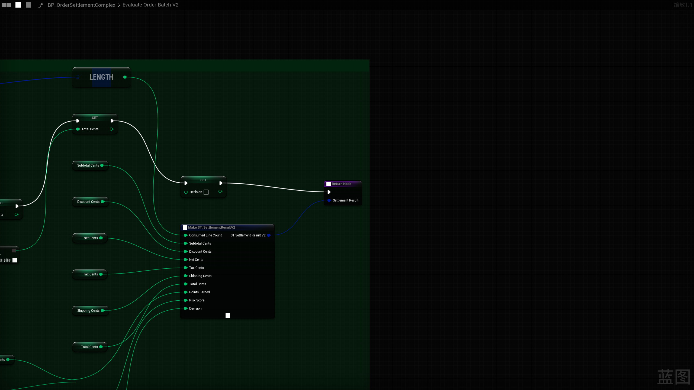

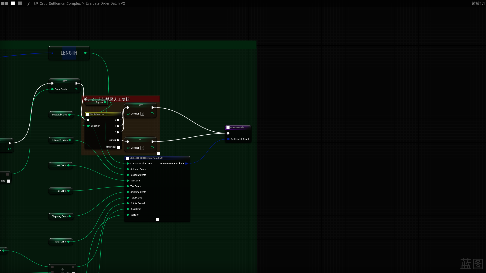

### Multi-logic regression unit 3: points exclude shipping

The original points path was `TotalCents / 100 → PointsEarned`. This unit inserts a consumer-local `Get ShippingCents` and integer Subtract between the existing Total Getter and Divide, producing `(TotalCents - ShippingCents) / 100`; the original points Divide and Make Struct input remain in use. The five point results become `334 / 307 / 324 / 334 / 318`, while all amount, risk, and decision fields remain unchanged. The full regression passes 4/4.

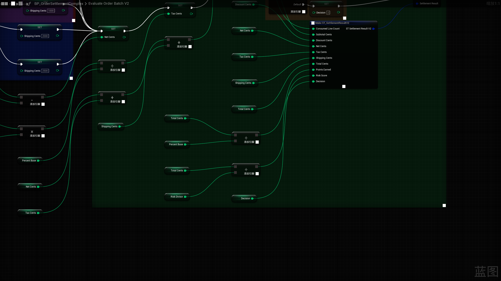

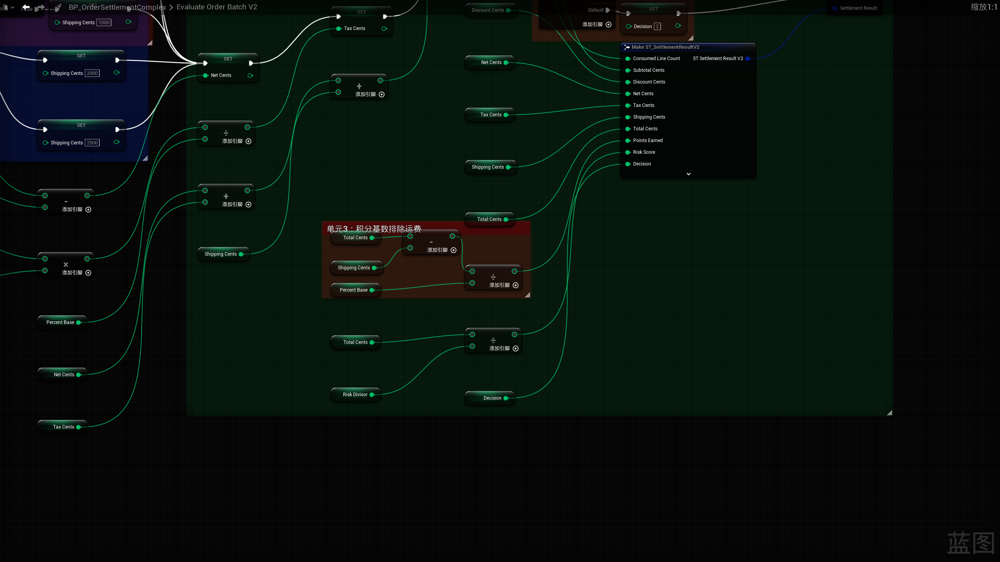

## Safety and behavior boundaries

- New or moved Blueprint asset paths must be valid standalone package paths under `/Game`; existing in-memory and on-disk package collisions are rejected.
- Level Blueprints can be read and graph-edited by object path, but `SaveAsset`, `DeleteAsset`, `RenameAsset`, and `DuplicateAsset` do not operate on them because those actions affect the owning level package. Use a World Editor workflow for the level itself.
- `CloseAsset` reports whether an editor was open and verifies that all editors for the Blueprint and its subobjects actually closed; cancellation is returned as an error.
- `ReloadBlueprintFromDisk` defaults to a read-only dry run and reports package dirty/editor state plus bounded file path, size, timestamp, and MD5 metadata. Because Unreal reloads the entire package, the tool stably enumerates top-level `RF_Public|RF_Standalone` assets and rejects any package containing an asset other than the target Blueprint; the structured rejection reports the bounded conflict list and `bCanApply=false`. Apply requires all three values `bDryRun=false`, `bDiscardUnsavedChanges=true`, and `bAcknowledgeUndoHistoryReset=true`. It closes and verifies editors for every top-level package asset, calls Unreal's official package reload API, reacquires the replacement Blueprint by object path, verifies a clean package, and optionally reopens the editor. Once Unreal reports a real reload, all post-reload verification errors are aggregated only after the requested reopen attempt, and `bReloadedFromDisk` remains true. Unreal necessarily resets the entire editor Undo/Redo transaction history during package reload to prevent stale references; this effect is reported before and after apply. The tool never saves assets, performs Save All, bypasses package-reload callbacks, or clears references manually.
- Member and local variable defaults are validated with Unreal's K2 pin rules before mutation; malformed UE text values are rejected.
- `ModifyVariable` accepts optional `Category` and `Tooltip` for member variables. An empty `Category` restores Unreal's default category; an empty `Tooltip` removes its metadata. The tool updates the variable declaration transactionally, marks the Blueprint modified without forcing a structural rebuild, participates in Undo, rolls back on compile failure, and never saves automatically. `GetBlueprintOverview` returns `Tooltip` when present.
- Variable type changes, renames, and removals reject unsafe operations while derived Blueprint classes are unloaded. Load descendants first so inherited references can be checked; child references must be removed before deleting a declaration.
- With automatic compilation enabled, transactional Blueprint mutations return bounded compiler diagnostics and roll back when compilation does not reach `UpToDate` or `Warning`; when disabled, mutation results report `CompileStatus: Skipped`. Rollback status is reported explicitly.
- Component names are validated against the complete Blueprint member namespace. Ambiguous short component class names are rejected; use a full class path to disambiguate.
- Component classes must be Blueprint-spawnable. A new SceneComponent without an explicit parent attaches to the unique local, inherited, or native scene root; ambiguous multi-root hierarchies are rejected instead of creating a second root.
- SCS hierarchy edits snapshot the local hierarchy for Undo and roll back on compile failure. `SetRootComponent` only replaces one unambiguous local scene root, never an inherited/native root.
- `GetComponentProperties` uses `Offset`/`MaxResults` pagination (maximum 100 properties), truncates individual exported values at 8,192 characters, and applies an overall serialized property budget with continuation metadata.
- `GetClassDefaults` uses the exact editable-property filter enforced by `SetClassDefaults`, returns stable pagination with declaring-class/inheritance metadata, and bounds individual values at 8,192 characters plus an overall serialized property budget.
- Native fixed-array reflection properties (`ArrayDim > 1`) are omitted from Class Default and component-template property maps because the map protocol cannot address individual fixed-array elements safely; ordinary `TArray` properties remain supported through UE text format.
- `GetBlueprintOverview` applies stable `Offset`/`MaxResults` pagination to every section (maximum 50 requested entries per section), bounds each section by serialized output budget, bounds variable defaults at 8,192 characters, and returns at most 16 input and 16 output signature pins per function.
- `ListBlueprintMembers` uses one stable page across functions, Custom Events, dispatchers, and local variables. Signatures return at most 16 pins per semantic direction and distinguish `SignatureDirection` from the inverse physical K2 `NodeDirection` used by entry/result nodes.
- `GetComponents` returns a stable paginated flat local list and inherited list (maximum 100 entries each), plus a local hierarchy tree capped at 200 nodes and depth 64. Flat traversal uses an explicit stack and reports truncation above 10,000 components or depth 256.
- `GetGraphDetail` returns at most 25 stably ordered nodes per call under a serialized page budget. Each node exposes independently paginated visible pins (maximum 64), with a per-node pin budget, at most eight bounded links per pin, and explicit truncation/continuation metadata.
- Tool schemas reject unknown top-level arguments and validate the nested graph-patch, signature, pin-default, component-property, and class-default structures before execution.
- HTTP request bodies are rejected above 1 MiB after the engine HTTP server has received them. Serialized responses are limited to 16 MiB; tool text is limited to 1 Mi characters, and image output is limited to four images, 8 Mi base64 characters per image, and 12 Mi total.
- Compile diagnostics return at most 200 error/warning entries, 4,096 characters per message, 256 Ki characters in total, and 32 unique node GUIDs per entry. `TotalErrors`, `TotalWarnings`, returned counts, and `bTruncated` disclose omitted diagnostics. `CompileBlueprint` and `GetCompileErrors` return MCP errors for non-success terminal states; `bWarningsAsErrors` can make warnings fail the call.
- Request timeout settings bound dispatcher waiting, but synchronous Blueprint/UObject work already running on the game thread cannot be preempted. Avoid immediate retries after a client-side timeout until editor state is known.
- Blueprint listing and deletion are refused while Asset Registry discovery is running, so pagination and reference checks are not based on incomplete data.
- Destructive asset deletion is not undoable. Without `bForce`, referenced assets are refused and normal editor deletion preserves live references; forced deletion may clear references and break dependents.
- Normal `DeleteAsset` uses Unreal's deletion-reference model to detect whether Undo/Redo history retains the target Blueprint or one of its generated instances. That state returns the stable structured failure `FailureCode=UndoHistoryReference`, `bDeletionAttempted=false`, and `bDeleted=false`, while unrelated transactions may remain and are verified unchanged after a successful normal delete.
- Forced deletion is accepted only when the entire editor transaction queue, including Undo and Redo entries, is empty. Otherwise it returns `FailureCode=ForceRequiresEmptyUndoHistory` without attempting deletion. The production tool does not call `ResetTransaction`; this contract promises that force deletion will not sacrifice history that existed before the call, not that Unreal's internal force-delete implementation never resets a transaction buffer created during the call.
- A persisted target must be the only registered top-level asset in its package. Missing Registry identity fails closed, and a package with a second asset returns `FailureCode=MultiAssetPackageUnsupported` without deletion; move each asset to its own package first.
- A successful response sets `bDeleted=true` only after the target UObject and Asset Registry entry are gone and the single-asset package file is removed or reported deleted by the active source-control provider. The response includes object, Registry, file/source-control, and transaction-history verification fields; a partial or unverifiable engine deletion is returned as an error instead of a false success.
- Screenshot file output is restricted to `Saved/MCPBlueprint/Screenshots`; absolute paths, traversal, and existing link/reparse-point paths are rejected. Existing PNG files are not replaced unless `bOverwrite=true`; these checks reduce link-path and accidental-overwrite risks but do not claim to eliminate external filesystem races.
- Source-only compatibility review is not a substitute for compiling and testing inside each target engine version.

## Configuration

Open **Project Settings > Plugins > MCP Blueprint**.

| Setting | Default | Description |
|---|---:|---|
| Port | 8766 | First HTTP port to try. |
| Auto Start | true | Start the server when the editor module loads. |
| Request Timeout | 30 seconds | Normal tool timeout. |
| Compile Timeout | 120 seconds | Compile/patch timeout. |
| Auto Compile After Modify | true | Compile after supported write operations. |

## Current Testing Focus

The current UE 5.2–5.8 Win64 BuildPlugin matrix passed from one source state, and the version-matched packages are deployed with matching package/install DLL hashes across all seven engine versions. Every deployed EnginePlugin passed real MCP `initialize`, `tools/list` (55), and `ping` calls in an isolated content-only project. These are release-preparation packages rather than a submitted Fab product: `MarketplaceURL`, the transition out of beta, and publication require a real listing plus explicit approval.

## Verified media

The images in [`Images/Fab`](./Images/Fab/) are uncomposited PNGs captured from real Unreal Blueprint graph widgets. Captions and workflow context are maintained in [FAB_LISTING.md](./FAB_LISTING.md). They contain no local filesystem paths and are not presented as HTTP-response or variable-Details screenshots. The arithmetic pair shows the persisted Real/Double `Add → Subtract → Multiply → Divide → Result` chain in two truthful views: the zoom-to-fit capture covers the left/middle chain, while a node-focused capture covers `Subtract → Multiply → Divide → Result` because UE 5.2's off-screen graph-widget capture can omit far-right node bodies during a full-graph frame.

The current 55-tool source passed UE 5.2 compilation and the final non-NullRHI editor suite completed 36/36. `MCPBlueprint.Function.ModifySignatureSafety` passed persisted declaration/external-caller coverage for dry-run invariants, approvals, AddInput/AddOutput, PinId/connection-preserving rename, data-loss-gated remove/type change, one-step Undo, injected-failure rollback, and official same-batch package reload with object-path reacquisition. `DeleteAsset`, `ReloadBlueprintFromDisk`, Struct/Enum, graph, HTTP, and the 55-tool Schema Matrix also passed. The same source then completed the refreshed UE 5.2–5.8 package/deployment/runtime matrix with exactly 55 tools per version.

Packaging verification proves that every target engine can compile the plugin and receive the expected deployed layout; it is not a substitute for exercising every MCP operation in every editor version. Broader cross-version real-editor regression of the remaining tool surface, save/restart persistence, and cleanup behavior remains ongoing.

## Known limitations

- `Auto` local displacement is deliberately bounded to 128 existing nodes, 128 closure iterations, and 100000 graph units. It fails closed at Function Entry or Comment containment boundaries instead of expanding into an unsafe whole-graph rewrite; use a smaller insertion or explicitly reorganize the protected region.
- An asset retained by Undo/Redo history cannot be deleted normally until that retaining history is released. Force deletion has the stricter whole-editor requirement that the complete Undo/Redo queue be empty before the call.

## Later Roadmap

Development has resumed in bounded, independently verified units. The current descriptive-variable-metadata unit covers `Category` and `Tooltip`; the entries below are remaining directions, not commitments to a specific version or date.

- **Event signatures and refactoring:** extend the verified function-signature safety model to Custom Event and Event Dispatcher signatures and flags.
- **Remaining variable metadata:** extend variable editing to cover access control, Expose on Spawn, SaveGame, replication, and RepNotify settings.
- **Graph lifecycle and impact analysis:** create, rename, and remove supported graph types; remove implemented interfaces; inspect references and affected assets before refactoring.
- **Blueprint types:** create additional Blueprint asset types such as Blueprint Interfaces, Function Libraries, and Macro Libraries.
- **Authoring and diagnostics:** improve selection layout inside Comment containers, member documentation, and debugging-oriented inspection.

These are candidate directions, not commitments to a particular release or date. They will be refined using evidence from testing and real usage.

## AI-Assisted Usage

If a tool, parameter, or workflow is unclear, you can provide this document to an AI assistant and ask it to read the documentation before attempting the operation with the MCP tools actually available in the current Unreal Editor session. Confirm target assets before write operations, and read the affected Blueprint state back afterward instead of treating a successful tool response alone as completion.

## Support

For questions, feedback, or the UE technical discussion group, use the unified contact page below.

- **Contact:** [Email, WeChat group, and X](https://mengzhishanghun.github.io/mengzhishanghun/contact/)
