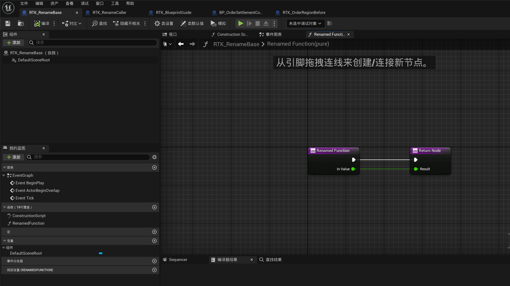
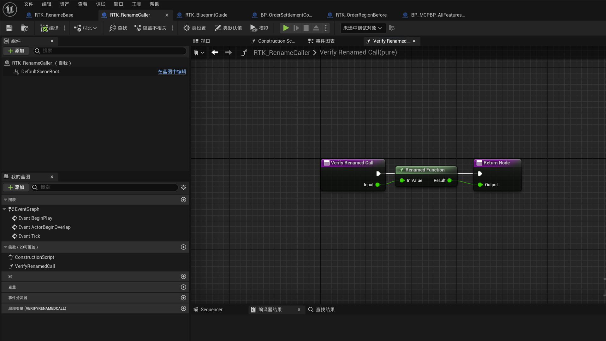
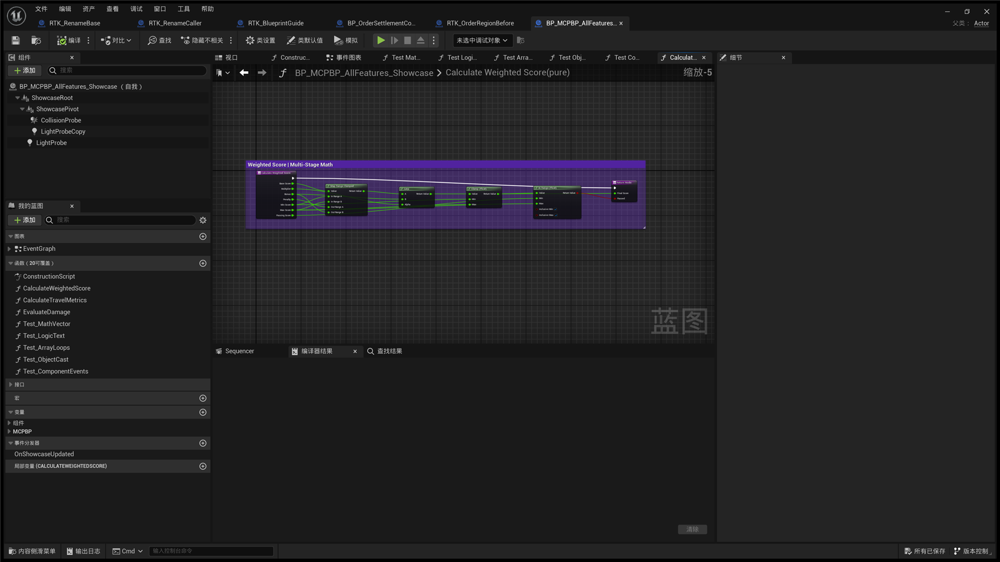
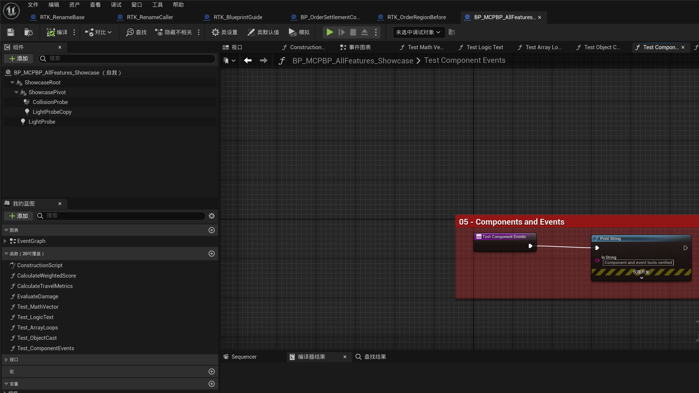
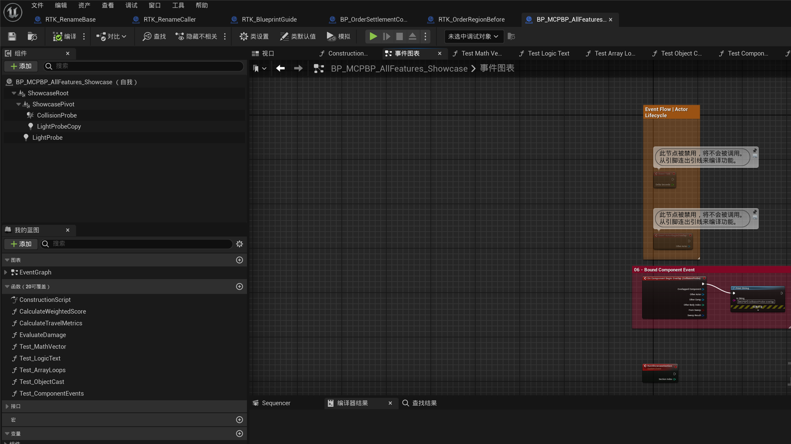

[English](./README.md) | [中文](./README_CN.md)

# MCPBlueprint User Guide

MCPBlueprint is an editor-only MCP server for discovering and safely editing Unreal Engine Blueprints. This guide covers the **55 tools registered by the current module**. The live editor tools/list response is authoritative for the exact runtime schema.

## Requirements and installation

- Unreal Engine 5.2+ Editor on Windows, macOS, or Linux.
- An MCP client that supports a local HTTP server.
- A package matching the exact Unreal Engine minor version.

Install once per engine:

```text
<UE_5.x>/Engine/Plugins/Marketplace/MCPBlueprint/
```

MCPBlueprint is an optional engine plugin (Installed=true, EnabledByDefault=true). Do not copy it into every project or add it to a project's .uproject; restart the editor after replacing the package. The toolbar shows the local endpoint (normally http://127.0.0.1:8766/mcp; occupied ports advance up to nine times). Use your MCP client's own setup flow.

## Connect an MCP client

MCPBlueprint starts its local HTTP server with the editor when **Auto Start** is enabled. Give the client the endpoint shown by the plugin toolbar; do not hard-code the default when another process may already occupy that port. The server binds only to the local machine.

`initialize` and `tools/list` are normal client handshake calls. `ping` is a troubleshooting check, not a required manual step for every session. Browser-style requests may use only `localhost`, `127.0.0.1`, or `[::1]` as `Origin`; ordinary non-browser MCP clients can omit `Origin`.

The live `tools/list` response is the schema authority. Refresh it after replacing the plugin package or reconnecting the editor instead of relying on a cached tool list.

## Concept map: choose the right state

```text
Blueprint asset
├─ parent class (inheritance) ─────────── ReparentBlueprint
├─ Class Default Object (class defaults) ─ Get/SetClassDefaults
├─ member variable declaration
│  └─ variable default ────────────────── AddVariable / ModifyVariable
├─ function declaration
│  └─ signature pins ──────────────────── CreateFunction / ModifyFunctionSignature
├─ graph node
│  └─ graph-pin defaults ──────────────── SetPinDefaults / ApplyGraphPatch
└─ Actor Blueprint construction script (SCS)
   └─ component template properties ────── Get/SetComponentProperties
      └─ attachment parent ─────────────── AddComponent / ReparentComponent / SetRootComponent
```

- A variable default is a member declaration's initial value—not a node pin or CDO property.
- Function signature pins declare the function contract and affect callers. Graph-pin defaults are literals on one node instance.
- Component template properties are values on a local SCS component template. Its attachment parent is a hierarchy relationship, not the Blueprint parent class.
- Class defaults are editable CDO properties, not level-instance overrides.

## Recommended safe workflow

1. Discover paths and identities with ListBlueprints, GetBlueprintOverview, GetGraphDetail, or GetComponents.
2. Use bDryRun=true whenever supported and read every impact, blocker, and approval requirement.
3. Apply only returned paths, GUIDs, pin IDs, component names, and SpawnerId values—never guesses.
4. Read the changed state back, compile where relevant, then call SaveAsset only when persistence is desired.

Ordinary edit tools mark assets dirty but do not silently save; `SaveAsset` is the explicit persistence tool, while `DeleteAsset` intentionally removes the asset from disk after its stricter safety checks. ApplyGraphPatch uses one transaction and attempts automatic rollback on failure; an unproven recovery is reported explicitly. Safety-sensitive tools fail closed when references, generated state, inheritance, or transaction recovery cannot be safely established.

## Complete feature matrix (55 tools)

The table summarizes important inputs and gates; it is not a replacement for the required fields and constraints returned by live `tools/list`. For nonvisual operations, verification names the concrete query, compile result, or disk/Asset Registry check to perform; a screenshot is not claimed where none is supplied.

| Tool | Purpose | Key inputs / gates | Verify; screenshot/evidence |
|---|---|---|---|
| ListBlueprints | Page Blueprint assets. | Filters; use bounded pages. | Confirm the returned asset path and parent class. |
| GetBlueprintOverview | Read parent, graphs, members, components, interfaces. | BlueprintPath. | Inspect the returned overview before and after a related edit. |
| ListBlueprintMembers | Page functions, events, dispatchers, locals. | BlueprintPath. | Confirm the named member and its pagination result. |
| GetGraphDetail | Read node GUIDs, pins, defaults, links, positions. | BlueprintPath; optional GraphName. | Before/after response; capture separately if visual proof is needed. |
| SearchGraphNodes | Find legal action SpawnerId values. | Blueprint/graph/query; never invent IDs. | Use the returned action ID in the patch request. |
| GetCompileErrors | Compile and return bounded diagnostics. | Blueprint; optional warnings-as-errors. | Confirm compile status and inspect errors/warnings. |
| CreateUserDefinedStruct | Create a User Defined Struct under /Game. | AssetPath; dirty, not auto-saved. | Query GetUserDefinedStruct, then save; no screenshot supplied. |
| GetUserDefinedStruct | Read struct fields and stable field GUIDs. | StructPath. | Inspect fields and retain GUIDs for a later modification; no screenshot supplied. |
| ModifyUserDefinedStruct | Make one field operation. | Struct/op data; addressed field by GUID; dry-run; remove/type needs data-loss approval. | Review dry-run impact, query fields again, then save; no screenshot supplied. |
| CreateUserDefinedEnum | Create a User Defined Enum under /Game. | AssetPath; dirty, not auto-saved. | Query GetUserDefinedEnum, then save; no screenshot supplied. |
| GetUserDefinedEnum | Read bounded enum entries/serialized values. | EnumPath. | Inspect entry names and serialized values; no screenshot supplied. |
| ModifyUserDefinedEnum | Make one enum operation. | Enum/op data; dry-run; remove/move needs semantic-change approval. | Review dry-run impact and query entries again; no screenshot supplied. |
| AddVariable | Declare a member variable. | Blueprint, name, type; optional default/category/editable. | Check the variable table in GetBlueprintOverview and compile. |
| ModifyVariable | Alter declaration type/default/name/editability/category/tooltip. | Blueprint/variable; type change rejects references; RepNotify must be removed before rename. | Compare the variable table in GetBlueprintOverview and compile. |
| RemoveVariable | Remove a member variable. | Blueprint/variable; references reject; bForce only removes local references. | Overview/graph + compile. |
| CreateFunction | Create a function graph/signature. | Blueprint/name; inputs/outputs; optional pure/override. | Entry/result GUIDs, graph + compile. |
| RenameFunction | Rename declared function and safe loaded references. | Dry-run default; apply needs bDryRun=false + reference approval; unsafe scans/bindings reject. | Confirm renamed declaration and caller, compile, save, close, reopen, and query the caller again; **real screenshots below**. |
| ModifyFunctionSignature | Add/rename/remove/change one parameter. | Function graph GUID; declared pin ID; dry-run default; approval; remove/type needs data-loss approval. | Inspect the declaration and affected callers, then compile; the capture below is illustrative only. |
| RemoveFunction | Remove a declared function graph. | Blueprint/function; referenced or unsafe/unloaded cases reject. | Confirm its absence in members/graphs and compile. |
| CreateCustomEvent | Create a custom event node. | Blueprint/event; optional graph/inputs. | Inspect the returned NodeGuid in GetGraphDetail. |
| AddEventNode | Add native overridable event. | Blueprint/event; idempotent. | Inspect the returned GUID in GetGraphDetail. |
| AddBoundEvent | Bind Actor component/Level Blueprint actor delegate. | Blueprint/event + target; Actor SCS only, not UMG WidgetTree events. | Inspect the returned GUID and event graph. |
| AddLocalVariable | Add a function local. | Blueprint/function/name/type. | Confirm it in ListBlueprintMembers and the function graph. |
| RemoveLocalVariable | Remove an unused function local. | Blueprint/function/name; references reject. | Confirm its absence in members and graph. |
| AddNodePin | Add optional Sequence/container/Switch pins. | Blueprint/node GUID; variable-pin nodes only. | Compare the returned pin list with GetGraphDetail. |
| RemoveNodePin | Remove one optional node pin. | Blueprint/node GUID/pin name; required pins reject. | Confirm absence in GetGraphDetail. |
| AddInterface | Implement a Blueprint Interface. | Blueprint/interface path; idempotent. | Confirm interface and generated members in overview. |
| AddEventDispatcher | Declare a multicast dispatcher. | Blueprint/name; optional inputs; idempotent. | Confirm it in members and find its actions with SearchGraphNodes. |
| RemoveEventDispatcher | Remove dispatcher/signature graph. | Blueprint/name; references/unloaded descendants reject. | Confirm its absence in members/graphs. |
| ApplyGraphPatch | Atomically create/connect/disconnect/remove/move graph nodes. | Blueprint; legal SpawnerId; max 60 ops; dry-run; optional skip compile. | Match the TempId-to-GUID map in GetGraphDetail, then compile; graph captures below. |
| SetPinDefaults | Set literal defaults on identified graph-node pins. | Blueprint/node GUID/nonempty UE-text map; connected pins keep their connection and ignore the literal at runtime. | GetGraphDetail + compile. |
| FormatGraph | Plan/apply deterministic graph layout. | Blueprint; scope/style; dry-run; whole graph cap 1000 nodes. | Review planned metrics/positions, then inspect graph positions. |
| AddCommentBox | Add native comment around explicit nodes. | Blueprint/title/node GUIDs; dry-run previews bounds. | Inspect the returned comment GUID/style in GetGraphDetail. |
| GetComponents | Read Actor Blueprint SCS hierarchy. | Blueprint; Actor/SCS scope. | Tree/list response; no component screenshot supplied. |
| AddComponent | Add an Actor Blueprint SCS component. | Blueprint/class/name; scene parent; non-Actor rejects. | Components/properties + compile. |
| SetComponentProperties | Set local component-template values. | Blueprint/component/nonempty UE-text Properties; editable non-array only; transaction required. | Property readback + compile; no screenshot supplied. |
| RenameComponent | Rename local SCS component/member references. | Blueprint/component/new name. | Confirm the name in component hierarchy and overview, then compile. |
| RemoveComponent | Remove local SCS component, promote children. | Blueprint/component; references/unloaded derived classes reject. | Components/graph + compile. |
| ReparentComponent | Change a local SceneComponent attachment parent. | Blueprint/component/new parent; no self/descendant; actual roots use SetRootComponent. | Hierarchy + compile; no screenshot supplied. |
| SetRootComponent | Make local SceneComponent the SCS root. | Blueprint/component; inherited/native roots cannot be replaced. | Inspect the SCS hierarchy and compile. |
| DuplicateComponent | Copy local component/template under its parent. | Blueprint/source/new name; actual local root excluded. | Components/properties + compile. |
| GetComponentProperties | Page editable component-template properties in UE text. | Blueprint/component. | Inspect property names and UE-text values; no screenshot supplied. |
| GetClassDefaults | Page editable CDO properties in UE text. | Blueprint. | Inspect editable CDO properties and values; no screenshot supplied. |
| SetClassDefaults | Set supported CDO properties. | Blueprint/nonempty UE-text Properties; editable non-array; transaction required. | CDO readback + compile; no screenshot supplied. |
| CreateBlueprint | Create Blueprint asset in memory. | Asset path/parent class; dirty until saved. | Open the new asset or query its overview, then save. |
| ReparentBlueprint | Change Blueprint parent class. | Blueprint/new parent; dry-run; hierarchy/recovery needs data-loss approval; compile rollback. | Dry-run + overview parent + compile; no screenshot supplied. |
| CompileBlueprint | Explicitly compile Blueprint. | Blueprint; optional warnings-as-errors. | Confirm compile status and inspect diagnostics. |
| SaveAsset | Persist a dirty Blueprint, User Defined Struct, or User Defined Enum. | Asset path; after verification/user approval. | Save + disk/Asset Registry state. |
| OpenAsset | Open Blueprint Editor. | Blueprint. | Editor/response; prerequisite for capture. |
| CloseAsset | Close Blueprint Editor. | Blueprint; no-op if closed. | Confirm the editor is closed, then reopen if needed. |
| ReloadBlueprintFromDisk | Reload loaded standalone Blueprint. | Dry-run default; apply needs discard-unsaved + Undo-reset acknowledgements. | State response then reopen/readback. |
| DeleteAsset | Delete Blueprint asset. | Blueprint; references reject unless force; non-undoable; force needs empty transaction queue. | Registry/disk absence; no screenshot supplied. |
| RenameAsset | Rename/move Blueprint asset. | Blueprint/new path; redirectors; save new path. | Asset Registry new-path readback. |
| DuplicateAsset | Duplicate asset in memory. | Blueprint/new path; save explicitly. | Query or open the new asset, then save. |
| CaptureGraphScreenshot | Capture an open graph PNG/viewport metadata. | Open asset first; graph/node/viewport mode; initialized widget required. | PNG + transform/token; real graph images below. |

## Focused write guides

### ApplyGraphPatch: one transactional graph change

Call SearchGraphNodes first and use only returned `SpawnerId` values. A patch can create nodes with temporary IDs, connect or disconnect pins, remove or move already-present nodes by stable GUID, set pin defaults, and apply layout. Pin references use a patch temporary ID for new nodes or `@<NodeGuid>` for already-present nodes. The combined operation limit is 60 across node creation, connections, disconnections, removals, and moves.

Start with `bDryRun=true`. Review normalized operations and every blocker; dry-run may explicitly say that Action Registry nodes, generated pins, type promotion, or exact post-layout state cannot be proven without mutation. Apply the same reviewed patch once. The real write executes in one transaction and attempts automatic rollback on failure. If recovery cannot be proven, the response reports that explicitly; stop and read the graph back before any retry. Then call GetGraphDetail, compile, and explicitly save only when persistence is wanted. Use the default Auto layout for normal authored logic; use explicit positions or `LayoutScope=None` only for a real fixed-layout requirement.

### ModifyVariable: variable defaults

Change only the supplied declaration fields: TypeName, DefaultValue, NewName, bInstanceEditable, Category, and Tooltip. Empty Category restores Unreal's default category; empty Tooltip removes metadata. Read the variable table with GetBlueprintOverview, compile, then save deliberately. This is neither SetPinDefaults nor a class-default write.

### ModifyFunctionSignature: function signature pins

Address the declaration with FunctionName plus stable FunctionGraphGuid, and a declared parameter only by stable PinId. Submit exactly one operation. Dry-run is default; apply requires reference approval, and remove/type change also requires potential-data-loss approval. The tool scans callers, rejects unsafe override/interface/RepNotify/delegate/AnimGraph cases, updates ordinary calls transactionally, compiles affected Blueprints, and never saves automatically.

### SetPinDefaults: graph pin defaults

Use a returned NodeGuid and a nonempty PinDefaults object mapping pin names to UE text literals. This changes one node's input literal—not the function signature, variable default, or CDO. Read back that graph and compile. Invalid, non-input, or read-only pins reject. A connected input keeps its connection, so the stored literal is ignored at runtime.

### SetComponentProperties and ReparentComponent

SetComponentProperties writes editable non-array **local SCS component-template** values from a nonempty UE-text Properties map. Read with GetComponentProperties first, then reread and compile. ReparentComponent changes the **attachment parent**; both sides must be local SceneComponents and cycles reject. An actual local root must use SetRootComponent. Neither changes the Blueprint parent class.

### SetClassDefaults: CDO defaults

Read GetClassDefaults, review the returned UE-text property map, apply supported editable non-array Properties, reread, compile, then save. These are class defaults—not instance overrides, graph literals, variable declarations, or component templates.

### ReparentBlueprint: parent class

NewParentClassPath accepts a full native path, unique loaded short name, or generated Blueprint class. Dry-run reports old/new classes, hierarchy risk, and duplicate inherited interfaces. By default the new parent must derive from the old; hierarchy changes or missing-parent recovery require bAllowPotentialDataLoss=true. Graph nodes refresh and compilation runs; a failed compile attempts transaction rollback, and an unproven recovery must be reported and read back before retrying.

## 13 fresh captures from one UE 5.2 session

All 13 images below were freshly captured in one UE 5.2 D3D11 editor session. MCP opened and located each graph, but the delivered images use pixels from the real Blueprint Editor window: ordinary graphs use the maximized 2560×1440 window, while extra-wide graphs use the same window extended to 3200×1800; every result is uniformly downscaled to 1920×1080. Each before/after pair uses the same source window size. They do not use the `FWidgetRenderer` off-screen PNG as the final artifact, avoiding the Slate Brush placeholder blocks observed on UE 5.2. Captures are visual evidence only: safety-sensitive changes still require the relevant dry-run, concrete state query, compilation result, explicit save, and reopen verification.

### Function rename: saved, reopened, and caller queried again

RenameFunction defaults to impact analysis. Apply requires bDryRun=false and bApproveReferenceUpdates=true; it rejects unsafe scans, RepNotify, protected graphs, unloaded derived Blueprints, CreateDelegate, and opaque AnimGraph bindings. This run saved the renamed function, closed and reopened the asset, then used GetGraphDetail again to confirm that the caller node title resolved to `Renamed Function`.





### Function, event, and graph showcase







### Controlled graph-editing comparisons

CalculateScore, Points, Discount, and Rename are fresh controlled tutorial assets from this session. The Region 1 Before frame is a copy of the Complex asset with the pre-change logic restored. Each before/after pair uses the same source window size, Dock layout, zoom procedure, and 1920×1080 output; the Region 1 pair also uses equal-size local crops. These graph captures do **not** prove component templates, class defaults, parent-class reparenting, Structs, or Enums.


## Screenshot coverage: honest status

| Area | Screenshot status | Nonvisual verification |
|---|---|---|
| Function rename | Two fresh UE 5.2 save/reopen captures above. | This run completed dry-run review, compilation, explicit save, reopen, and a post-reopen caller query; repeat that chain for every rename. |
| Function signatures and events | Three fresh UE 5.2 showcase captures above. | Signature/member query, caller impact, and compile result. |
| Graph patch, pin defaults, layout | Eight fresh controlled graph captures above. | GetGraphDetail before/after and diagnostics. |
| Component properties / attachment parent | **No screenshot supplied.** | GetComponents / GetComponentProperties before/after + compile. |
| Class defaults | **No screenshot supplied.** | GetClassDefaults before/after + compile. |
| Blueprint parent class | **No screenshot supplied.** | Reparent dry-run, overview parent, compile. |
| User Defined Struct / Enum | **No screenshot supplied.** | Query fields or entries again and review the dry-run impact. |
| Asset lifecycle, members, discovery | **No screenshot supplied.** | Confirm the returned asset/member state and check Asset Registry or disk where applicable. |

## Capture, settings, limits, and troubleshooting

Call OpenAsset before CaptureGraphScreenshot. Select a full-graph, node, explicit viewport, or graph-rectangle frame; modes are mutually exclusive. The response contains PNG content or a saved path plus the applied transform and viewport token; when a saved PNG exceeds 1 MiB, Base64 content can be omitted. The tool rejects an uninitialized/zero-size editor widget. On UE 5.2, the `FWidgetRenderer` off-screen result can still show Slate Brush placeholder blocks, so visually inspect every formal image; the 13 images in this guide use real-window screen capture instead.

In **Project Settings → Plugins → MCP Blueprint**, configure Port, Auto Start, Auto Compile After Modify, request timeout, and compile timeout.

- The plugin is editor-only; there is no generic arbitrary Blueprint runtime-invocation tool.
- Custom Event and Event Dispatcher signature mutation is less complete than ordinary function signatures.
- Some actions cannot be scanned/restored transactionally and fail closed.
- Compilation is not persistence: save explicitly.
- If a tool is missing, refresh tools/list; if a write rejects, read blockers then reread the target.
- If UE asks to add this installed engine plugin to a project descriptor, choose **Not Now**; updating creates the project dependency this installation model avoids.

## Support

For questions or feedback, use the [contact page](https://mengzhishanghun.github.io/mengzhishanghun/contact/).
