[English](./README.md) | [中文](./README_CN.md)

# MCPBlueprint User Guide

MCPBlueprint is an editor-only MCP server for discovering and safely editing Unreal Engine Blueprints. This guide covers the **55 tools registered by the current module**. The live editor tools/list response is authoritative for the exact runtime schema.

## Requirements and installation

- Unreal Engine 5.2+ Editor on Windows, macOS, or Linux.
- An MCP client that supports a local HTTP server.
- A package matching the exact Unreal Engine minor version.

Install once per engine:

```text
<UE_5.x>/Engine/Plugins/Marketplace/MCPBlueprint/
```

MCPBlueprint is an optional engine plugin (Installed=true, EnabledByDefault=true). Do not copy it into every project or add it to a project's .uproject; restart the editor after replacing the package. The toolbar shows the local endpoint (normally http://127.0.0.1:8766/mcp; occupied ports advance up to nine times). Use your MCP client's own setup flow.

## Connect an MCP client

MCPBlueprint starts its local HTTP server with the editor when **Auto Start** is enabled. Give the client the endpoint shown by the plugin toolbar; do not hard-code the default when another process may already occupy that port. The server binds only to the local machine.

`initialize` and `tools/list` are normal client handshake calls. `ping` is a troubleshooting check, not a required manual step for every session. Browser-style requests may use only `localhost`, `127.0.0.1`, or `[::1]` as `Origin`; ordinary non-browser MCP clients can omit `Origin`.

The live `tools/list` response is the schema authority. Refresh it after replacing the plugin package or reconnecting the editor instead of relying on a cached tool list.

## Concept map: choose the right state

```text
Blueprint asset
├─ parent class (inheritance) ─────────── ReparentBlueprint
├─ Class Default Object (class defaults) ─ Get/SetClassDefaults
├─ member variable declaration
│  └─ variable default ────────────────── AddVariable / ModifyVariable
├─ function declaration
│  └─ signature pins ──────────────────── CreateFunction / ModifyFunctionSignature
├─ graph node
│  └─ graph-pin defaults ──────────────── SetPinDefaults / ApplyGraphPatch
└─ Actor Blueprint construction script (SCS)
   └─ component template properties ────── Get/SetComponentProperties
      └─ attachment parent ─────────────── AddComponent / ReparentComponent / SetRootComponent
```

- A variable default is a member declaration's initial value—not a node pin or CDO property.
- Function signature pins declare the function contract and affect callers. Graph-pin defaults are literals on one node instance.
- Component template properties are values on a local SCS component template. Its attachment parent is a hierarchy relationship, not the Blueprint parent class.
- Class defaults are editable CDO properties, not level-instance overrides.

## Recommended safe workflow

1. Discover paths and identities with ListBlueprints, GetBlueprintOverview, GetGraphDetail, or GetComponents.
2. Use bDryRun=true whenever supported and read every impact, blocker, and approval requirement.
3. Apply only returned paths, GUIDs, pin IDs, component names, and SpawnerId values—never guesses.
4. Read the changed state back, compile where relevant, then call SaveAsset only when persistence is desired.

Edits are not saved automatically. Use `SaveAsset` when you want to keep a change. Destructive tools require extra confirmation or refuse the operation when references could be broken.

## Complete feature matrix (55 tools)

The table is a quick guide. Live tools/list remains the source for the exact fields and constraints.

| Tool | What it does | Important notes |
|---|---|---|
| ListBlueprints | Lists Blueprint assets. | Filter and page large projects. |
| GetBlueprintOverview | Shows a Blueprint's parent, graphs, members, components, and interfaces, including member variable flags, Details metadata, and VarGuid. | `IsSet` fields distinguish absent metadata from an empty string. |
| GetBlueprintDetails | Reads implemented member-variable declaration properties and editing capability. | Target uses `Kind: "MemberVariable"`, `Name`, and optional `VarGuid`; `Properties.NewName` reports the current name and whether this declaration can be renamed. `CoverageComplete: false` marks the current scope. |
| ListBlueprintMembers | Lists functions, events, dispatchers, and local variables. | Results are paged. |
| GetGraphDetail | Shows graph nodes, pins, links, defaults, and positions. | Use returned identifiers when editing a graph. |
| SearchGraphNodes | Finds available node actions. | Use only returned SpawnerId values. |
| GetCompileErrors | Compiles a Blueprint and shows diagnostics. | Optional warnings-as-errors mode. |
| CreateUserDefinedStruct | Creates a User Defined Struct under /Game. | New assets are dirty until saved. |
| GetUserDefinedStruct | Shows Struct fields and field identifiers. | Use the field identifier for an existing field. |
| ModifyUserDefinedStruct | Changes one Struct field operation. | Start with dry-run; removing or changing a type needs data-loss approval. |
| CreateUserDefinedEnum | Creates a User Defined Enum under /Game. | New assets are dirty until saved. |
| GetUserDefinedEnum | Shows Enum entries and serialized values. | Results are bounded. |
| ModifyUserDefinedEnum | Changes one Enum operation. | Start with dry-run; remove or move needs semantic-change approval. |
| AddVariable | Adds a Blueprint member variable. | Supports type, default, category, and instance-editable settings. |
| ModifyVariable | Changes a member variable and its Details metadata. | Type changes block while referenced; remove RepNotify before renaming. |
| RemoveVariable | Removes a member variable. | References block removal; force affects only local references. |
| CreateFunction | Creates a function graph with inputs and outputs. | Can create pure functions or overrides. |
| RenameFunction | Renames a declared function and safe loaded callers. | Dry-run by default; applying needs explicit reference approval and unsafe bindings block it. |
| ModifyFunctionSignature | Adds, renames, removes, or changes one function parameter. | Dry-run by default; changing/removing a parameter requires explicit approvals. |
| RemoveFunction | Removes a declared function graph. | References and unsafe unloaded descendants block removal. |
| CreateCustomEvent | Adds a Custom Event node. | Optional input parameters are supported. |
| AddEventNode | Adds an overridable engine event node. | Repeating the same event is safe. |
| AddBoundEvent | Adds a bound event for an Actor component or Level Blueprint Actor. | Not for UMG WidgetTree events; use MCPUMG there. |
| AddLocalVariable | Adds a variable scoped to one function. | The function must already exist. |
| RemoveLocalVariable | Removes an unused local variable. | Referenced locals cannot be removed. |
| AddNodePin | Adds optional pins to supported nodes. | Supports Sequence, container makers, and Switch nodes. |
| RemoveNodePin | Removes one optional node pin. | Required or non-removable pins are refused. |
| AddInterface | Adds a Blueprint Interface. | Repeating an implemented interface is safe. |
| AddEventDispatcher | Adds an Event Dispatcher. | Optional input signature; repeating it is safe. |
| RemoveEventDispatcher | Removes a declared Event Dispatcher. | References and unsafe unloaded descendants block removal. |
| ApplyGraphPatch | Applies one atomic graph edit. | Use legal SpawnerIds; start with dry-run; maximum 60 operations. |
| SetPinDefaults | Sets literal values on graph input pins. | Values use UE text; a connected pin keeps its connection. |
| FormatGraph | Plans or applies graph layout. | Supports dry-run, scope, style, and optional reroutes. |
| AddCommentBox | Adds a native comment around nodes. | Dry-run can preview bounds. |
| GetComponents | Shows an Actor Blueprint component hierarchy. | Works with the Actor Blueprint construction script. |
| AddComponent | Adds a component to an Actor Blueprint. | A parent attachment must be a scene component. |
| SetComponentProperties | Sets local component-template properties. | Uses editable non-array UE-text properties; requires an editor transaction. |
| RenameComponent | Renames a local component. | Updates Blueprint member references. |
| RemoveComponent | Removes a local component and promotes its children. | References and unchecked derived Blueprints block removal. |
| ReparentComponent | Moves a local SceneComponent below another SceneComponent. | Cannot create cycles; use SetRootComponent for an actual local root. |
| SetRootComponent | Makes a local SceneComponent the root. | Inherited and native roots cannot be replaced. |
| DuplicateComponent | Duplicates a local component and its template properties. | The actual local scene root cannot be duplicated. |
| GetComponentProperties | Shows editable component-template properties. | Values use UE text. |
| GetClassDefaults | Shows editable Blueprint Class Default Object properties. | Values use UE text. |
| SetClassDefaults | Sets supported Class Default Object properties. | Uses editable non-array UE-text properties; requires an editor transaction. |
| CreateBlueprint | Creates a Blueprint asset in memory. | Provide an asset path and parent class; save explicitly. |
| ReparentBlueprint | Changes a Blueprint's parent class. | Start with dry-run; hierarchy changes need potential-data-loss approval. |
| CompileBlueprint | Explicitly compiles a Blueprint. | Supports warnings-as-errors. |
| SaveAsset | Saves a dirty Blueprint, Struct, or Enum. | Saving is always explicit. |
| OpenAsset | Opens a Blueprint in the editor. | Required before capturing its graph. |
| CloseAsset | Closes a Blueprint editor. | Does nothing if it is already closed. |
| ReloadBlueprintFromDisk | Replaces a loaded Blueprint with its disk version. | Dry-run by default; applying discards unsaved changes and resets Undo/Redo. |
| DeleteAsset | Deletes a Blueprint asset. | Not undoable; referenced assets block deletion unless force is explicitly chosen. |
| RenameAsset | Renames or moves a Blueprint asset. | Redirectors preserve references; save at the new path. |
| DuplicateAsset | Duplicates a Blueprint asset in memory. | Save the new asset explicitly. |
| CaptureGraphScreenshot | Captures a PNG of an open Blueprint graph. | Choose one viewport mode; an initialized editor graph is required. |

## Focused write guides

### ApplyGraphPatch: one transactional graph change

Call SearchGraphNodes first and use only returned `SpawnerId` values. A patch can create nodes with temporary IDs, connect or disconnect pins, remove or move already-present nodes by stable GUID, set pin defaults, and apply layout. Pin references use a patch temporary ID for new nodes or `@<NodeGuid>` for already-present nodes. The combined operation limit is 60 across node creation, connections, disconnections, removals, and moves.

Start with `bDryRun=true`. Inspect normalized operations and every blocker; dry-run may explicitly say that Action Registry nodes, generated pins, type promotion, or exact post-layout state cannot be proven without mutation. Apply the same planned patch once. The write executes in one transaction and attempts automatic rollback on failure. If recovery cannot be proven, the response reports that explicitly; stop and read the graph back before any retry. Then call GetGraphDetail, compile, and explicitly save only when persistence is wanted. Use the default Auto layout for normal authored logic; use explicit positions or `LayoutScope=None` only for a real fixed-layout requirement.

### ModifyVariable: member-variable declarations and defaults

1. Call `GetBlueprintOverview` with `BlueprintPath` to find a variable **declared by this Blueprint** and its `VarGuid`. Then call `GetBlueprintDetails` with `Target.Kind: "MemberVariable"`, its `Name`, and optionally that `VarGuid`. `CoverageComplete: false` means the tool currently returns implemented member-variable declaration properties only; it does not yet cover all Blueprint Details functionality. Inspect `Properties` before editing: `Current` is the value, `IsSet` distinguishes an absent metadata key from an empty one, and `Editable`/`Reason` or `Enable`/`Disable` explain available changes. Within `Enable`/`Disable`, `Allowed` means the action can run, `NoChange` means the requested state is already current, and `Reason` explains a restriction. `Properties.NewName.Editable` describes the current declaration; a proposed new name still needs validation. Inherited variables can be read here, but `ModifyVariable` changes only declarations owned by the target Blueprint.
2. Call `ModifyVariable` with `BlueprintPath`, the existing `VariableName`, and only the fields you want to change. `DefaultValue` changes the UE-text **declaration default**; use `SetPinDefaults` for graph pin literals and `SetClassDefaults` for direct class-default edits. It does not retroactively replace existing instance overrides. A dirty or newly added declaration can receive flags, defaults, and metadata; rename and type changes require a successfully compiled baseline. Compile when relevant, then use `SaveAsset` with `BlueprintPath` only if you want to keep the change on disk.

These are complete tool arguments; replace `/Game/Blueprints/BP_Player` and the sample variable names with your own Blueprint path and declarations:

```json
{"BlueprintPath":"/Game/Blueprints/BP_Player"}
```

Pass that object to `GetBlueprintOverview`, then use `GetBlueprintDetails`:

```json
{"BlueprintPath":"/Game/Blueprints/BP_Player","Target":{"Kind":"MemberVariable","Name":"Health"}}
```

For an `int32` `Health` declaration, this `ModifyVariable` call sets a default, instance display, category, and SaveGame archive flag:

```json
{"BlueprintPath":"/Game/Blueprints/BP_Player","VariableName":"Health","DefaultValue":"100","bInstanceEditable":true,"bSaveGame":true,"Category":"Stats","Tooltip":"Current health"}
```

| Field | Applicable value or type | Effect |
|---|---|---|
| `BlueprintPath`, `VariableName` | Required strings; existing Blueprint and member name | Select the declaration. `VariableName` is the old name even when using `NewName`. |
| `TypeName`, `DefaultValue`, `NewName` | Type syntax accepted by `AddVariable`; UE-text default; nonempty new name | Change type, declaration default, or name. Referenced variables cannot change type; RepNotify variables cannot be renamed here. Rename/type also reject references or dependencies that cannot be safely updated. |
| `bInstanceEditable`, `Category`, `Tooltip` | Boolean; category/tooltip strings | Control instance Details editing, category, and help text. Empty `Category` restores Unreal's default category; empty `Tooltip` removes its metadata. |
| `bSaveGame`, `bTransient`, `bAdvancedDisplay` | Booleans | Select properties for SaveGame archives, exclude them from persistent serialization, or move them to advanced Details. `bSaveGame` does **not** create a save system; `bTransient` is a serialization flag. |
| `bBlueprintReadOnly`, `bPrivate` | Booleans on owned member declarations | Restrict Blueprint Set usage or Blueprint access from other Blueprints. These are independent of `bInstanceEditable`; see the access example below. |
| `UIMin`, `UIMax`, `ClampMin`, `ClampMax` | Finite numeric strings on scalar `int32`, non-enum `byte`, `float`/`double`, or supported range structs | Set slider and clamp bounds. Lower bounds cannot exceed upper bounds, and slider/clamp intervals must overlap. |
| `ForceUnits` | Recognized unit name or abbreviation on scalar numeric variables | Changes the displayed unit without converting the default. UE 5.4+ stores the editor's full unit name; UE 5.2/5.3 store a recognized input. An old abbreviation may display as None after upgrading; set the unit again if needed. |
| `bMultiLine` | Boolean for `string`/`text`, including array/set elements and Map values | Select a multiline text editor. |
| `bBitmask`, `BitmaskEnum` | Boolean and explicit Enum object path; scalar `int32` only | Display a bitmask, optionally using an allowable Blueprint Enum with `Bitflags` metadata. A nonempty `BitmaskEnum` requires `bBitmask` enabled in the final state. |
| `bDeprecated`, `DeprecationMessage` | Boolean and string | Mark the declaration deprecated and show a message. A nonempty message requires `bDeprecated` enabled in the final state. |

| Input | Result |
|---|---|
| Omit an optional field | Leave its current value or metadata unchanged. |
| Pass `false` to a Boolean flag | Clear that flag. `bPrivate: false` removes its metadata key even if the stored value is `"false"` or empty; check `IsSet` and `Disable` in Details. Clearing `bBitmask` or `bDeprecated` leaves the Enum or message until you clear it separately. |
| Pass `""` to `Category`, `Tooltip`, or a string metadata field | Restore the default category or remove the corresponding metadata key. `NewName: ""` does not rename; `DefaultValue` uses UE text and is not a metadata-clear command. |

For a numeric variable, a range edit is another complete `ModifyVariable` request:

```json
{"BlueprintPath":"/Game/Blueprints/BP_Player","VariableName":"Health","UIMin":"0","UIMax":"100","ClampMin":"0","ClampMax":"100"}
```

For a scalar `int32` `AbilityFlags`, use `{"BlueprintPath":"/Game/Blueprints/BP_Player","VariableName":"AbilityFlags","bBitmask":true}`. If you add `BitmaskEnum`, supply the actual object path of your Blueprint-usable `Bitflags` Enum. Bitmask edits rebuild only supported local getter/setter nodes; external references, derived Blueprints, or unsupported local nodes can block the edit. Apply bitmask changes separately from rename or type changes.

For an access-restriction example, first inspect `Properties.bBlueprintReadOnly.Enable` and `Properties.bPrivate.Enable` in Details. If both are allowed, call `ModifyVariable`:

```json
{"BlueprintPath":"/Game/Blueprints/BP_Player","VariableName":"Health","bBlueprintReadOnly":true,"bPrivate":true}
```

ReadOnly keeps Blueprint reads but blocks variable Set nodes; it is **not deep immutability**. A mutable reference consumer can also block enabling it, while some engine-version container operations may still compile with warnings. Enabling ReadOnly removes `MakeEditWidget` metadata. Private restricts Blueprint reads and writes outside the declaring Blueprint; existing external references block it. Unresolved references or unloaded derived Blueprints can block either restriction. A missing inherited-variable action in `SearchGraphNodes` does not prove Private access is safe. To remove these restrictions, use `{"BlueprintPath":"/Game/Blueprints/BP_Player","VariableName":"Health","bBlueprintReadOnly":false,"bPrivate":false}`.

Move any default value you still need to a replacement variable **before** setting `bDeprecated: true`: Unreal does not serialize deprecated property values, so reopening the Blueprint may reset them. To retain an edit, call `SaveAsset` with `{"BlueprintPath":"/Game/Blueprints/BP_Player"}`.

### ModifyFunctionSignature: function signature pins

Address the declaration with FunctionName plus stable FunctionGraphGuid, and a declared parameter only by stable PinId. Submit exactly one operation. Dry-run is default; apply requires reference approval, and remove/type change also requires potential-data-loss approval. The tool scans callers, rejects unsafe override/interface/RepNotify/delegate/AnimGraph cases, updates ordinary calls transactionally, compiles affected Blueprints, and never saves automatically.

### SetPinDefaults: graph pin defaults

Use a returned NodeGuid and a nonempty PinDefaults object mapping pin names to UE text literals. This changes one node's input literal—not the function signature, variable default, or CDO. Read back that graph and compile. Invalid, non-input, or read-only pins reject. A connected input keeps its connection, so the stored literal is ignored at runtime.

### SetComponentProperties and ReparentComponent

SetComponentProperties writes editable non-array **local SCS component-template** values from a nonempty UE-text Properties map. Read with GetComponentProperties first, then reread and compile. ReparentComponent changes the **attachment parent**; both sides must be local SceneComponents and cycles reject. An actual local root must use SetRootComponent. Neither changes the Blueprint parent class.

### SetClassDefaults: CDO defaults

Read GetClassDefaults, inspect the returned UE-text property map, apply supported editable non-array Properties, reread, compile, then save. These are class defaults—not instance overrides, graph literals, variable declarations, or component templates.

### ReparentBlueprint: parent class

`NewParentClassPath` accepts a native class path, a unique loaded class name, or another Blueprint class. Preview the change first. If the new parent changes the class hierarchy, the tool asks for explicit data-loss approval. A parent that cannot compile is rejected and the problem is reported.

## Tutorial: create a calculation function

This example creates:

```text
FinalScore = (BaseScore + Bonus) × Multiplier
```

1. Use `CreateBlueprint` to create an Actor Blueprint.
2. Use `CreateFunction` to add `CalculateScore` with three `double` inputs and one `double` output.
3. Use `GetGraphDetail` to find the new function's Entry and Result node identifiers.
4. Search this function graph for `Add` and `Multiply`, then use the returned `Operator:Add` and `Operator:Multiply` actions.
5. Preview an `ApplyGraphPatch` containing the two nodes and five data connections.
6. Apply the same patch with native `double` promotion and automatic `Balanced` layout.
7. Call `SaveAsset` if you want to keep the change.

The finished graph adds `BaseScore` and `Bonus`, then multiplies the result by `Multiplier` from left to right.

## Visual examples

The examples below show Blueprint functions, events, graphs, and common logic changes. Use them as a visual guide alongside the tool workflow described above.

### Rename a function

`RenameFunction` previews the impact before changing anything. Review the preview, approve reference updates when requested, then use `SaveAsset` if you want to keep the renamed function.

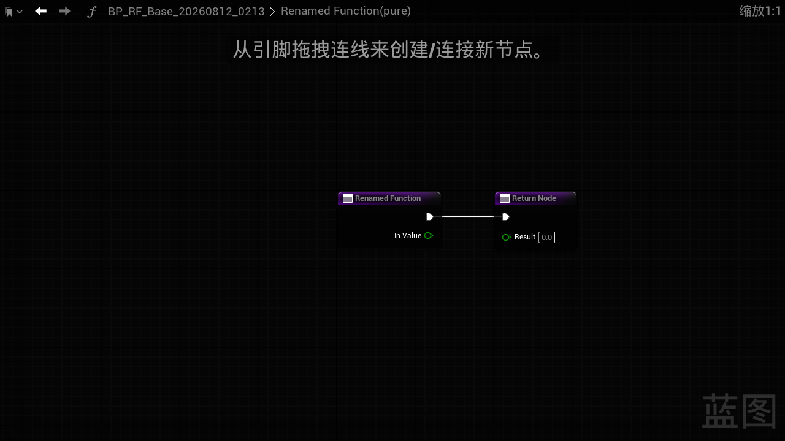

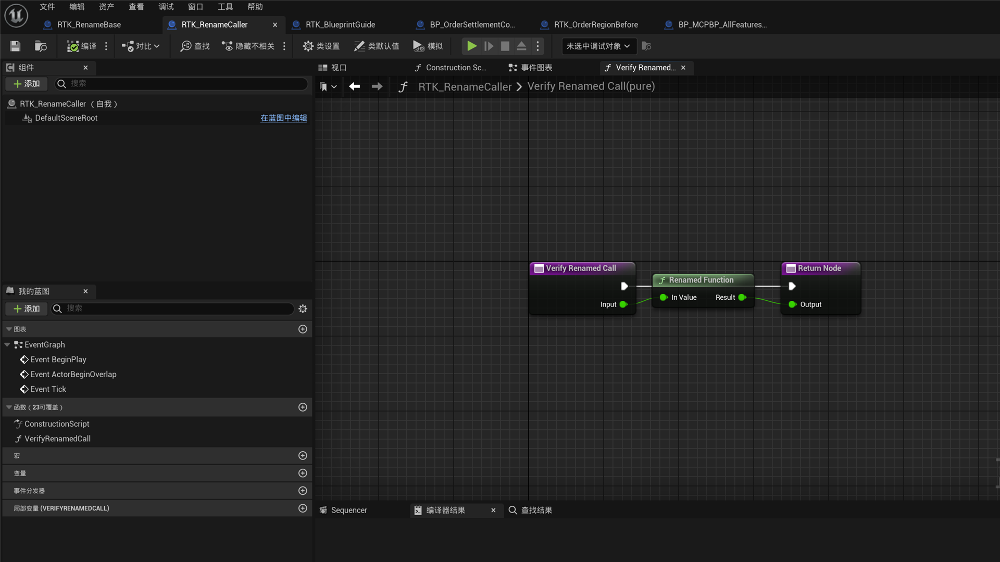

### Function, event, and graph showcase

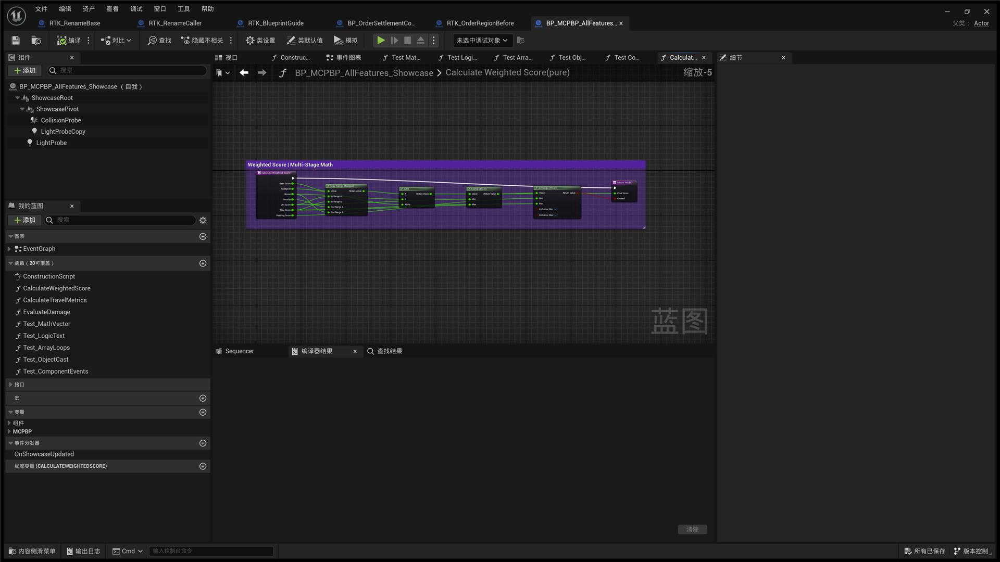

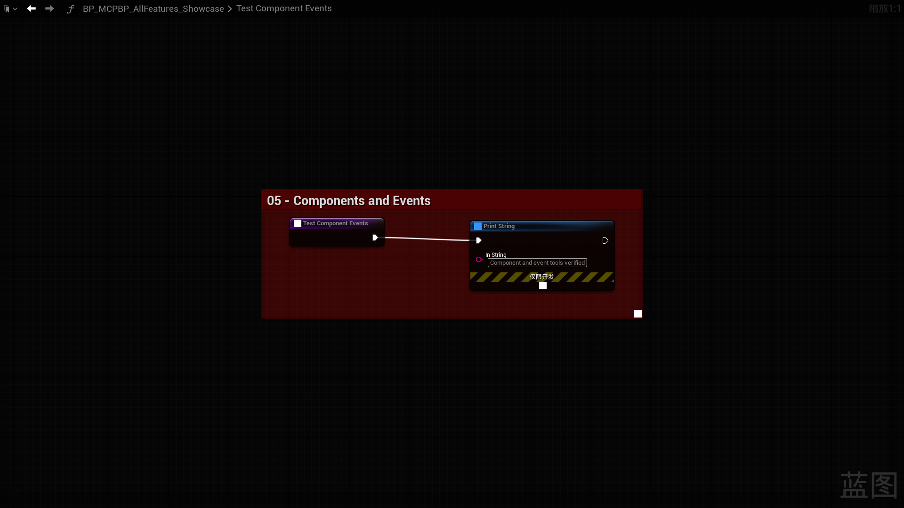

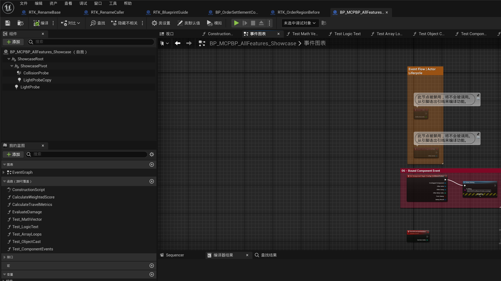

### Create a calculation function

`CalculateScore` adds `BaseScore` and `Bonus`, then multiplies the result by `Multiplier`.

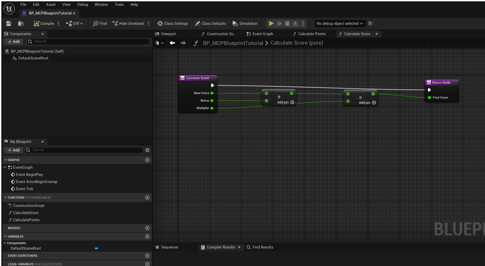

### Build a larger workflow

`EvaluateOrderBatchV2` keeps order totals, discounts, shipping, tax, points, risk scoring, and the final result in one connected function graph.

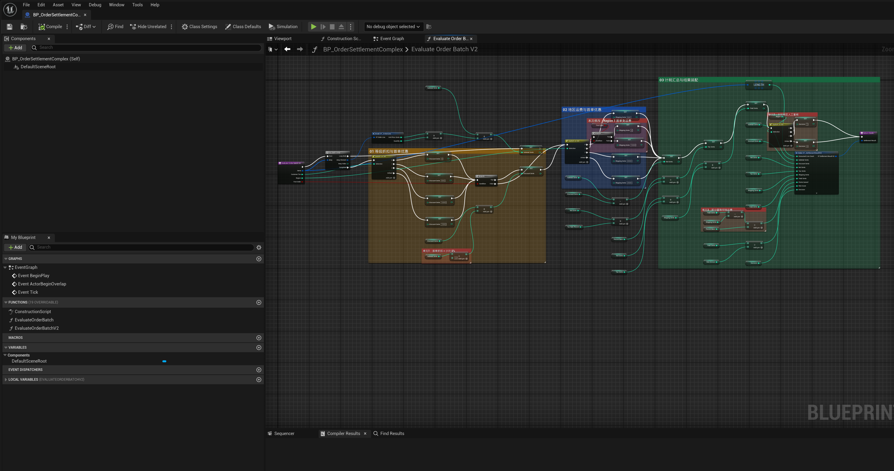

### Add free shipping for first orders

Before the change, Region 1 always sets `ShippingCents = 1000`.

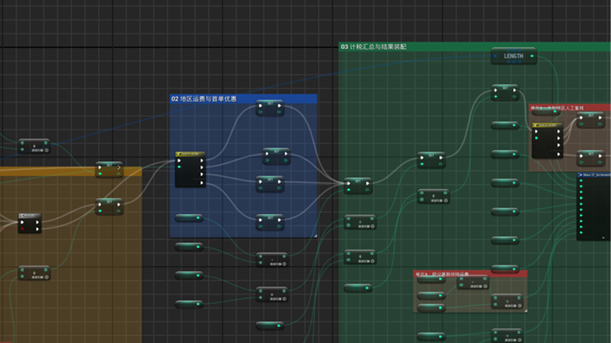

After the change, a `FirstOrder` branch sets shipping to `0` for first orders and keeps `1000` for other orders.

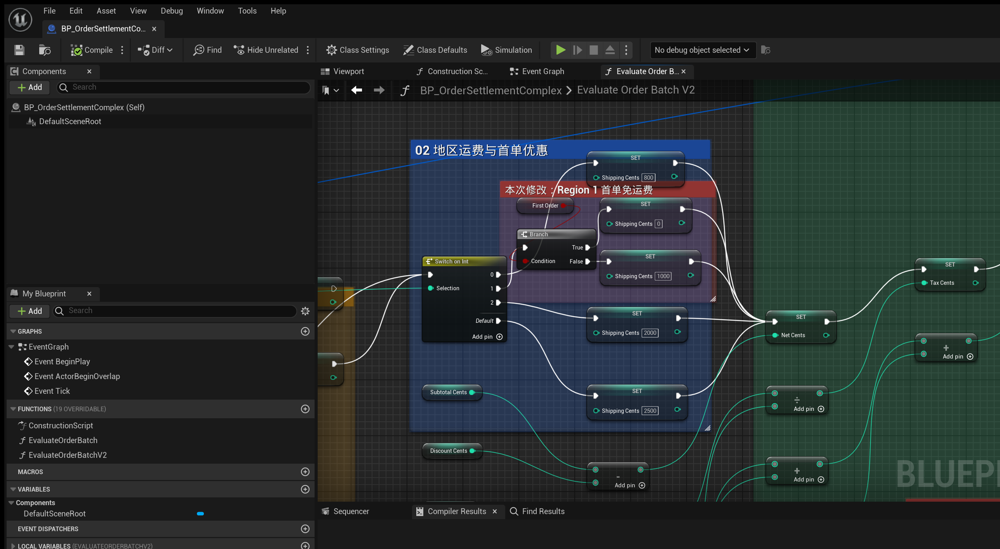

### Exclude shipping from points

Before the change: `PointsEarned = TotalCents / 100`.

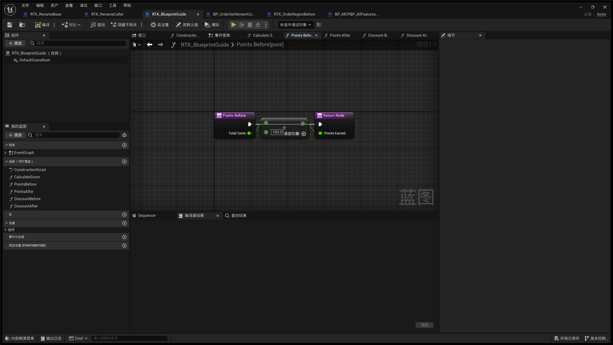

After the change: `PointsEarned = (TotalCents - ShippingCents) / 100`.

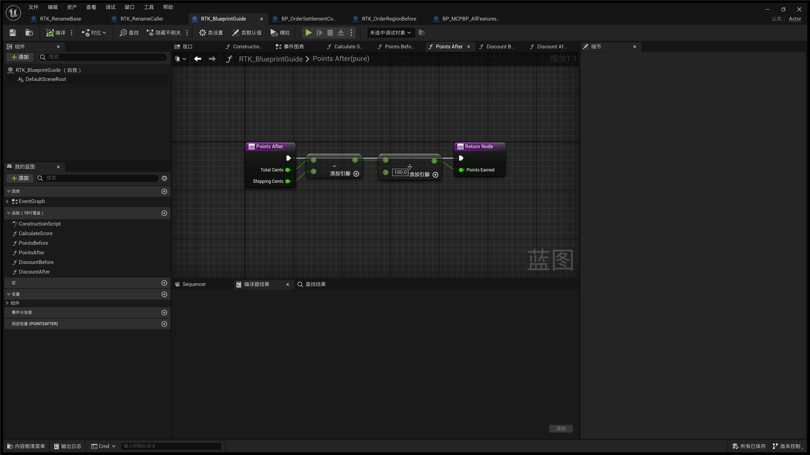

### Replace a fixed discount with 5%

Before the change, the graph always returns a fixed discount of `500`.

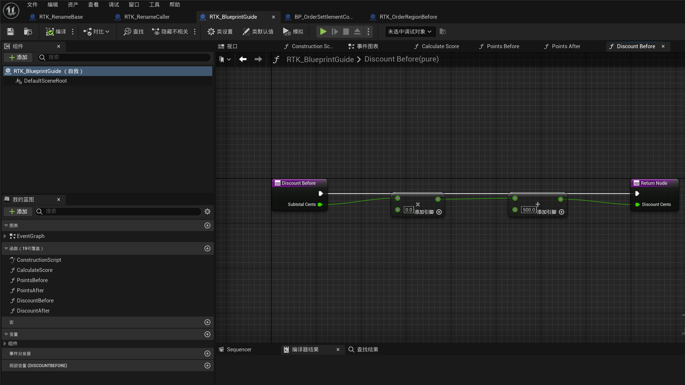

After the change, `SubtotalCents / 20` produces a 5% discount.

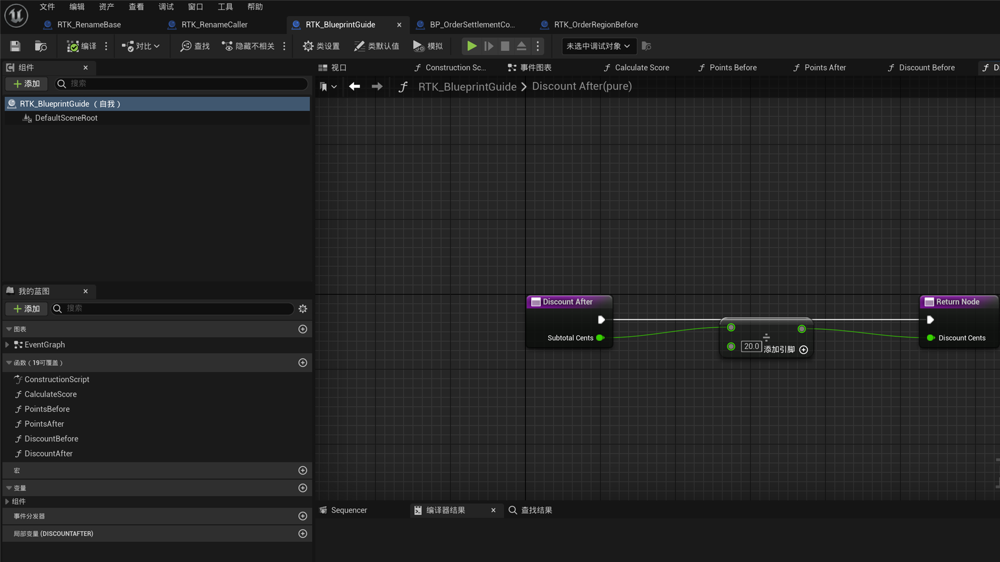

## Capture, settings, limits, and troubleshooting

Call `OpenAsset` before `CaptureGraphScreenshot`. You can capture the full graph, focus on one node, or reuse a specific viewport. Check that titles, pins, and connections are readable before sharing the image.

In **Project Settings → Plugins → MCP Blueprint**, configure Port, Auto Start, Auto Compile After Modify, request timeout, and compile timeout.

- The plugin is editor-only; there is no generic arbitrary Blueprint runtime-invocation tool.
- Custom Event and Event Dispatcher signature mutation is less complete than ordinary function signatures.
- Some unsafe actions are refused instead of being partially applied.
- Compilation is not persistence: save explicitly.
- If a tool is missing, refresh `tools/list`. If an edit is refused, read the reason before trying again.
- If UE asks to add this installed engine plugin to a project descriptor, choose **Not Now**; updating creates the project dependency this installation model avoids.

## Support

For questions or feedback, use the [contact page](https://mengzhishanghun.github.io/mengzhishanghun/contact/).
