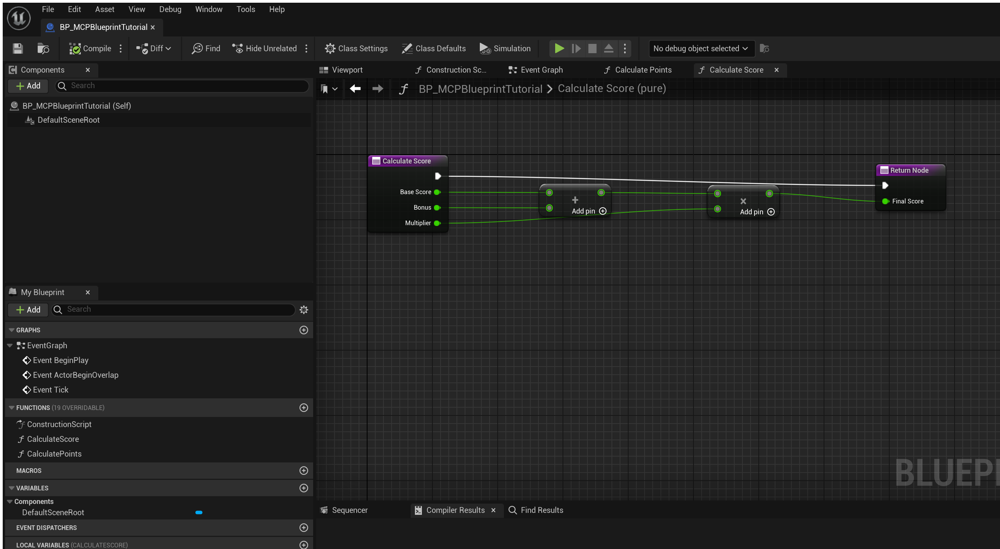
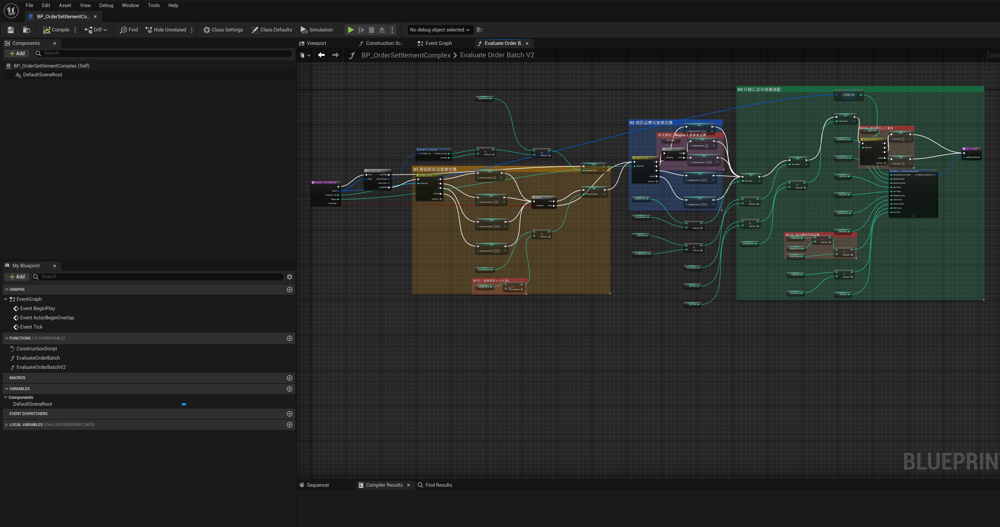
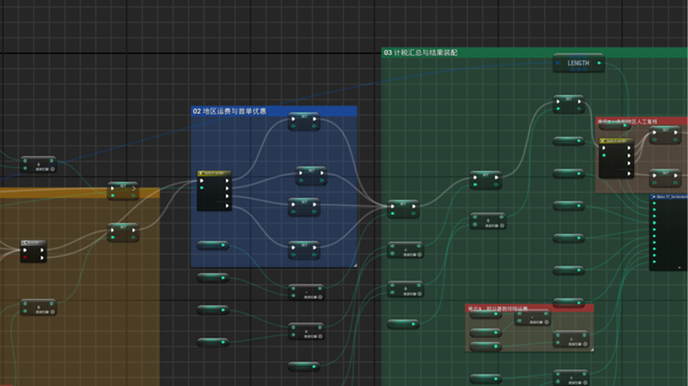
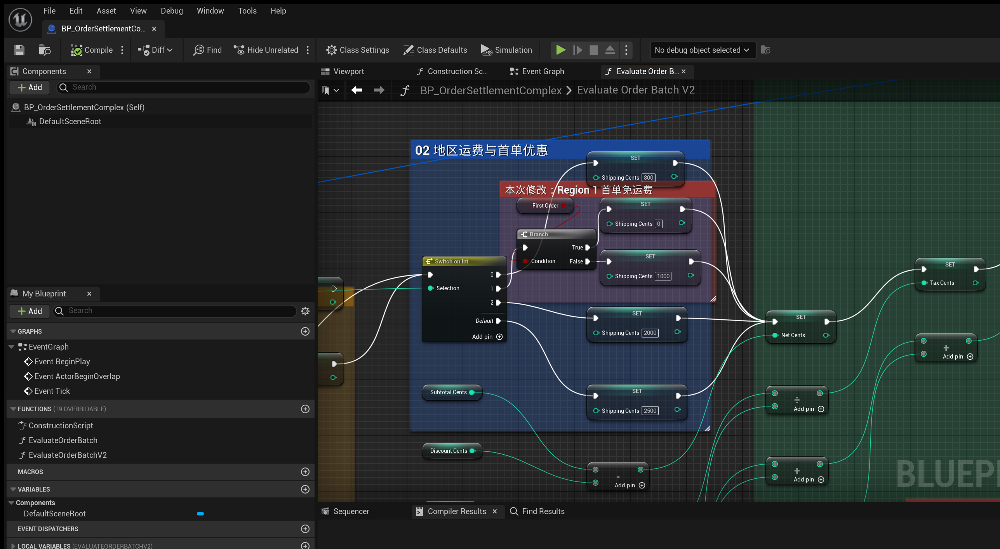
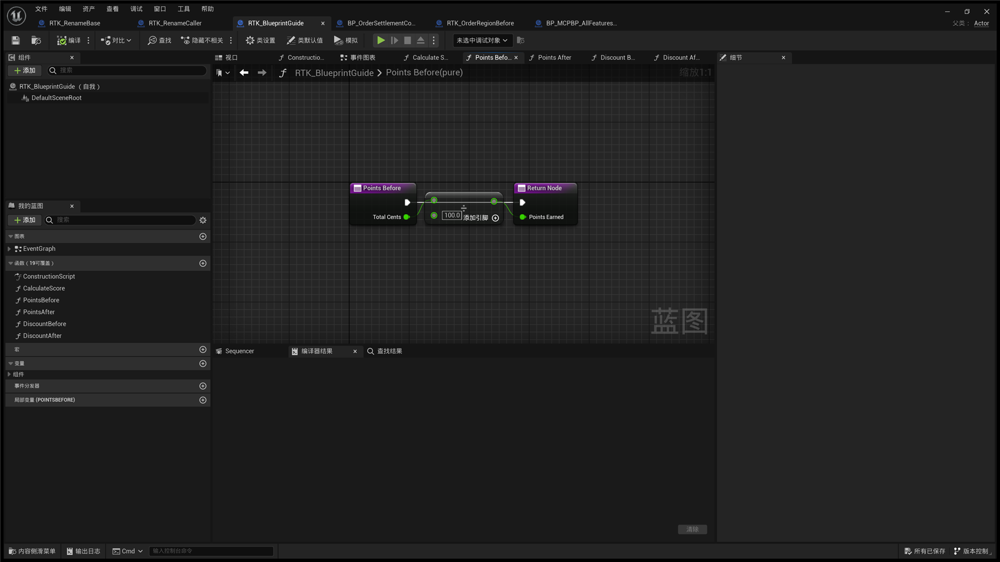
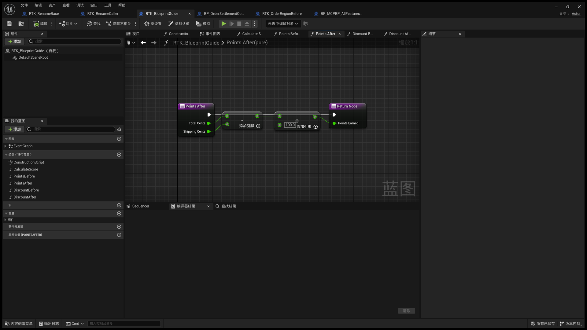
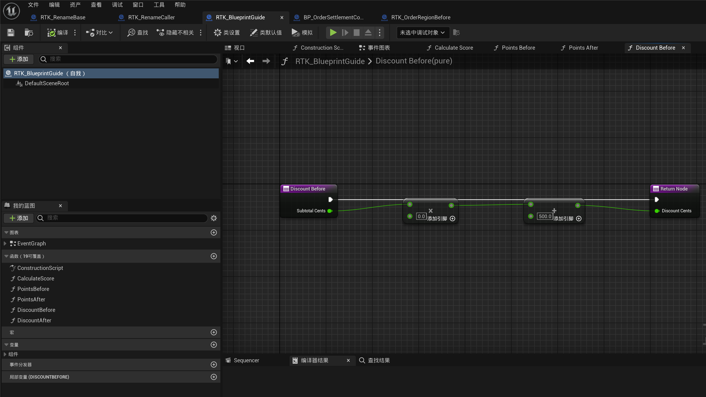
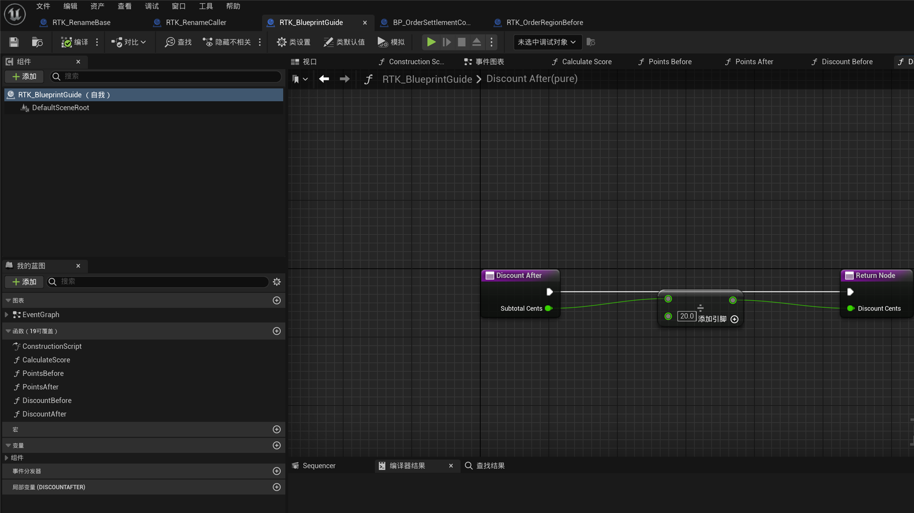

[English](./README.md) | [中文](./README_CN.md)

# MCPBlueprint 用户教程

MCPBlueprint 通过 MCP 向 AI 客户端提供蓝图发现、图表编辑、成员、组件、资产生命周期、编译反馈和图表截图能力。当前编辑器会话中真实可用的工具名和参数始终以 `tools/list` 返回结果为准。

## 要求与安装

- Unreal Engine 5.2–5.8，Win64 Editor。
- 支持本机 HTTP 服务的 MCP 客户端。
- 插件包必须与 Unreal Engine 的小版本完全一致。

每个引擎只安装一次 MCPBlueprint：

```text
<UE_5.x>/Engine/Plugins/Marketplace/MCPBlueprint/
```

MCPBlueprint 是跟随引擎安装的可选编辑器工具。`.uplugin` 使用 `Installed=true` 和 `EnabledByDefault=true`。不要把它重复复制进每个项目，也不要向用户项目的 `.uproject` 添加 MCPBlueprint。替换引擎中的插件包后，应重启对应版本的编辑器。

## 连接 AI 客户端

MCPBlueprint 会自动启用，并在编辑器启动时自动启动本机 MCP 服务。用户不需要在每个项目中手动启用插件，也不需要向项目 `.uproject` 添加插件声明。

让你使用的 AI 客户端按照自身的 MCP 配置流程接入 MCPBlueprint，并把插件工具栏显示的端点交给它即可。默认端点为 `http://127.0.0.1:8766/mcp`；配置端口被占用时，MCPBlueprint 最多尝试后续九个端口。不同 AI 客户端的配置格式不同，因此本文不规定某个客户端专用的 JSON 文件或手动端口配置步骤。

`initialize` 和 `tools/list` 通常由 MCP 客户端自动完成；`ping` 只用于排障，不是普通用户每次都要手动执行的步骤。

服务器只绑定本机。浏览器风格的 `Origin` 只允许 `localhost`、`127.0.0.1` 和 `[::1]`；普通非浏览器 MCP 客户端可以省略 `Origin`。

## 当前已完成功能

当前版本注册 55 个工具：

| 能力 | 数量 | 工具 |
|---|---:|---|
| 发现与读取 | 6 | `ListBlueprints`、`GetBlueprintOverview`、`ListBlueprintMembers`、`GetGraphDetail`、`SearchGraphNodes`、`GetCompileErrors` |
| User Defined Struct 与 Enum | 6 | `CreateUserDefinedStruct`、`GetUserDefinedStruct`、`ModifyUserDefinedStruct`、`CreateUserDefinedEnum`、`GetUserDefinedEnum`、`ModifyUserDefinedEnum` |
| 变量、函数、事件与 Pin | 17 | `AddVariable`、`ModifyVariable`、`RemoveVariable`、`CreateFunction`、`RenameFunction`、`ModifyFunctionSignature`、`RemoveFunction`、`CreateCustomEvent`、`AddEventNode`、`AddBoundEvent`、`AddLocalVariable`、`RemoveLocalVariable`、`AddNodePin`、`RemoveNodePin`、`AddInterface`、`AddEventDispatcher`、`RemoveEventDispatcher` |
| 图表编辑与布局 | 4 | `ApplyGraphPatch`、`SetPinDefaults`、`FormatGraph`、`AddCommentBox` |
| 组件与默认值 | 11 | `GetComponents`、`AddComponent`、`SetComponentProperties`、`RenameComponent`、`RemoveComponent`、`ReparentComponent`、`SetRootComponent`、`DuplicateComponent`、`GetComponentProperties`、`GetClassDefaults`、`SetClassDefaults` |
| 资产生命周期与截图 | 11 | `CreateBlueprint`、`ReparentBlueprint`、`CompileBlueprint`、`SaveAsset`、`OpenAsset`、`CloseAsset`、`ReloadBlueprintFromDisk`、`DeleteAsset`、`RenameAsset`、`DuplicateAsset`、`CaptureGraphScreenshot` |

已完成的行为包括：

- 大型资产、成员、图表和 Pin 读取的稳定有界分页。
- 使用 Action Registry 返回的节点 ID，而不是编造节点类型。
- 原子图表 Patch：创建、连接、断开、删除、移动、默认值和布局。
- `Balanced`、`Straight`、`Compact` 三种确定性布局风格。
- 局部和全图布局中的原生 Comment Box 包围关系保护。
- 高风险修改的 dry-run 影响分析和显式批准门禁。
- 编译/读回验证、事务回滚，以及 Unreal 支持范围内的单步 Undo。
- 显式保存：写工具只把资产标脏，不会静默保存。
- 无需项目声明即可从引擎目录自动发现并加载。

## 推荐操作流程

所有写操作都使用同一顺序：

1. **检查** — 确定精确资产、图、稳定 GUID、Pin、成员或组件。
2. **搜索** — 通过 `SearchGraphNodes` 获取合法 `SpawnerId`。
3. **预览** — 工具支持时使用 `bDryRun=true`，检查受影响资产、规范化操作、限制和 blocker。
4. **应用** — 只发送一次已审阅操作，不编造 GUID 或 `SpawnerId`。
5. **读回** — 再次查询目标图或资产并比较预期状态。
6. **编译** — 获取权威状态、错误和警告。
7. **显式保存** — 只有用户需要持久化时才调用 `SaveAsset`。

Dry-run 可能报告 Action Registry 节点、生成 Pin、类型提升或精确修改后布局无法在不写入时证明。这是预览能力的真实限制，不是自动写入许可；应用前仍须核对当前图和精确的 `SearchGraphNodes` 返回结果。

## 教程：创建计算函数

下面的示例创建：

```text
FinalScore = (BaseScore + Bonus) × Multiplier
```

1. 用 `CreateBlueprint` 创建 Actor 蓝图。
2. 用 `CreateFunction` 创建 `CalculateScore`，包含三个 `double` 输入和一个 `double` 输出。
3. 用 `GetGraphDetail` 读取新函数并记录 Entry/Result 节点 GUID。
4. 在这个函数图中搜索 `Add` 和 `Multiply`，使用返回的 `Operator:Add` 和 `Operator:Multiply`。
5. 预览一个同时包含两个节点和五条数据连接的 `ApplyGraphPatch`。
6. 对完全相同的 Patch 执行写入，使用原生 `double` 类型提升和自动 `Balanced` 布局。
7. 读回四个节点和六条连线，编译并显式保存。

最终图应形成一个从左到右的单一连通组件：无节点重叠、无反向边、没有任何编造的节点 ID。

## 正常编辑器截图与业务规则修改对比

以下图片直接截取自真实 UE 5.2 Blueprint Editor 窗口，没有使用会导致 Slate Brush 缺失和黑白方块伪影的离屏 Graph PNG 路径。

### 正常图表示例

已保存的 `CalculateScore` 教程函数包含 Action Registry 创建的 Add 与 Multiply 节点、完整数据/执行连线、成功编译和自动布局。



### 复杂正式业务流程全图

`EvaluateOrderBatchV2` 是一个包含 71 个节点的订单结算函数。同一张连通图中完成订单行累计、客户等级与首单折扣、地区运费、税费、人工复核决策、积分与风险分数，以及最终结算结果装配。



### 修改 1：Region 1 增加首单免运费

修改前：Region 1 直接执行 `ShippingCents = 1000`，首单判断分支不在执行路径中。



修改后：Region 1 先进入 `FirstOrder` 分支；首单执行 `ShippingCents = 0`，非首单保留原来的 `ShippingCents = 1000` 规则。



### 修改 2：积分基数排除运费

修改前：`PointsEarned = TotalCents / 100`。



修改后：`PointsEarned = (TotalCents - ShippingCents) / 100`。同一视口可直接看到新增 Subtract 节点，以及保留的 Divide 和 Result 节点。



### 修改 3：首单折扣由固定值改为小计 5%

修改前：函数通过带零默认值的同类型 Add 节点传递固定折扣。



修改后：固定值路径替换为 `SubtotalCents / 20`，得到小计 5% 折扣，同时保持相同函数输出和图表画幅。



三组对比展示的都是真实节点、默认值或连线变化，不是只移动节点或调整布局。对比图使用固定视口与稳定节点身份，并完成图表读回、成功编译和显式保存。若 dry-run 无法在不写入时证明生成 Pin 状态，则先核对现有 GUID 与连线，再执行单事务修改并在修改后再次验证。这些示例是受控的正式项目风格业务流程，不含客户项目数据。

## 查找资产与图表

- 用 `ListBlueprints` 分页查找资产。
- 用 `GetBlueprintOverview` 查看图、变量、函数、组件、接口和父类。
- 用 `ListBlueprintMembers` 查看函数、自定义事件、事件分发器和局部变量。
- 图表修改前后都用 `GetGraphDetail` 获取 GUID、Pin、默认值、连线和坐标。
- 用 `GetCompileErrors` 或 `CompileBlueprint` 获取权威诊断。

始终使用插件返回的精确资产路径。大型图应分页读取，不要根据截图推断结构。

## 安全添加图表逻辑

使用 Unreal 英文动作名搜索，例如 `Branch`、`For Loop`、`For Each Loop`、`Switch on Int`、`Switch on Name`、`Switch on String`、`Add`、`Subtract`、`Multiply` 或 `Divide`。

`ApplyGraphPatch` 支持：

- 带临时 ID 和 Action Registry `SpawnerId` 的 `Nodes`。
- `Connections` 与 `Disconnections`。
- 通过稳定 Node GUID 定位的 `RemoveNodes`。
- 通过稳定 Node GUID 和绝对图坐标定位的 `MoveNodes`。
- 可选的 `PinDefaults`、`PromotedType`、布局范围和布局风格。

整个 Patch 只使用一个事务。任一步失败都会回滚目标图修改，不留下半成品。

## 成员、函数、Struct 与 Enum

- 变量工具管理类型、默认值、Category、Tooltip 和安全删除。
- 函数工具创建、重命名、执行受支持的签名修改，或安全删除用户函数。
- 局部变量动作同时绑定函数图和声明 GUID。
- Struct/Enum 修改使用稳定字段或条目标识，并报告引用影响。
- 可能丢失数据或改变 Enum 序列化值语义的操作需要独立显式批准。

函数重命名和签名修改默认先分析影响。遇到不支持的 Override、不完整引用扫描、不透明 Delegate 绑定、未加载派生类或无法安全恢复的状态时会 fail-closed。

## 组件与类默认值

添加、重命名、复制、重设父级、设置根组件、修改模板属性或删除组件前，先读取当前组件层级。类默认值工具读取或修改支持的 Blueprint 默认值，不会把实例值冒充为类默认值。

## 资产生命周期

资产工具可以创建、复制、重命名、重设父类、编译、打开、关闭、重载、删除和保存支持的蓝图资产。

- 编译成功不代表资产已经持久化。
- 磁盘重载默认 dry-run，丢弃内存状态前必须显式批准。
- 破坏性删除比普通图修改具有更严格的 Undo/Redo 和 Package 安全要求。
- 只有 UObject、Asset Registry 和磁盘检查一致时才能报告成功。

## 截取图表

先调用 `OpenAsset`，再使用 `CaptureGraphScreenshot`。优先选择文字、Pin 和连线可读的全图或节点聚焦画面。需要可比较画幅时，复用返回的视图位置、缩放、尺寸和 Viewport Token。

截图工具要求真正初始化的蓝图图表编辑器控件。完全无界面或尺寸为零的 Graph Widget 会被拒绝，不会生成误导性的空白图。

## 设置

打开 **项目设置 → 插件 → MCP Blueprint**：

- **Port** — 默认 `8766`；被占用时最多尝试后续九个端口。
- **Auto Start** — 随编辑器启动服务器。
- **Auto Compile After Modify** — 支持的写操作完成后自动编译。
- **Request Timeout Seconds** — 普通工具超时。
- **Compile Timeout Seconds** — 编译类工具独立超时。

## 当前限制

- 仅支持 Win64 Editor，不提供 Runtime/Shipping 模块。
- 暂无“调用任意 Blueprint 函数并返回运行结果”的通用工具。
- Custom Event 和 Event Dispatcher 的签名修改能力尚未达到普通函数签名修改的完整程度。
- 某些 Blueprint Action 类型存在无法完整扫描或事务恢复的状态，此时会 fail-closed。
- 截图需要真实初始化的 Blueprint Graph Editor 控件。

## 后续开发与完善方向

后续准备推进：

1. 有界、隔离的通用 Blueprint 运行调用与结果读回能力。
2. 带引用影响分析和回滚的 Custom Event / Event Dispatcher 安全签名编辑。
3. 更深入的图生命周期、调用者/引用、继承和未加载资产影响检查。
4. 支持更多 Blueprint 资产类型和更复杂的原生 Action Registry 节点。
5. 补充连接、dry-run、批准、持久化、Undo 和拒绝场景的完整图文教程。

详细优先级和验收证据以 AIHub 为准。以上是开发方向，不承诺具体发布日期。

## 故障排查

- **无法连接：** 使用工具栏显示的实际端点，配置端口可能已被占用。
- **找不到工具：** 刷新 `tools/list`，不要依赖旧缓存。
- **写入被拒绝：** 阅读所有 blocker 和批准参数要求，重试前重新读取目标。
- **编译失败：** 获取编译诊断，根据真实蓝图错误修复后再保存。
- **图表结果异常：** 对比前后的 `GetGraphDetail`，适用时执行 Undo。
- **插件提示重建：** 安装与引擎小版本完全匹配的包。
- **项目中找不到插件：** 核对插件是否安装在该引擎的 `Engine/Plugins/Marketplace`；不要用添加项目依赖的方式绕过。
- **UE 5.5 提示项目文件过期，原因是已安装的 MCPBlueprint 不在项目描述符中：** 选择 **Not Now（暂不）**。引擎插件仍会自动加载；选择 **Update（更新）** 会把 MCPBlueprint 写入项目 `.uproject`，形成当前安装模式明确要避免的项目侧依赖。

## 支持

如有问题或反馈，请使用[统一联系页面](https://mengzhishanghun.github.io/mengzhishanghun/contact/)。
