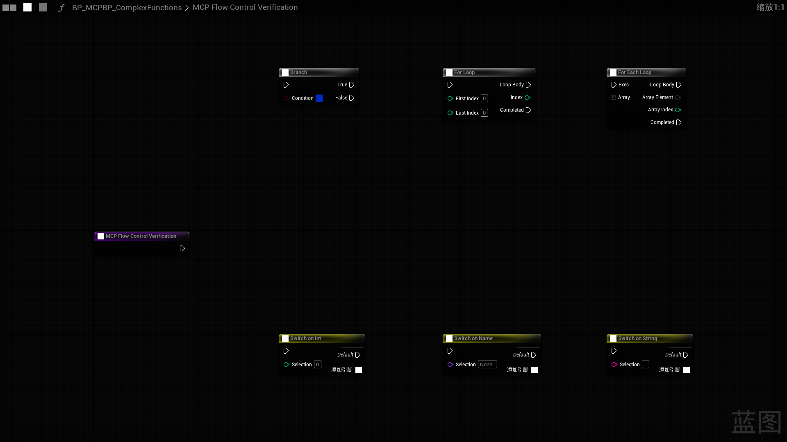

[English](./README.md) | [中文](./README_CN.md)

# MCPBlueprint

MCPBlueprint 是一个自包含的 Unreal Editor 插件，通过 HTTP MCP 向 AI 客户端提供蓝图发现、图表编辑、成员管理、组件管理、资产生命周期与编译反馈能力。插件支持 Unreal Engine 5.2 及以上版本，不依赖其他用户制作的插件；带预编译二进制的 Win64 Editor 插件包已覆盖验证 UE 5.2–5.8。

Fab 英文商品文案、当前逐版本兼容矩阵、安装步骤、7 个完整工作流、隐私/网络说明、故障排查与真实截图见 [FAB_LISTING.md](./FAB_LISTING.md)。

## 连接方式

默认端点为 `http://127.0.0.1:8766/mcp`。若端口被占用，服务器会继续尝试后续端口，工具栏会显示实际端点。请在 AI 客户端中把该 URL 配置为 HTTP MCP 服务器。

服务器实现 `initialize`、`tools/list`、`tools/call` 和 `ping`。写操作在游戏线程执行；引擎支持时会纳入编辑器事务以便 Undo；修改只把资产标记为 Dirty，不会自动保存到磁盘。

请求必须使用 JSON-RPC `2.0`，且 `params` 与工具 `arguments` 必须是对象。浏览器风格的 `Origin` 仅允许 `localhost`、`127.0.0.1` 或 `[::1]`；非浏览器客户端可以不发送 `Origin`。

## 工具（53 个）

### 发现与读取

| 工具 | 用途 |
|---|---|
| `ListBlueprints` | 使用稳定且有上限的分页列出蓝图资产。 |
| `GetBlueprintOverview` | 读取图表、变量、函数、组件、接口与父类。 |
| `ListBlueprintMembers` | 使用统一稳定分页列出函数、Custom Event、Dispatcher 与局部变量。 |
| `GetGraphDetail` | 读取图表节点、Pin、默认值和连接。 |
| `SearchGraphNodes` | 使用 Unreal 英文标准名称搜索蓝图动作并返回稳定的 `SpawnerId`；标准查询包括 `Branch`、`For Loop`、`For Each Loop`、`Switch on Int/Name/String` 与 `Add/Subtract/Multiply/Divide`。 |
| `GetCompileErrors` | 编译并返回蓝图权威状态与诊断。 |

### User Defined Struct 与 Enum

| 工具 | 用途 |
|---|---|
| `CreateUserDefinedStruct` / `GetUserDefinedStruct` / `ModifyUserDefinedStruct` | 创建、读取并按稳定字段 GUID 安全修改结构体。 |
| `CreateUserDefinedEnum` / `GetUserDefinedEnum` / `ModifyUserDefinedEnum` | 创建、读取并安全修改枚举项。 |

先用 `bDryRun=true` 审阅有界引用影响结果；删除结构体字段或修改字段类型随后必须显式传入 `bAllowPotentialDataLoss=true`，删除或重排枚举项必须显式传入 `bAllowSerializedValueSemanticChange=true`。枚举重命名只修改显示名并保留内部枚举项名称。修改操作会刷新并编译引用 Blueprint，报告受影响的 DataTable/DataAsset，纳入 Undo 并只标记 Dirty，绝不自动保存。创建会先完成有效性验证；失败的部分资产会被丢弃，也不会通知 Asset Registry。

### 变量、函数与事件

| 工具 | 用途 |
|---|---|
| `AddVariable` / `ModifyVariable` / `RemoveVariable` | 管理蓝图成员变量；`ModifyVariable` 还可事务化更新 `Category` 与 `Tooltip`。 |
| `CreateFunction` / `RenameFunction` / `RemoveFunction` | 创建、安全门禁重命名或安全删除函数图。重命名默认只做 dry-run 影响分析，更新引用前必须显式批准。 |
| `CreateCustomEvent` / `AddEventNode` / `AddBoundEvent` | 添加自定义事件、引擎事件、组件事件或关卡 Actor 事件。 |
| `AddLocalVariable` / `RemoveLocalVariable` | 添加或安全删除函数局部变量。 |
| `AddNodePin` / `RemoveNodePin` | 为 Sequence、容器和 Switch 等节点添加或删除受支持的动态 Pin。 |
| `AddInterface` | 实现蓝图接口。 |
| `AddEventDispatcher` / `RemoveEventDispatcher` | 创建或安全删除多播事件分发器及其签名。 |

调用 `RenameFunction` 时，省略 `bDryRun`（或设为 `true`）只会返回稳定 Graph GUID、有界的本地/外部引用计数、受影响 Blueprint、未加载派生类与阻断项，不产生修改。正式执行必须同时传入 `bDryRun=false` 与 `bApproveReferenceUpdates=true`。首版会主动拒绝 override/受保护函数、RepNotify 函数、不完整引用扫描、未加载派生 Blueprint、`CreateDelegate` 绑定，以及在声明 Blueprint、已加载依赖或 Asset Registry 外部引用项中发现 AnimBlueprint/AnimGraph 状态的情况，即使普通节点引用计数为 0 也会阻断。该门禁采用 fail-closed，因为 UE 5.4+ 可能改写目前无法完整扫描或事务恢复的嵌套函数属性绑定。成功执行会保留 `FunctionGraphGuid`、确认旧名称引用归零、编译全部受影响 Blueprint、纳入 Undo、只标记 Dirty，绝不自动保存。

### 图表编辑

| 工具 | 用途 |
|---|---|
| `ApplyGraphPatch` | 在一个声明式事务中执行有上限的节点创建/删除、连接/断开、默认值和布局修改。 |
| `SetPinDefaults` | 为现有输入 Pin 设置经过校验的字面量默认值。 |
| `FormatGraph` | 自动排列整张图或指定节点集合。 |
| `AddCommentBox` | 以可配置颜色、标题和边距把指定节点框入原生 Comment Box。 |

#### 专业蓝图布局

`FormatGraph` 使用确定性的弱连通区域分离、SCC 循环压缩、从左到右的分层拓扑、重心法交叉线优化、Slate 节点与 Pin 行尺寸及其有界回退、Pin-aware 纵向对齐，以及多区域装箱。`LayoutScope` 支持 `WholeGraph`、`ConnectedComponent` 和 `Selection`。`LayoutStyle` 支持 `Balanced`（默认通用间距）、`Straight`（更强的连线拉直和更多纵向空间）与 `Compact`（更小占用、较轻的拉直）；项目约定或 AI 技能规范只需选择预设，不必绑定算法内部权重。整图布局会保护注释框及其当前包围的节点。设置 `bDryRun=true` 时不会调用 `Modify()` 或开启编辑器事务，只返回规划位置，以及布局前后的重叠、反向边、交叉线、长连线、占用面积、`FlatEdgeRatio`、`AveragePinDeltaY` 和 `P95PinDeltaY` 指标。可选 Reroute 默认关闭，并受 `MaxRerouteNodes` 限制；其质量指标描述插入 Knot 前的原节点布局方案。

`ApplyGraphPatch` 支持 `LayoutScope=Auto|CreatedNodes|ConnectedComponent|None`，并接受相同的 `LayoutStyle` 预设。MCP 驱动的节点放置默认必须避免重叠，且不能静默接受仍未解决的碰撞。显式提供 `Position` 的节点保持固定。布局、Reroute 或编译失败都会进入同一个图补丁事务回滚；两个工具都会返回实际采用的范围、风格和布局质量指标。

创建标准算术节点时，先用 Unreal 英文动作名 `Add`、`Subtract`、`Multiply` 或 `Divide` 调用 `SearchGraphNodes`，再把其返回的精确 `Operator:<Name>` 交给 `ApplyGraphPatch`，不要手工拼接 SpawnerId。在同一个 patch 中，把 Real/Double 来源 Pin 连接到 `A` 或 `B`，并为节点可选传入 `PromotedType: "double"` 或 `"real"`。Unreal Schema 会执行原生的连接驱动类型提升；全部连接完成后，工具再验证目标运算函数与 `A`、`B`、`ReturnValue` 均为 Real/Double，否则整笔 patch 回滚。不同引擎版本和 Pin 上下文可能在界面或序列化文本中显示为 **Float**、**Double** 或 **Real**；当前流程明确保证 Real/Double 形式，不承诺强制独立的单精度 Float 形式。

标准流程控制节点请使用 Unreal 英文名称搜索：`Branch`、`For Loop`、`For Each Loop`、`Switch on Int`、`Switch on Name`、`Switch on String`。循环节点来自真实的 StandardMacros Action Registry（例如 `Macro:/Engine/EditorBlueprintResources/StandardMacros.StandardMacros:ForLoop`），Branch 和三种标量 Switch 使用 Registry 支持的 `Native:K2Node_*` ID。必须使用搜索返回值；手工伪造宏或原生 ID 仍会被拒绝。节点放置后，编辑器界面标题可按 UE 当前语言本地化，但搜索名保持英文标准名称。

*真实 UE 5.2 截图：已完成 Search → ApplyGraphPatch → 读回 → 编译 → 保存 → 关闭重开；六个标准节点彼此分离且无重叠。*

### Actor 蓝图组件与默认值

| 工具 | 用途 |
|---|---|
| `GetComponents` / `GetComponentProperties` | 读取本地 SCS 层级与组件模板的可编辑属性。 |
| `AddComponent` / `DuplicateComponent` / `RenameComponent` / `RemoveComponent` | 管理本地 SCS 组件。 |
| `ReparentComponent` / `SetRootComponent` | 修改本地 SceneComponent 层级。 |
| `SetComponentProperties` | 使用 UE 文本格式原子设置组件模板属性。 |
| `GetClassDefaults` / `SetClassDefaults` | 分页读取可编辑的 Class Default Object 属性，再原子设置经确认的值。 |

### 资产生命周期与截图

| 工具 | 用途 |
|---|---|
| `CreateBlueprint` | 在 `/Game` 下创建内存中的蓝图资产。 |
| `CompileBlueprint` | 编译并返回权威状态与诊断。 |
| `SaveAsset` / `OpenAsset` / `CloseAsset` | 保存独立蓝图资产或控制其编辑器。 |
| `DeleteAsset` / `RenameAsset` / `DuplicateAsset` | 管理独立蓝图资产。 |
| `ReparentBlueprint` | 预演或执行安全父类修改，拒绝继承循环并报告潜在数据丢失。 |
| `CaptureGraphScreenshot` | 返回 PNG，也可保存到 `Saved/MCPBlueprint/Screenshots` 下。 |

## 安全与行为边界

- 新建、移动或复制蓝图时，目标必须是 `/Game` 下合法的独立包路径；若内存或磁盘已有同名包会拒绝操作。
- 关卡蓝图可以通过对象路径读取和编辑图表，但 `SaveAsset`、`DeleteAsset`、`RenameAsset` 与 `DuplicateAsset` 不处理关卡蓝图，因为这些操作会影响所属关卡包；请通过 World Editor 工作流处理关卡本身。
- `CloseAsset` 会返回之前是否打开，并核验蓝图及其子对象的所有编辑器是否真正关闭；用户取消关闭时返回错误。
- 成员变量和局部变量的默认值会在修改前按 Unreal K2 Pin 规则校验；不合法的 UE 文本值会被拒绝。
- `ModifyVariable` 可选接收成员变量的 `Category` 与 `Tooltip`。空 `Category` 恢复 Unreal 默认类别；空 `Tooltip` 删除该元数据。该工具会在事务中更新变量声明，只把蓝图标记为已修改而不强制结构重建，支持 Undo，编译失败会回滚，且绝不自动保存；`GetBlueprintOverview` 会在存在时返回 `Tooltip`。
- 存在未加载派生蓝图时，变量类型变更、重命名和删除会被拒绝。请先加载派生蓝图以检查继承引用；删除声明前必须先移除子蓝图引用。
- 启用自动编译时，事务型蓝图修改会返回有界编译诊断，并在终态不是 `UpToDate` 或 `Warning` 时回滚且明确报告回滚状态；禁用时结果会返回 `CompileStatus: Skipped`。
- 组件名称会对完整蓝图成员命名空间进行校验。短组件类名存在歧义时会被拒绝；请使用完整类路径消除歧义。
- 组件类必须允许由蓝图创建。未显式指定父级的新 SceneComponent 会挂到唯一的本地、继承或原生场景根；存在多个根时会拒绝操作，不会创建第二个根。
- SCS 层级编辑会为 Undo 快照本地层级，并在编译失败时回滚。`SetRootComponent` 只替换唯一且明确的本地场景根，不会替换继承或原生根。
- `GetComponentProperties` 使用 `Offset`/`MaxResults` 分页（每页最多 100 个属性），单个导出值最多返回 8,192 个字符，并应用整体序列化属性预算与续页元数据。
- `GetClassDefaults` 使用与 `SetClassDefaults` 完全一致的可编辑属性筛选，返回稳定分页及声明类/继承元数据，并同时限制单值为 8,192 个字符和整体序列化属性预算。
- Class Default 与组件模板属性映射会省略原生固定数组反射属性（`ArrayDim > 1`），因为当前映射协议无法安全寻址固定数组的单个元素；普通 `TArray` 属性仍可通过 UE 文本格式读写。
- `GetBlueprintOverview` 对每个分区应用稳定的 `Offset`/`MaxResults` 分页（每个分区最多请求 50 项），同时限制各分区序列化预算；变量默认值最多返回 8,192 个字符，每个函数最多返回 16 个输入和 16 个输出签名 Pin。
- `ListBlueprintMembers` 对函数、Custom Event、Dispatcher 与局部变量使用统一稳定分页；每个语义方向最多返回 16 个签名 Pin，并区分 `SignatureDirection` 与 Entry/Result 节点使用的反向物理 `NodeDirection`。
- `GetComponents` 返回稳定分页的本地扁平列表和继承列表（各最多 100 项），并保留最多 200 个节点、深度最多 64 的本地层级树。扁平遍历使用显式栈，超过 10,000 个组件或深度 256 时报告截断。
- `GetGraphDetail` 单次最多请求 25 个稳定排序的节点，并受序列化页预算限制；每个节点的可见 Pin 独立分页（最多 64 个）且受单节点 Pin 预算限制，每个 Pin 最多返回 8 个有界连接，并提供明确的截断与续页元数据。
- Asset Registry 仍在扫描时会拒绝列举和删除蓝图，避免分页与引用检查建立在不完整数据上。
- 删除资产不可 Undo。未传 `bForce` 时会拒绝删除被引用资产，并使用编辑器常规删除流程保留实时引用；强制删除可能清空引用并破坏依赖资产。
- 若目标资产仍被当前会话的 Undo/Redo 事务历史持有，`DeleteAsset` 可能返回 `locked or in use`。不要改用 `bForce` 掩盖状态；先保存需要保留的工作并重启编辑器，再以 `bForce=false` 重试。
- 截图文件输出限定在 `Saved/MCPBlueprint/Screenshots`；绝对路径、路径穿越和已存在的链接/重解析点路径会被拒绝。除非显式传入 `bOverwrite=true`，否则不会覆盖已有 PNG；这些检查用于降低链接路径与误覆盖风险，但不宣称消除外部文件系统竞争。
- 仅源码静态兼容审查不能代替在各目标引擎版本中的真实编译与测试。

- 工具 Schema 会拒绝未知顶层参数，并在执行前递归校验图补丁、函数/事件签名、Pin 默认值、组件属性与 Class Defaults 的结构。
- HTTP 请求体在引擎 HTTP 服务器完成接收后按 1 MiB 上限拒绝；序列化响应上限为 16 MiB。工具文本最多 1 Mi 字符；图片最多 4 张、单张最多 8 Mi Base64 字符、合计最多 12 Mi。
- 编译诊断最多返回 200 条错误/警告；单条最多 4,096 字符、合计最多 256 Ki 字符，每条最多 32 个去重 NodeGuid。`TotalErrors`、`TotalWarnings`、实际返回数量与 `bTruncated` 会明确报告省略情况。`CompileBlueprint` 和 `GetCompileErrors` 在非成功终态返回 MCP 错误；可用 `bWarningsAsErrors` 把警告也视为失败。
- 请求超时只限制 Dispatcher 等待时间，无法抢占已在游戏线程同步执行的 Blueprint/UObject 操作。客户端超时后应先确认编辑器状态，不要立即重试写操作。

## 配置

打开 **Project Settings > Plugins > MCP Blueprint**。

| 设置 | 默认值 | 说明 |
|---|---:|---|
| Port | 8766 | 首个尝试的 HTTP 端口。 |
| Auto Start | true | 编辑器模块加载时启动服务器。 |
| Request Timeout | 30 秒 | 普通工具超时。 |
| Compile Timeout | 120 秒 | 编译/图补丁工具超时。 |
| Auto Compile After Modify | true | 支持的写操作后自动编译。 |

## 当前测试重点

当前源码的 UE 5.2–5.8 Win64 BuildPlugin 矩阵均已通过。修正版包已部署到 UE 5.2–5.6 与 UE 5.8 的 Marketplace 目录，DLL 哈希与包一致、BuildId 按版本匹配且 `EnabledByDefault=true`。UE 5.7 修正版包已生成，但因无关编辑器正在占用已安装 DLL，重部署尚待完成；此前按版本部署的包已经通过 EnginePlugin 加载与 MCP 健康检查。UE 5.2、5.3、5.5–5.8 的 initialize、`tools/list`（53）和 ping 均通过；UE 5.4 已确认 EnginePlugin 加载、注册 53 个工具并启动 endpoint。

## 已验证截图

[`Images/Fab`](./Images/Fab/) 中的 PNG 均由真实 Unreal Blueprint Graph 控件直接捕获，未合成伪 UI，也不含本机文件路径。各图说明与对应工作流见 [FAB_LISTING.md](./FAB_LISTING.md)。这些图片不会被描述为 HTTP 响应或变量 Details 面板截图。算术节点使用两张真实画面共同证明持久化后的 Real/Double `Add → Subtract → Multiply → Divide → Result` 链：全图缩放图覆盖左侧与中段，节点聚焦图覆盖 `Subtract → Multiply → Divide → Result`；原因是 UE 5.2 的离屏 Graph Widget 全图捕获有时不绘制最右侧节点本体。

当前 53 工具源码已通过 UE 5.2 编译与 `RenameFunction` 自动化安全回归，覆盖真实落盘的 Asset Registry 外部引用、GUID 冲突、`CreateDelegate`、AnimBlueprint/AnimGraph、override、RepNotify、显式批准、Undo 恢复和注入失败回滚。真实编辑器 HTTP 回归还验证了 initialize、`tools/list`（53）、ping、默认 dry-run、带真实外部 Caller 的批准写入、稳定 Graph GUID、写后读回、Blueprint 编译、保存、关闭重开持久化和截图。6 个 User Defined Struct/Enum 工具也已完成真实编辑器 HTTP 回归，覆盖创建、读取、修改、稳定 GUID 保留、dry-run、显式授权门禁、拒绝路径、分页和 Map value 直接循环检测。当前 UE 5.2–5.8 完整 Win64 BuildPlugin 矩阵均已成功；修正版部署与 DLL 哈希验证已通过 UE 5.2–5.6 和 UE 5.8，UE 5.7 等待无关编辑器释放 DLL 占用后重部署。

打包验证证明各目标引擎可以编译插件并获得预期目录结构，但不能替代每个引擎版本内对全部 MCP 操作的运行时验证。其余工具的跨版本真实编辑器回归、保存/重启持久化与清理行为仍会继续推进。

## 已知限制

- 向已有函数插入部分逻辑时，新增块所需空间可能超过当前“只移动新增节点”策略能够安全让出的范围。后续预定方案是识别受影响的既有局部逻辑块，在同一事务中把该逻辑块整体平移，同时保护显式固定位置与 Comment Box 包含关系。该“既有逻辑整体让位”能力尚未完成或验证；当前在此边界暂停，之后再继续。
- 对已经位于 Comment Box 内的节点执行 `LayoutScope=Selection` 或 `ConnectedComponent` 时，当前布局器仍会把 Comment Box 当作外部障碍，规划结果可能把节点整体移到框外。先使用 `bDryRun=true` 检查位置与指标；当前可靠流程是先布局、后创建 Comment Box。
- 同一会话中经过大量事务修改的资产可能仍被 Undo/Redo 历史持有，导致非强制删除失败；处理方式见上方 `DeleteAsset` 安全边界。后续计划提供不清空无关 Undo 历史的定向处理与更明确诊断。

## 后期路线图

开发已恢复，并继续按可独立验证的有界单元推进。当前描述性变量元数据单元覆盖 `Category` 与 `Tooltip`；以下条目是剩余方向，不代表具体版本或日期承诺。

- **成员签名与重构：** 安全修改函数签名与标志，并把同一安全模型扩展到 Custom Event 和 Event Dispatcher 签名。
- **剩余变量元数据：** 扩展变量编辑，覆盖访问控制、Expose on Spawn、SaveGame、复制和 RepNotify 等设置。
- **图表生命周期与影响分析：** 创建、重命名和删除受支持的图表类型；移除已实现接口；重构前查询引用与受影响资产。
- **蓝图类型：** 创建 Blueprint Interface、Function Library、Macro Library 等其他蓝图资产类型。
- **编辑体验与诊断：** 改进 Comment 容器内的选择布局、成员文档和面向调试的状态检查能力。

以上内容是候选方向，不承诺具体版本或完成时间；后续将根据本轮测试与真实使用证据继续调整。

## AI 辅助使用

如果对某个工具、参数或操作流程不清楚，可以把本文档提供给 AI，让 AI 先阅读文档，再根据当前 Unreal Editor 会话中实际可用的 MCP 工具尝试操作。涉及写入时请先确认目标资产，并在操作后重新读取受影响的蓝图状态，不要只凭工具返回成功就认定操作完成。

## 支持

如有问题、反馈或希望加入 UE 技术交流群，请访问以下统一联系方式页面。

- **联系入口：** [邮箱、微信群和 X](https://mengzhishanghun.github.io/mengzhishanghun/contact/)
