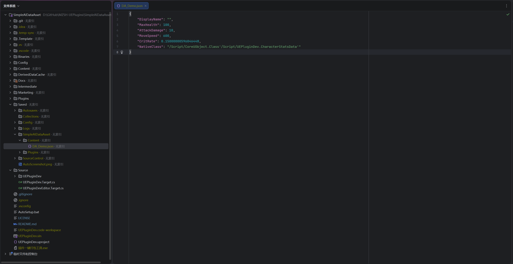

[English](./README.md) | [中文](./README_CN.md)

# Simple AI DataAsset

Automatic bidirectional binding between DataAssets and JSON files, enabling AI to directly modify DataAssets.

## Features

- **Bidirectional Sync**: Changes in DataAssets automatically export to JSON; JSON file changes automatically import back to DataAssets
- **Initial Sync**: On editor startup, compares timestamps and syncs the latest version
- **Orphan Cleanup**: Automatically removes JSON files whose corresponding DataAssets no longer exist
- **Source Control Integration**: Automatically checks out files via Perforce/Git/SVN before saving
- **Circular Prevention**: Built-in mechanism to prevent infinite sync loops
- **High Precision**: JSON export uses full precision for float/double values
- **Property Name Restoration**: JSON field names match editor display names instead of UE's internal camelCase
- **Smart Write**: Only writes files when content actually changes, avoiding unnecessary version control noise

## Installation

1. Copy the `SimpleAIDataAsset` folder to your project's `Plugins/` directory
2. Restart the Unreal Editor
3. Enable the plugin in Edit > Plugins if not already enabled

## Configuration

Go to **Project Settings > Plugins > SimpleAIDataAsset**:

| Setting | Default | Description |
|---------|---------|-------------|
| JSON Output Directory | `Saved/SimpleAIDataAsset` | Directory where JSON files are stored (relative to project root) |
| Enable Auto Sync | `true` | Toggle automatic synchronization on/off |

## How It Works

1. When a DataAsset property changes in the editor, the plugin exports it to a JSON file
2. When a JSON file is modified externally (e.g., by an AI tool), the plugin imports changes back to the DataAsset
3. On startup, the plugin performs an initial sync based on file timestamps

## AI Integration

This plugin is designed for AI workflows. Here's how to connect AI tools to your DataAssets.

### JSON File Location

JSON files are stored in your project's `Saved/SimpleAIDataAsset/` directory (configurable). The path mirrors your Content Browser structure:

| Asset Path (in UE) | JSON File Path |
|---------------------|----------------|
| `/Game/DA_Demo` | `Saved/SimpleAIDataAsset/Content/DA_Demo.json` |
| `/Game/Data/Characters/DA_Warrior` | `Saved/SimpleAIDataAsset/Content/Data/Characters/DA_Warrior.json` |

### JSON Format

Given a `CharacterStatsData` DataAsset in the editor:


The plugin automatically exports the following JSON:



```json
{
    "DisplayName": "",
    "MaxHealth": 100,
    "AttackDamage": 10,
    "MoveSpeed": 600,
    "CritRate": 0.15000000596046448,
    "NativeClass": "/Script/CoreUObject.Class'/Script/UEPluginDev.CharacterStatsData'"
}
```

> **Note**: Field names match the UE editor display (e.g., `MaxHealth`, not `maxHealth`). Float values use full precision to prevent data loss during round-trips.

### AI Workflow Example

1. **Tell the AI where to find the data**:

   ```
   The game character data is at:
   D:/MyProject/Saved/SimpleAIDataAsset/Content/

   Read DA_Demo.json, increase MaxHealth by 20% and reduce CritRate to 0.1,
   then save the file.
   ```

2. **AI reads the JSON, modifies values, and writes back**:

   ```json
   {
       "DisplayName": "",
       "MaxHealth": 120,
       "AttackDamage": 10,
       "MoveSpeed": 600,
       "CritRate": 0.10000000149011612,
       "NativeClass": "/Script/CoreUObject.Class'/Script/UEPluginDev.CharacterStatsData'"
   }
   ```

3. **The plugin detects the file change and automatically imports it into the DataAsset** — no manual steps needed. The change appears immediately in the UE editor.

### Tips

- Keep the UE editor open while AI modifies JSON files — the file watcher only runs in the editor
- Do not remove or rename the `NativeClass` field — it is required for deserialization
- AI can create new JSON files following the same path convention — the plugin will create the corresponding DataAsset on the next editor startup

## Supported Engine Versions

- Unreal Engine 5.2+

## Contact

For questions or feedback, please leave a comment on the Fab product page.
