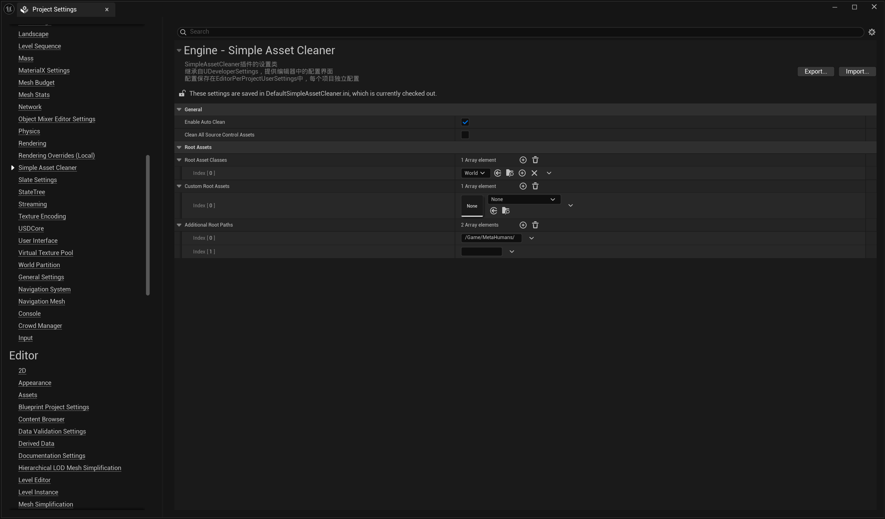
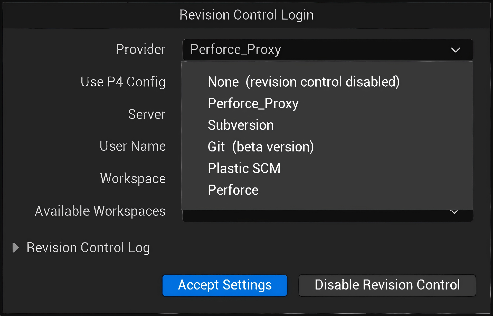

[English](./README.md) | [中文](./README_CN.md)

# 📘 SimpleAssetCleaner 插件教程

**SimpleAssetCleaner** 自动识别并移除 Unreal Engine 项目中未被引用的资产，保持仓库整洁。

> ⚠️ **重要**：此插件可以从版本控制中删除资产。使用前请仔细阅读。

---

## 🎯 清理范围

### ✅ 仅项目内容
- **仅限**项目 `/Content/` 文件夹中的资产（`/Game/` 路径）

### ❌ 不会触及
- 插件资产（如 `/PluginName/Content/`）
- 引擎资产
- 代码文件（C++ 头文件/源文件）
- `/Content/` 外部的引用

---

## 📝 工作原理

插件使用**引用链分析**：

1. **根资产** - 始终视为"使用中"（地图、蓝图、数据资产等）
2. **引用链** - 被根资产直接或间接引用的资产视为"使用中"
3. **未引用资产** - 无法从任何根资产到达的资产将被清理

### 两种模式

**提交时自动清理（推荐）**
- 打开版本控制提交对话框时触发
- 仅检查新添加的文件
- 将未引用的文件从版本控制中还原
- **本地副本安全** - 不会从磁盘删除

**手动全量清理（谨慎！）**
- 扫描整个 Content 文件夹
- 新添加的文件：还原（本地保留）
- 已跟踪的文件：**从服务器和本地删除**

---

## ⚙️ 配置

**位置**：编辑器 > 项目设置 > General > Simple Asset Cleaner

### 版本控制提供者（重要！）

插件会自动将你的版本控制提供者包装为代理以监控提交。

⚠️ **不要手动选择代理提供者！**
- 始终选择你实际的版本控制提供者（Perforce、Git、SVN 等）
- 插件会在后台自动包装
- 直接选择代理可能导致问题

**正确设置**：
- 使用：`Perforce`、`Git`、`Subversion` 等
- 避免：`Perforce_Proxy`、`Git_Proxy` 或任何以 `_Proxy` 结尾的提供者

### 通用设置

#### Enable Auto Clean
- **默认**：开启
- **功能**：提交前检查引用
- **行为**：还原未引用的新添加文件（本地文件安全）
- **建议**：日常使用保持开启

#### Clean All Source Control Assets
- **类型**：按钮
- **功能**：扫描所有 Content 并删除未引用资产
- **警告**：已跟踪的文件将从服务器和本地删除！
- **建议**：仅在有备份且团队协调后使用

#### Enable Verbose Logging
- **默认**：关闭
- **功能**：用于调试的详细日志
- **建议**：仅在排查问题时开启

### 根资产配置

#### Root Asset Classes
- **默认**：`UWorld`（地图文件）
- **功能**：这些类型的资产（包括父类/派生类）被视为根
- **示例**：
  - `UWorld` - 地图（.umap）及派生类型
  - `UDataAsset` - 数据资产及派生类型
- **注意**：自动包含父类和所有派生类

#### Custom Root Assets
- **功能**：手动指定个别资产为根
- **示例**：`/Game/Core/GameMode.GameMode`
- **用途**：Root Asset Classes 未涵盖的关键资产

#### Additional Root Paths
- **功能**：这些路径下的所有资产都视为根
- **示例**：`/Game/Essential/`、`/Game/Core/`
- **用途**：保护整个系统文件夹不被清理

---

## ⚠️ 重要说明

### 删除与还原对比

| 资产状态 | 自动清理 | 手动全量清理 |
|---------|---------|------------|
| 新添加 | 还原，**本地保留** | 还原，**本地保留** |
| 已跟踪 | 不处理 | **删除（服务器 + 本地）** |

---

## 支持

如有问题或反馈，请在 Fab 产品页面留言。

**报告问题时请提供**：
- Unreal Engine 版本
- 版本控制系统（Perforce/Git/SVN）
- 插件设置截图
- 日志输出（启用详细日志后）

---

**平台支持**：已在 Windows 上测试，理论上支持所有平台

**记住**：从保守开始。你可以随时删除资产，但恢复需要版本控制历史！
