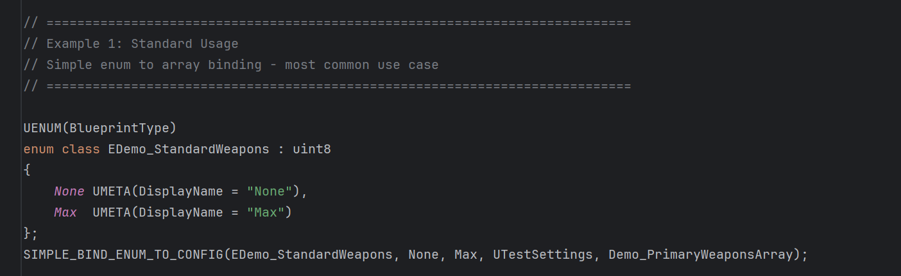
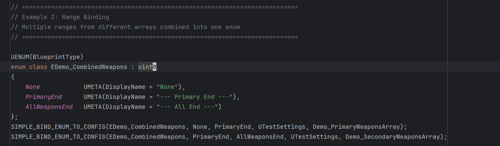
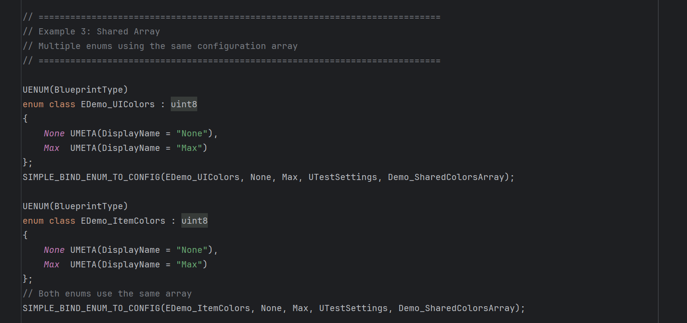
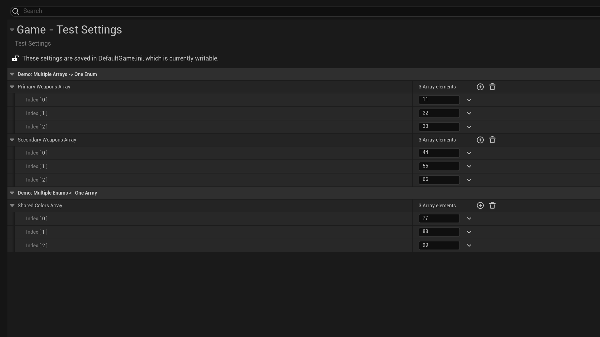
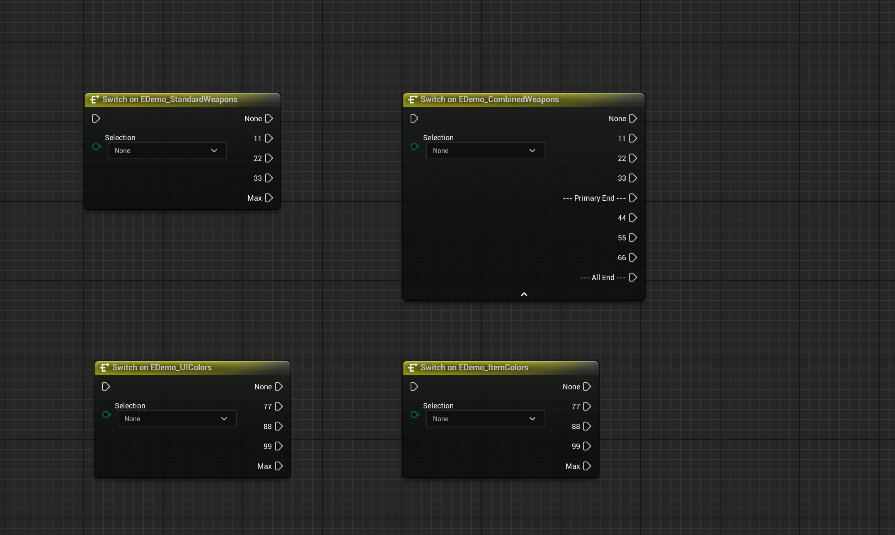

[English](./README.md) | [中文](./README_CN.md)

# 📘 SimpleAutoEnum 插件教程

**SimpleAutoEnum** 是一个轻量级插件，可将 Unreal Engine 枚举自动绑定到可配置的字符串数组。
在项目设置中定义枚举值，插件会在运行时动态填充枚举条目。

> ⚠️ **注意**：此插件需要 **C++ 代码**来定义枚举和配置数组，不是纯蓝图方案。

---

## 📝 使用方法

### SIMPLE_BIND_ENUM_TO_CONFIG 宏参数：

```cpp
SIMPLE_BIND_ENUM_TO_CONFIG(EnumType, MinValue, MaxValue, SettingsClass, ArrayProperty)
```

1. **EnumType**：你的枚举类（如 `EMyWeapons`）
2. **MinValue**：起始边界值（如 `None`）
3. **MaxValue**：结束边界值（如 `Max`）
4. **SettingsClass**：继承自 `UDeveloperSettings` 的设置类
5. **ArrayProperty**：设置类中 `TArray<FString>` 属性的名称

### 完整设置流程：

**步骤 1：创建设置类**
```cpp
// MyGameSettings.h
UCLASS(config = Game, defaultconfig)
class UMyGameSettings : public UDeveloperSettings
{
    GENERATED_BODY()
public:
    UPROPERTY(config, EditAnywhere, Category = "Weapons")
    TArray<FString> WeaponsList;
};
```

**步骤 2：定义带边界的枚举**
```cpp
// MyEnums.h
UENUM(BlueprintType)
enum class EMyWeapons : uint8
{
    None UMETA(DisplayName = "None"),
    Max  UMETA(DisplayName = "Max")
};
```

**步骤 3：绑定枚举到配置**
```cpp
SIMPLE_BIND_ENUM_TO_CONFIG(EMyWeapons, None, Max, UMyGameSettings, WeaponsList);
```

**步骤 4：在项目设置中配置**
前往 **项目设置 > Game > Your Settings** 并向数组中添加字符串值。

---

## 🎯 使用示例

### 示例 1：标准用法
*最常见的模式 - 简单的枚举到数组绑定*



```cpp
UENUM(BlueprintType)
enum class EDemo_StandardWeapons : uint8
{
    None UMETA(DisplayName = "None"),
    Max  UMETA(DisplayName = "Max")
};
SIMPLE_BIND_ENUM_TO_CONFIG(EDemo_StandardWeapons, None, Max, UTestSettings, Demo_PrimaryWeaponsArray);
```

### 示例 2：范围绑定
*将多个数组组合到一个枚举的不同范围中*



```cpp
UENUM(BlueprintType)
enum class EDemo_CombinedWeapons : uint8
{
    None            UMETA(DisplayName = "None"),
    PrimaryEnd      UMETA(DisplayName = "--- Primary End ---"),
    AllWeaponsEnd   UMETA(DisplayName = "--- All End ---")
};
// 绑定主武器（None -> PrimaryEnd）
SIMPLE_BIND_ENUM_TO_CONFIG(EDemo_CombinedWeapons, None, PrimaryEnd, UTestSettings, Demo_PrimaryWeaponsArray);
// 绑定副武器（PrimaryEnd -> AllWeaponsEnd）
SIMPLE_BIND_ENUM_TO_CONFIG(EDemo_CombinedWeapons, PrimaryEnd, AllWeaponsEnd, UTestSettings, Demo_SecondaryWeaponsArray);
```

### 示例 3：共享数组
*多个枚举使用同一个配置数组*



```cpp
UENUM(BlueprintType)
enum class EDemo_UIColors : uint8
{
    None UMETA(DisplayName = "None"),
    Max  UMETA(DisplayName = "Max")
};
SIMPLE_BIND_ENUM_TO_CONFIG(EDemo_UIColors, None, Max, UTestSettings, Demo_SharedColorsArray);

UENUM(BlueprintType)
enum class EDemo_ItemColors : uint8
{
    None UMETA(DisplayName = "None"),
    Max  UMETA(DisplayName = "Max")
};
// 两个枚举使用相同的配置数组
SIMPLE_BIND_ENUM_TO_CONFIG(EDemo_ItemColors, None, Max, UTestSettings, Demo_SharedColorsArray);
```

---

## ⚙️ 配置与运行时结果

**项目设置配置：**


**最终运行时结果：**


插件根据配置动态生成枚举值，方便实现：
- 无需修改代码即可添加新枚举值
- 在不同系统间保持一致的命名
- 多个枚举共享配置

---

## ⚠️ 重要说明与限制

### 蓝图函数
- **问题**：蓝图函数将枚举值存储为 `FString`，因此更改枚举名称或位置可能不会自动更新
- **解决方案**：右键蓝图函数并选择 **Refresh** 以同步当前枚举值

### 数据资产
- **行为**：数据资产使用枚举索引，名称更改时自动同步
- **警告**：重新排序枚举值会导致数据资产值偏移（例如交换位置 1 和 2，存储值 1 的数据资产将引用位置 2）
- **建议**：在生产环境中避免重新排序现有枚举条目；仅追加新值

---

## 支持

如有问题或反馈，请在 Fab 产品页面留言。
