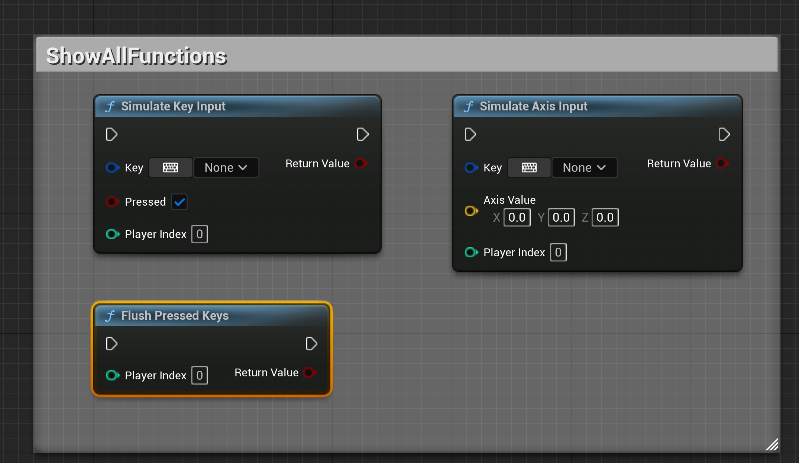
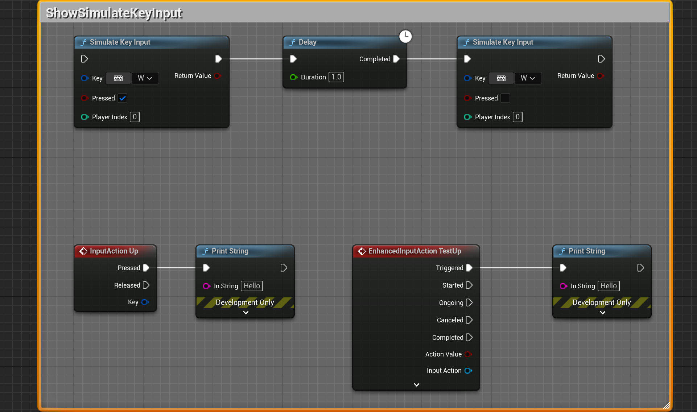
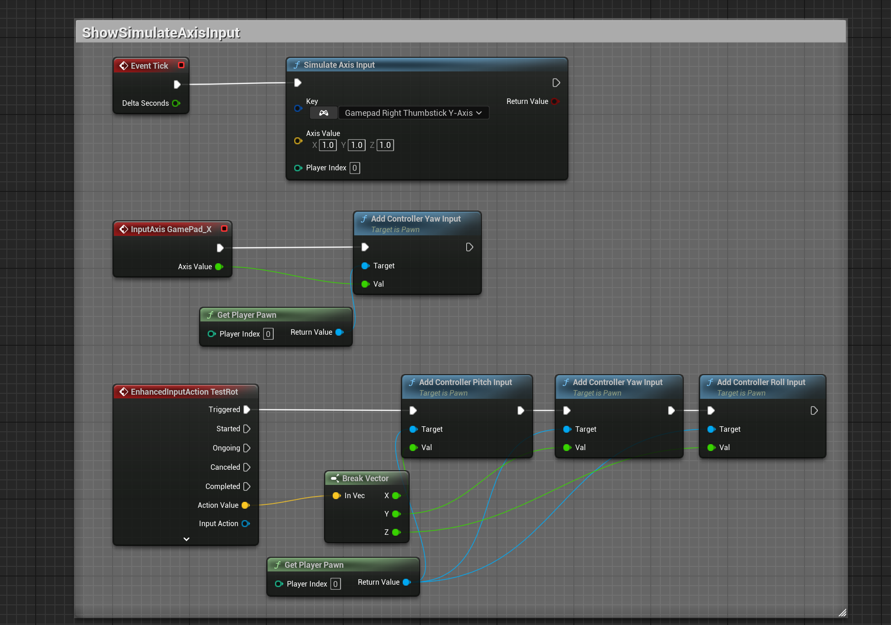

[English](./README.md) | [中文](./README_CN.md)

# 📘 Simple Input Simulator 插件教程（蓝图版）

**Simple Input Simulator** 是 Unreal Engine 的轻量级输入模拟插件。
提供**三个蓝图函数**，可以程序化模拟键盘、鼠标和手柄输入。

---

## 🔧 插件使用

插件启用后立即生效。
所有函数在蓝图的 **Simple Input Simulator** 分类下可用。

---

## 🧠 蓝图节点接口

### 🎮 按键输入模拟

| 节点                | 说明                                    |
|--------------------|----------------------------------------|
| `Simulate Key Input` | 模拟任意输入按键的按下/释放事件            |

**参数：**
- **Key**：要模拟的输入按键（空格键、鼠标左键、手柄按钮等）
- **Pressed**：`true` 为按下，`false` 为释放
- **Player Index**：目标玩家控制器（0 = 第一个玩家）

### 🕹️ 轴输入模拟

| 节点                 | 说明                                    |
|---------------------|----------------------------------------|
| `Simulate Axis Input` | 模拟模拟量输入值（移动、鼠标增量、手柄摇杆） |

**参数：**
- **Key**：轴输入按键（Mouse X/Y、Gamepad Left Thumbstick X/Y 等）
- **Axis Value**：输入值的 3D 向量（通常使用 X 分量）
- **Player Index**：目标玩家控制器（0 = 第一个玩家）

### 🧹 输入状态管理

| 节点               | 说明                          |
|-------------------|-------------------------------|
| `Flush Pressed Keys` | 清除所有已按下的按键并重置输入状态 |

**参数：**
- **Player Index**：目标玩家控制器（0 = 第一个玩家）

---

## 🔁 增强输入兼容性

| 输入系统     | 兼容性                                  |
|-------------|----------------------------------------|
| Legacy Input | ✅ 完全支持                             |
| Enhanced Input | ✅ 完全支持 - 自动触发 Input Actions     |

插件工作在原始输入层级，因此两种输入系统都会自动接收模拟事件。

---

## 🧪 蓝图示例（图片）

### 按键输入示例

为 Player 0 模拟按下空格键。

### 轴输入示例

模拟鼠标移动或手柄摇杆输入。

---

## ✅ 提示与注意事项

- 所有函数返回 `bool` 表示成功/失败
- Player Index 0 指向第一个玩家控制器
- 使用 Flush Pressed Keys 防止按键"卡住"
- 轴输入自动适应当前帧率
- 查看输出日志获取详细模拟信息（LogSimpleInputSimulator）

---

## 支持

如有问题或反馈，请在 Fab 产品页面留言。
