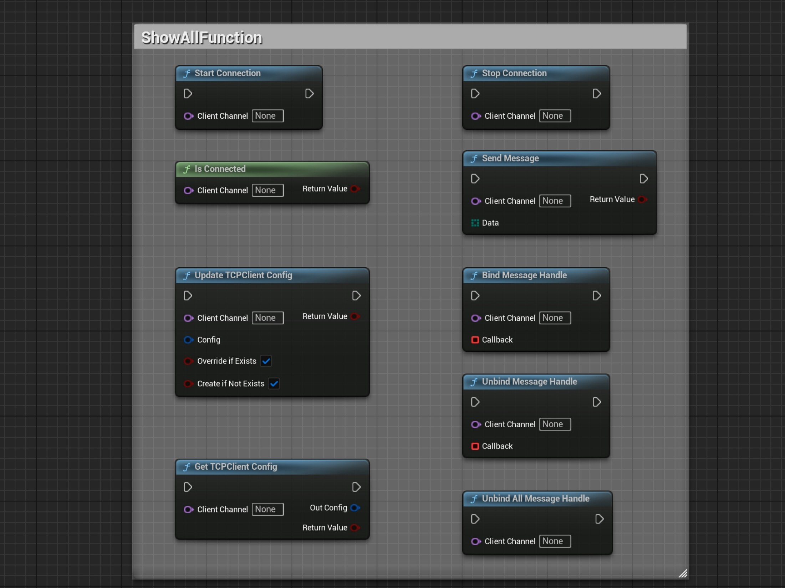
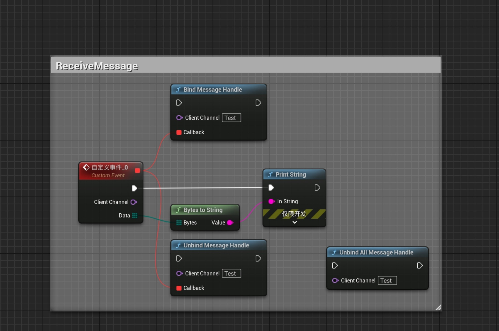
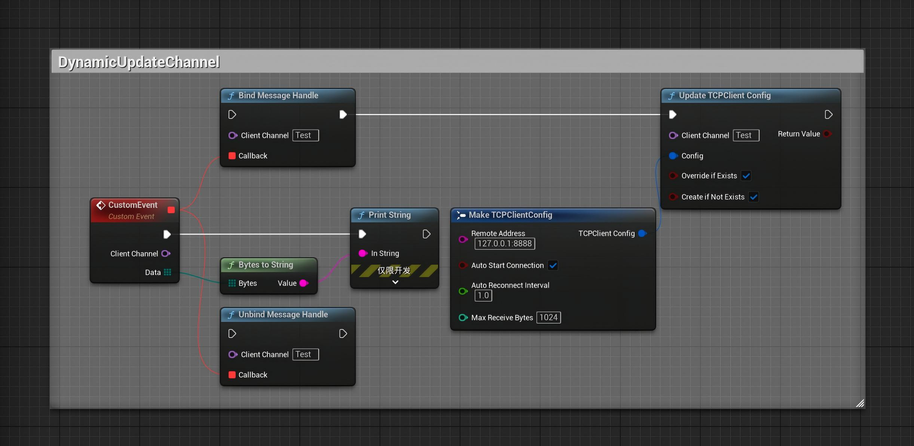
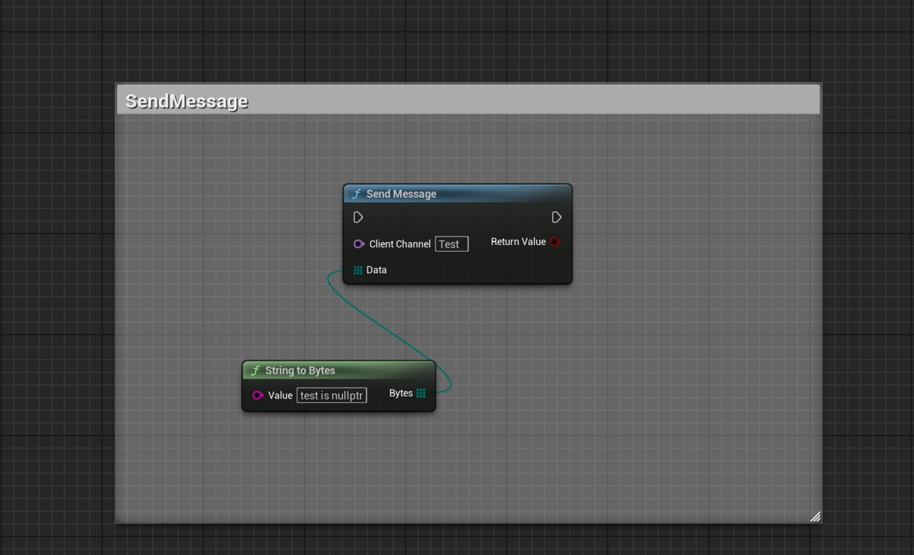

[English](./README.md) | [中文](./README_CN.md)

# 📘 SimpleTCPClient 插件教程（蓝图版）

**SimpleTCPClient** 是一个为 Unreal Engine 设计的轻量级 TCP 客户端插件。  
支持**运行时动态配置客户端通道**，所有功能均暴露给蓝图，方便集成。

---

## 🔧 插件初始化

插件启用后自动激活。  
内部注册为 `GameInstanceSubsystem`，无需手动启动或关闭代码。

---

## ⚙️ 静态通道配置（可选）

可通过 **项目设置 → SimpleTCPClient Settings** 预定义客户端通道。  
建议在此处配置通道，便于集中管理。

### 🔹 客户端通道配置字段

| 字段                 | 示例                | 说明                                |
|---------------------|---------------------|-------------------------------------|
| Channel Name         | `DefaultClient`     | 蓝图中引用通道的名称                  |
| Remote Address (IP:Port) | `127.0.0.1:8888` | 要连接的目标地址                     |
| Auto Connect         | `True`              | 是否在启动时自动连接                  |
| Auto Reconnect Interval | `1.0`（秒）       | 重连尝试间隔                         |
| Max Receive Bytes    | `1024`              | 每次接收的最大字节数                  |

---

## 🧠 蓝图节点接口

### 📥 接收

| 节点函数                    | 说明                             |
|----------------------------|----------------------------------|
| `BindMessageHandle`        | 绑定消息接收委托                   |
| `UnbindMessageHandle`      | 解绑指定委托                       |
| `UnbindAllMessageHandle`   | 解绑所有委托并关闭 Socket          |

### 📤 发送

| 节点函数         | 说明                                   |
|-----------------|----------------------------------------|
| `SendMessage`   | 通过指定通道发送字节数组                  |

### ⚙️ 运行时通道管理

| 节点函数                    | 说明                                         |
|----------------------------|----------------------------------------------|
| `StartConnection`          | 手动启动连接（用于非自动连接的通道）            |
| `StopConnection`           | 停止并销毁 Socket                             |
| `IsConnected`              | 检查通道当前是否已连接                         |
| `UpdateTCPClientConfig`    | 创建或更新通道配置（自动重连）                  |
| `GetTCPClientConfig`       | 获取通道的当前配置                             |

---

## 🔁 Socket 生命周期

| 类型          | 创建时机                           | 销毁时机                            |
|--------------|-----------------------------------|-------------------------------------|
| Client Socket| 调用 `StartConnection` 或自动连接时 | 调用 `StopConnection` 或关闭时       |

---

## 🧪 蓝图示例（图片）

### 所有蓝图节点  

### 手动启动/停止连接  
  
注：如果通道设置了自动连接且配置了重连间隔，则无需手动启动。

### 绑定和解绑消息处理  

### 动态更新客户端通道配置  
  
注：消息委托在 Socket 重连后仍然有效。更新顺序无关紧要——配置更新后，回调仍会被触发。

### 发送消息（字符串或结构化数据）  

---

## ✅ 提示与注意事项

- 仅支持 IPv4——不支持域名、IPv6 或加密
- 所有 Socket 由内部完全管理，无需手动清理
- 插件存在于 `GameInstance` 生命周期中，不受关卡切换影响

---

## 🔧 推荐配套插件

配合 **SimpleByteConverter** 使用，可轻松将常见 Unreal 类型（FString、float、int 等）与 `TArray<uint8>` 互转，构建结构化协议。

---

## 支持

如有问题或反馈，请在 Fab 产品页面留言。
