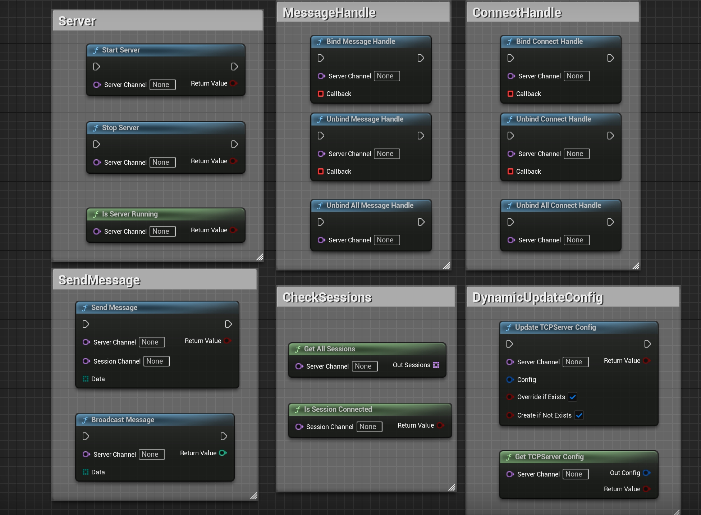

[English](./README.md) | [中文](./README_CN.md)

# 📘 SimpleTCPServer 插件教程（蓝图版）

**SimpleTCPServer** 是一个为 Unreal Engine 设计的轻量级 TCP 服务器插件。  
支持**多通道监听**、**动态配置更新**，提供完整蓝图 API 用于在运行时管理客户端连接。

---

## 🔧 插件初始化

启用后插件自动激活。  
注册为 `GameInstanceSubsystem`，其生命周期跨越关卡切换。

---

## ⚙️ 静态通道配置（可选）

可通过 **项目设置 → SimpleTCPServer Settings** 定义服务器监听通道。  
建议使用此方法进行集中管理和调试。

### 🔹 通道配置字段

| 字段名            | 示例              | 说明                                     |
|------------------|-------------------|------------------------------------------|
| Channel Name     | `MainServer`      | 蓝图中引用通道的名称                       |
| Bind Address (IP:Port) | `0.0.0.0:8888` | 监听 Socket 绑定的地址                  |
| Max Connections  | `32`              | 最大并发客户端连接数                       |
| Max Receive Bytes | `1024`           | 每条消息的最大缓冲区大小                   |

---

## 🧠 蓝图节点接口

### 📥 接收

| 节点函数                    | 说明                                |
|----------------------------|-------------------------------------|
| `BindMessageHandle`        | 绑定消息接收委托                     |
| `UnbindMessageHandle`      | 解绑指定委托                         |
| `UnbindAllMessageHandle`   | 解绑所有委托                         |

### 🔌 连接状态回调

| 节点函数                     | 说明                                      |
|-----------------------------|-------------------------------------------|
| `BindConnectHandle`         | 绑定客户端连接/断开委托                     |
| `UnbindConnectHandle`       | 解绑指定连接委托                           |
| `UnbindAllConnectHandle`    | 解绑所有连接委托                           |

### 📤 发送

| 节点函数           | 说明                                      |
|-------------------|-------------------------------------------|
| `SendMessage`     | 向指定 SessionChannel 发送字节数组          |
| `BroadcastMessage` | 向通道上所有连接广播字节数组               |

### ⚙️ 通道和连接管理

| 节点函数                    | 说明                                               |
|----------------------------|----------------------------------------------------|
| `StartServer`              | 开始在服务器通道上监听                               |
| `StopServer`               | 停止监听并断开该通道上所有客户端                      |
| `IsServerRunning`          | 检查服务器通道是否正在运行                           |
| `GetAllSessions`           | 获取监听通道上所有当前 SessionChannel                |
| `IsSessionConnected`       | 检查 Session 是否仍然连接                           |
| `UpdateTCPServerConfig`    | 更新通道配置（支持热重载）                           |
| `GetTCPServerConfig`       | 获取通道的当前配置                                  |

---

## 🔁 Socket 生命周期

| 类型            | 创建时机                      | 销毁时机                                  |
|----------------|-------------------------------|-------------------------------------------|
| 监听 Socket    | 调用 `StartServer` 时          | 调用 `StopServer` 时                       |
| Session Socket | 接受客户端连接时               | 客户端断开或 Socket 被销毁时               |

---

## 🧪 蓝图示例（图片）

### 所有节点概览  

---

## ✅ 注意事项与提示

- 仅支持 IPv4——不支持域名、IPv6 和加密  
- 所有 Socket 由内部管理，无需手动清理  
- 插件跨越关卡切换持续存在，绑定到 GameInstance 生命周期  
- 每个连接的客户端被分配唯一的 `SessionChannel`，格式为 `"IP:Port"`

---

## 🔧 推荐配套插件

- 🔌 **SimpleTCPClient 插件**  
  为客户端设计的轻量级插件，适合连接到 SimpleTCPServer 实例。

- 🧩 **SimpleByteConverter 插件**  
  支持原生 Unreal 类型（如 FString、float、int）与 `TArray<uint8>` 之间的转换，适合构建结构化协议。

---

## 支持

如有问题或反馈，请在 Fab 产品页面留言。
