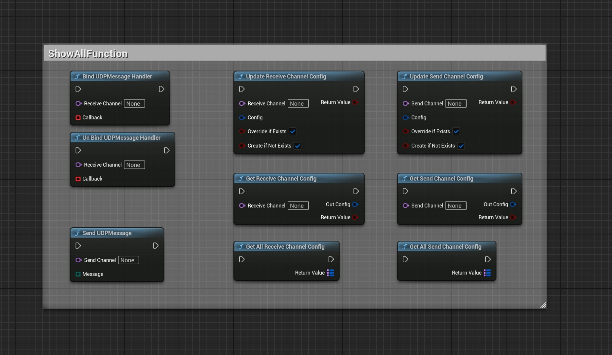
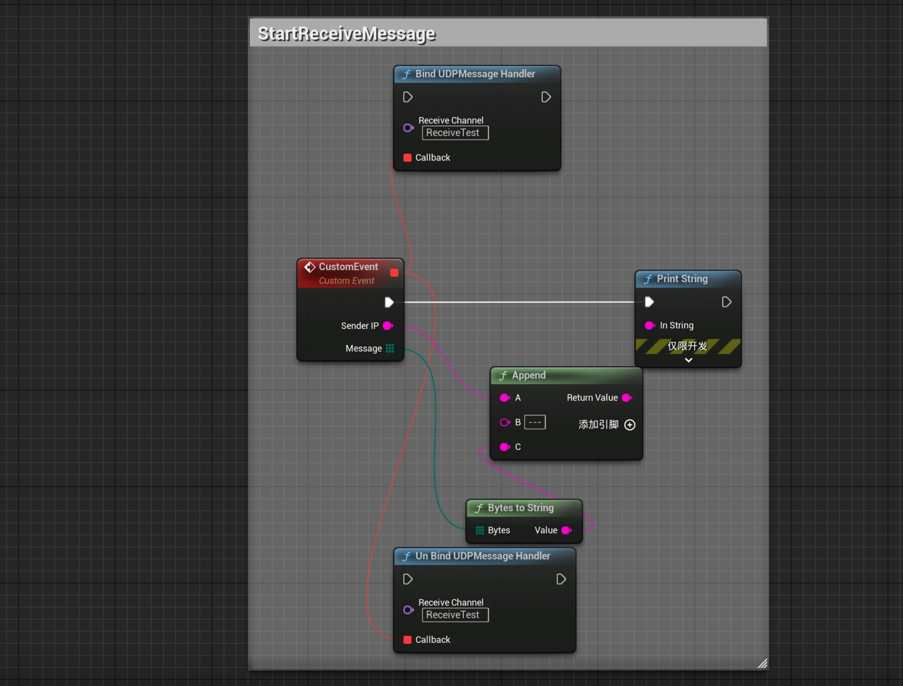
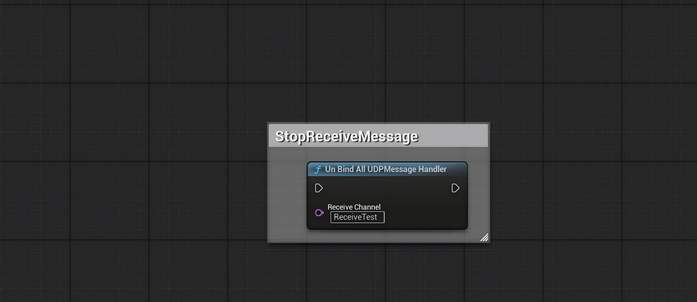
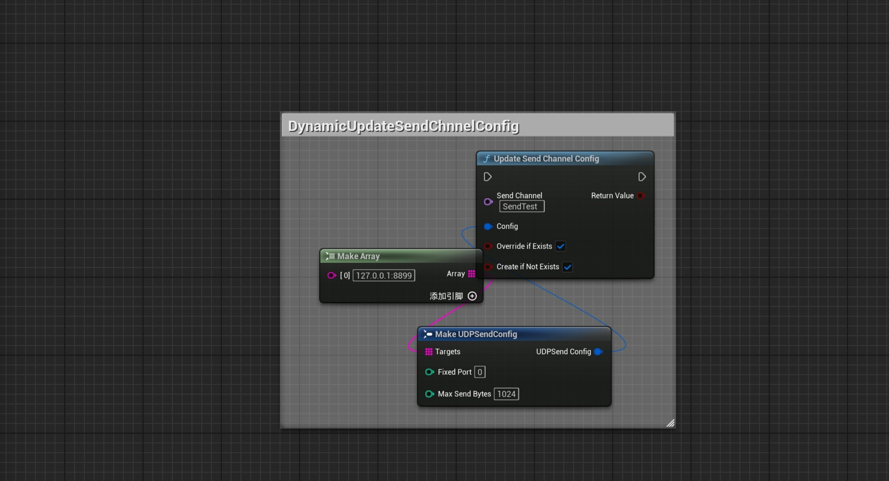
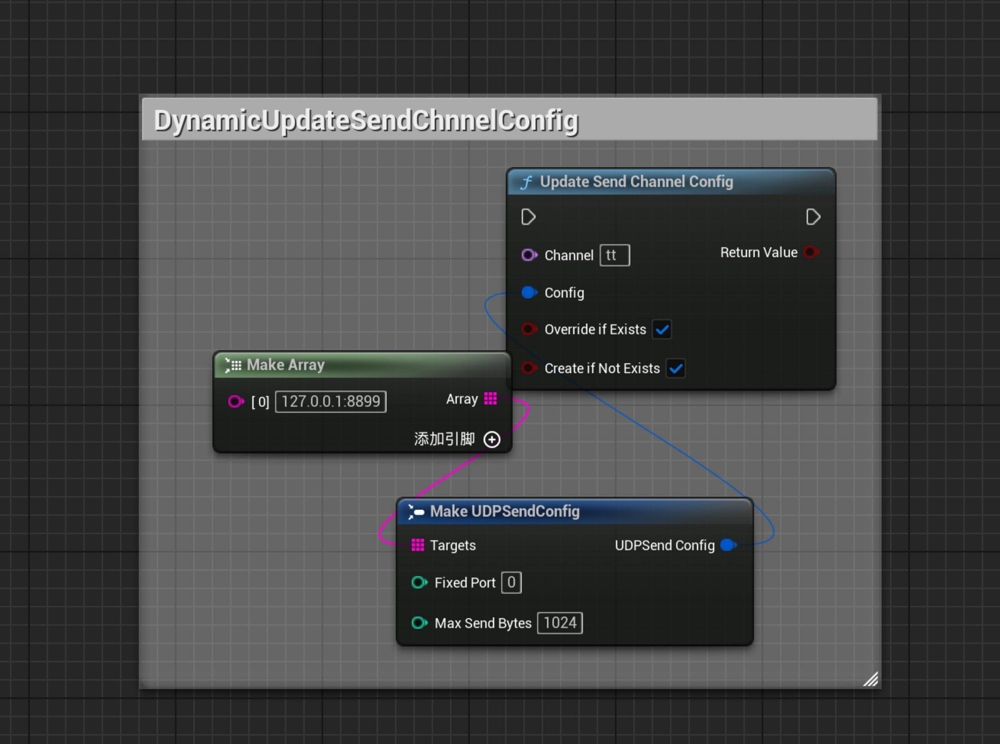
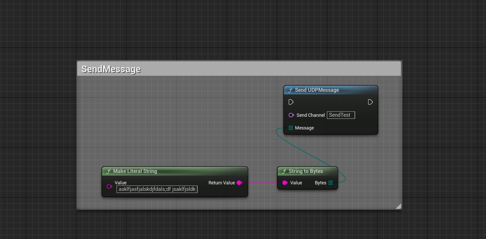

[English](./README.md) | [中文](./README_CN.md)

# 📘 SimpleUDP 插件教程（蓝图版）

**SimpleUDP** 是 Unreal Engine 的轻量级 UDP 通信插件。  
支持**运行时动态配置收发通道**，所有功能均暴露给蓝图，方便集成。

---

## 🔧 插件初始化

插件启用后立即生效。  
内部注册为 `GameInstanceSubsystem`——无需手动启动或关闭代码。

---

## ⚙️ 静态通道配置（可选）

可通过 **项目设置 → SimpleUDP Settings** 预配置通道。

注意：虽然支持运行时修改通道，但建议尽可能在此处配置，便于管理。

### 🔹 接收通道

| 字段             | 示例                | 说明                              |
|-----------------|---------------------|-----------------------------------|
| Channel Name    | `DefaultRecv`       | 蓝图中使用的通道名称                |
| Bind Address    | `0.0.0.0:9000`      | 要监听的本地 IP 和端口             |
| Max Receive Bytes | `1024`            | 每次接收的最大包大小                |
| Filter Mode     | None / Whitelist / Blacklist | IP 过滤模式              |
| Whitelist / Blacklist | `["192.168.1.0/24"]` | 支持 CIDR 格式             |

### 🔹 发送通道

| 字段             | 示例                            | 说明                              |
|-----------------|---------------------------------|-----------------------------------|
| Channel Name    | `DefaultSend`                   | 通道名称                           |
| Target Addresses | `["255.255.255.255:9000"]`     | 目标 IP:Port 列表                  |
| Fixed Port 🔧   | `0`（默认）                      | 发送 Socket 的本地绑定端口（0 = 自动）|
| Max Send Bytes  | `1024`                          | 每个包的最大大小                    |

---

## 🧠 蓝图节点接口

### 📥 接收

| 节点                           | 说明                             |
|-------------------------------|----------------------------------|
| `BindUDPMessageHandler`       | 绑定消息接收回调                   |
| `UnBindUDPMessageHandler`     | 解绑指定处理器                     |
| `UnBindAllUDPMessageHandler`  | 解绑所有处理器并关闭 Socket        |

### 📤 发送

| 节点              | 说明                             |
|------------------|----------------------------------|
| `SendUDPMessage` | 通过通道发送字节数组（Socket 自动创建）|

### ⚙️ 运行时配置

| 节点                           | 说明                                          |
|-------------------------------|-----------------------------------------------|
| `UpdateReceiveChannelConfig`  | 创建/更新接收通道（如需要会重新绑定）            |
| `UpdateSendChannelConfig`     | 创建/更新发送通道，支持 `FixedPort` ✅          |
| `GetReceiveChannelConfig`     | 获取单个接收通道配置                            |
| `GetSendChannelConfig`        | 获取单个发送通道配置                            |
| `GetAllReceiveChannelConfig`  | 获取所有接收通道配置                            |
| `GetAllSendChannelConfig`     | 获取所有发送通道配置                            |

### 🛠️ 工具节点

| 节点             | 说明                                |
|-----------------|-------------------------------------|
| `ParseEndpoint` | 解析 `"127.0.0.1:9000"` 为 IP 和端口 |
| `IsIPInCIDR`    | 检查 IP 是否在 CIDR 块内             |

---

## 🔁 Socket 生命周期

| 类型   | 创建时机                              | 销毁时机                             |
|--------|--------------------------------------|--------------------------------------|
| 接收端 | 首次调用 `BindUDPMessageHandler` 时    | 所有处理器移除 → 自动关闭 Socket      |
| 发送端 | 首次调用 `SendUDPMessage` 或配置时     | 插件关闭或通道删除时                   |

---

## 🧪 蓝图示例（图片）

### 所有蓝图函数  

### 绑定和解绑示例  

首次绑定后 Socket 自动创建，无处理器时自动销毁。

### 解绑全部（强制关闭 Socket）  

使用此节点解绑通道上的所有内容并手动关闭 Socket。

### 动态更新接收通道  

如需要 Socket 会自动重建。函数调用顺序无关紧要。  

两个布尔值控制是覆盖现有通道还是添加新通道。

### 动态更新发送通道  

发送 Socket 仅在 `FixedPort` 不同时重建。  

两个布尔值的行为与接收配置相同。

### 发送字符串消息  

---

## ✅ 提示与注意事项

- 仅支持 IPv4（不支持 IPv6 或域名解析）
- 有效端口范围：`0~65535`，其中 `0` 表示自动分配
- 不要在不同通道中绑定相同端口，除非 Socket 已释放
- IP 过滤支持 CIDR 格式（如 `192.168.1.0/24`）

---

## 🔧 推荐配套

配合 **SimpleByteConverter** 插件使用，轻松实现数据与 `TArray<uint8>` 之间的序列化/反序列化。

---

## 支持

如有问题或反馈，请在 Fab 产品页面留言。
