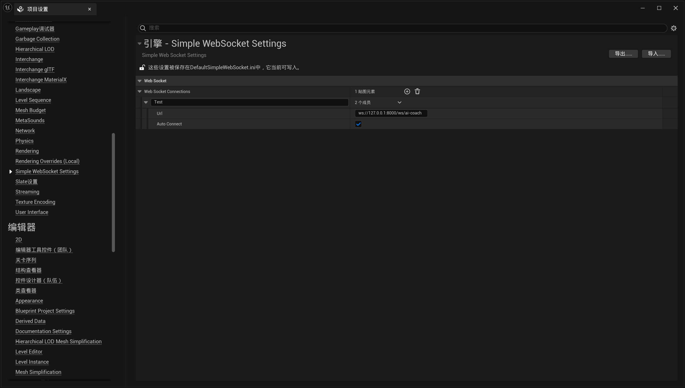
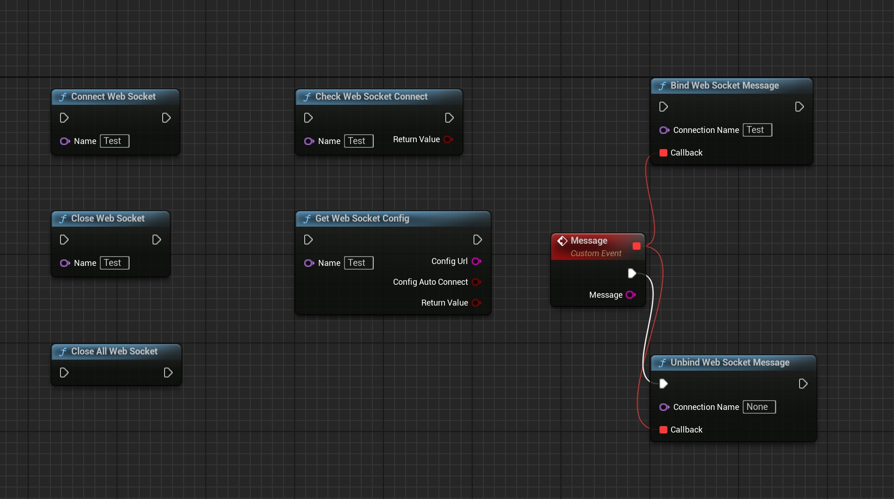

[English](./README.md) | [中文](./README_CN.md)

# 📘 SimpleWebSocket 用户指南

本指南介绍如何配置和使用 SimpleWebSocket 插件在 Unreal Engine 项目中进行 WebSocket 通信。

---

## 🛠️ 插件设置

启用插件后，前往项目设置面板的 `Simple WebSocket Settings`。

### 步骤：

1. 打开 Unreal Engine 编辑器  
2. 前往 `编辑 > 项目设置`  
3. 向下滚动找到 `Simple WebSocket Settings`  
4. 添加新的 WebSocket 连接条目（如命名为 `Test`）  
5. 输入 WebSocket 地址（推荐格式：`ws://127.0.0.1:xxxx`，**不要使用 localhost**）  
6. 启用 **Auto Connect**（可选；启用后运行时自动建立连接）

📷 示例截图：

---

## 🎮 蓝图使用示例

可使用 GameInstance 级别的蓝图函数来连接、发送、接收和关闭 WebSocket 连接。所有函数都是静态的，可从任何蓝图调用。

### 可用节点：

- `Connect Web Socket`：按名称连接 WebSocket  
- `Send WebSocket Message`：发送文本消息  
- `Bind Web Socket Message`：绑定蓝图事件接收消息（支持多个回调）  
- `Close Web Socket`：关闭指定连接  
- `Close All Web Socket`：关闭所有连接  
- `Check Web Socket Connect`：检查连接是否已建立  
- `Get Web Socket Config`：获取指定连接的配置  
- `Unbind Web Socket Message`：解绑消息事件  

📷 蓝图示例：

---

## ✅ 注意事项

- 插件仅支持 `ws://` 协议。不支持安全连接 `wss://`。
- 已在**打包构建**中完全测试——在生产环境中正常工作。
- WebSocket URL 中避免使用 `localhost`。始终使用 `127.0.0.1` 以防止连接问题。
- 每个连接名称可以绑定多个回调，支持模块化事件处理。

---

## 支持

如有问题或反馈，请在 Fab 产品页面留言。
